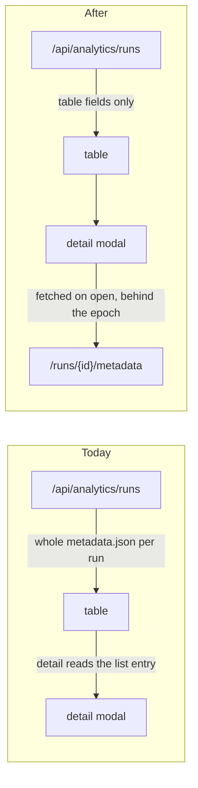

# The Analytics read path: ANALYTICS-02 (repair), 03 and 04

Three findings, one seam. Everything here is `src/analytics/metrics.py`, the Analytics endpoints in `src/web/server.py`, and `src/web/static/analytics.js`. Nothing touches a worker, a sampler, or the saved-run format, so it cannot collide with `XAI-01` or with what `LIFE-04` just landed.

## Three corrections to the report, found while scoping

**`ANALYTICS-04`'s path escape is already fixed.** The report says compare joins IDs straight to `RESULTS_DIR`. It no longer does: `_compute_run_metrics` resolves through the store like its siblings, and the comment there records the fix.

```2126:2130:src/web/server.py
def _compute_run_metrics(run_id: str) -> Dict[str, Any]:
    # Through the store's resolver like every other run-id endpoint.
    # This one used to join the path unguarded, so a crafted id could
    # walk out of the data root while its three siblings refused.
    run_dir = run_store.resolve_run_dir(RESULTS_DIR, run_id)
```

`DATA-01` did it. What remains of the finding is the bound, the dedup, the epoch, the error taxonomy and the labels. There is still no compare-specific traversal test, so one gets written to keep it fixed.

**`ANALYTICS-03`'s cited evidence is stale.** `server.py:1379-1393` is `activation_status` today and `app.js:4021` is prompt history, not the runs API. Only [analytics.js](src/web/static/analytics.js) calls `/api/analytics/runs`, which makes the contract change far cheaper than the report implies.

**A defect the report does not name: the two Tokens/s readouts disagree.** The live generator sums per-frame `revealed` counts ([app.js:1766](src/web/static/app.js)), while Analytics does `first_frame_mask_count - current_mask_count` ([analytics.js:4186](src/web/static/analytics.js)). On a multi-canvas DiffusionGemma run these give different answers. Same math, two places, so it is fixed in the same pass.

## Commit 1: convergence and throughput from token records

Convergence is a character fraction wearing a token label. `compute_convergence` counts mask glyphs against `len(stripped)`, the decoded character count:

```238:243:src/analytics/metrics.py
        mask_count = stripped.count(MASK_CHAR)
        resolved = total - mask_count
        results.append({
            "frame": i,
            "mask_count": mask_count,
            "total_chars": total,
```

So resolving one masked position into a ten-character token moves the curve ten times as far as a one-character token, and the chart is labelled "% Resolved".

The fix needs no new persisted field, because the records are already there. `tokens.json` holds one entry per position per frame with an explicit mask flag `m`, and **200 of the 222 runs in `results/` carry them**. Convergence becomes `count(m == false) / len(frame)`.

- Add a token-record basis to `compute_convergence`, reading through the existing `load_run_frames` / `records_available` machinery in [metrics.py](src/analytics/metrics.py) rather than a new reader.
- Return which basis was used, so the client can label rather than guess. The 13 id-only and 9 token-less runs keep the character proxy and **say so on the chart**, following the existing "Token overlays are not available for this run" precedent rather than inventing a new one.
- Fix the throughput numerator to accumulate across canvases. `canvas_index` is already saved and already surfaced as `canvas_boundaries`; it is simply unused by `tokensProducedSeries`, which is why a committed canvas resets the series instead of carrying forward.
- Make the live readout and the chart agree, since both are now counting resolved positions.

Tests: convergence is invariant to token text length (the report's own verification: equal token schedules, one- versus multi-character tokens); produced count is monotone across two canvases and its terminal value equals the output token count; a token-less run reports the character basis. `test_convergence_is_identical_across_eras` in [tests/analytics/test_run_schema.py](tests/analytics/test_run_schema.py) pins the current behaviour and needs its fixture given token records: v0 and v1 must still agree, just on the token answer.

## Commit 2: a bounded, coherent compare

```2255:2262:src/web/server.py
@app.get("/api/analytics/compare")
async def analytics_compare(ids: str = "") -> JSONResponse:
    run_ids = [
        rid.strip() for rid in ids.split(",") if rid.strip()
    ]
```

No cap, no dedup. Every failure collapses to the same `"Run not found"` string whether the run is missing, malformed, corrupt or from a future schema, and anything outside `(FileNotFoundError, ValueError)` 500s the whole batch rather than one row.

- Cap and dedup the selection; return one explicit record per selection, carrying data or a reason, so a run cannot silently vanish. `_read_catalog_entry` already models this well with its `invalid` plus `error` rows; compare should not re-invent a thinner version.
- Give compare its own request fence. [detail_requests.js](src/web/static/detail_requests.js) is already a factory built for exactly this, and its own comment names the compare view as a cancel site: `detailRequestsCreate()` gives compare an independent epoch and `AbortController` with no new machinery.
- Render omissions instead of skipping them. Today errored and autoregressive selections are dropped with a bare `continue`, so selecting three runs can draw one line with nothing saying why.
- Replace the hardcoded label with capability-driven fields. `buildCompareLabel` reads `steps`, `gen_length`, `block_length`, so a DiffusionGemma or SmolLM3 run renders `undefined`. The registry already publishes `param_specs` per model.

Tests: the traversal test compare never had, plus caps, duplicates, a corrupt run, mixed model families, and out-of-order responses around close and reopen.

## Commit 3: a skinny catalog and a detail endpoint

The catalog returns whole `metadata.json` blobs. That means the full prompt, the full `final_text`, the full `params`, the whole reproducibility block, and the per-frame arrays: a 2047-token run carries 2047-element `per_frame_elapsed` and `mean_conf` **in its list entry**.

Every sortable and groupable key is a fixed, small set, confirmed from the markup: `created_at`, `model`, `processor`, `prompt`, `elapsed_seconds`, `has_diff`. So the summary carries those plus `run_id`, `backend`, `model_type`, `partial`, and `invalid`/`error`, with a bounded prompt preview. Everything else moves behind a new per-run metadata endpoint.



Sort, group, select-all and collection counts all keep working unchanged, because the whole set is still in memory; it is just small. Two consequences to handle rather than discover:

- **The detail modal currently builds its metadata rows from the list entry**, so it gains a fetch, routed through the epoch fence it already uses for metrics and frames.
- **Dropping `params` breaks `buildCompareLabel`**, which reads `run.params` off `allRuns`. Commit 2 has already replaced it. This is the clearest evidence these three belong in one plan.

Also index collection membership as sets. Today `collectionHasRun` is an `indexOf` scan and `runIsCollected` runs one per collection per row, so a render does up to 24 linear scans per row, and `collectionPresentCount` scans the whole catalog once per tab.

Written against the `DATA-02` decision below: membership is keyed by run, and changes are expressed as add/remove/rename intents rather than by writing the whole array back, so the client stops assuming it owns the array before the server takes it over.

## Commit 4: records

- **Record the `DATA-02` decision**: collections become server-authoritative through bounded semantic operations, not revision/ETag. The reason worth keeping is the precedent: `run_store.save` resolves identity server-side under `_PUBLISH_LOCK`, and the duplicate-save bug went away precisely because the client stopped being the authority. Collections are the same shape, and ETag hands conflict resolution back to the client. Move it out of "Needs a maintainer decision" and note that the implementation still follows.
- Correct the three stale claims above in the ledger, so a later session does not re-verify a path escape that `DATA-01` already closed.
- Reconcile `ANALYTICS-02`: the status table says `ready` while the prose says it is "parked at `blocked`". The repair half is done here; record that the persist half remains and belongs with `XAI-01`, since both change what a worker records.
- Manual items: convergence on a multi-character-token run against a single-character one, a multi-canvas DiffusionGemma throughput curve, compare with a deliberately mixed and duplicated selection, and the Analytics page against the full 222-run archive.

## Verification

`.venv/bin/python -m pytest`, `.venv/bin/python scripts/lint_ratchet.py`, `node --check` on changed JS, `node --test tests/web/static/*.test.js`, ReadLints on everything touched. Measure the catalog response size before and after, which is the number `ANALYTICS-03` is really about.