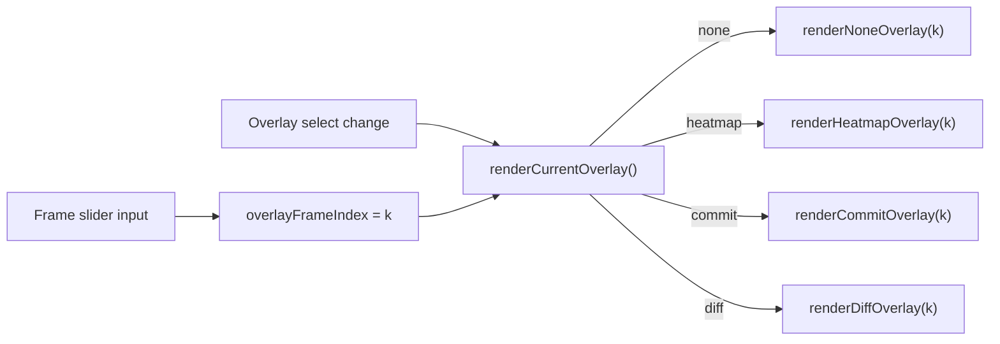

## Feature 1: Analytics per-frame scrubber + durable Heatmap

The frames endpoint already ships every frame to the client. `_compute_run_frames` returns `data["frames"]` / `data["original_frames"]` ([src/web/server.py](src/web/server.py) line 1347), and `loadRunOverlays` stores all of it in `overlayData.frames` ([src/web/static/analytics.js](src/web/static/analytics.js) line 879). Today the viewer discards all but the final frame via `overlayFinalFrame(...)`. So this is frontend-only: no server, `metrics.py`, or `tokens.json` changes.

All the math is already shared in [src/web/static/overlays.js](src/web/static/overlays.js): `heatColor` (line 18), `commitColor` (line 28), `overlaysComputeCommitSteps` (line 53), `overlaysComputeDiff` (line 181), `overlaysBuildDiffLayers` (line 136), `OVERLAYS_MASK_CHAR`. No new shared helpers are needed.

### Render dispatch

### Scrubber DOM + CSS
- Add a slim scrubber (prev / slider / next + a `Frame i / N` label) inside `#overlay-viewer`, below `#overlay-output-wrap` and above `#overlay-diff-controls` ([src/web/static/analytics.html](src/web/static/analytics.html) lines 132-181). Give it ids like `#overlay-scrubber`, `#overlay-scrubber-slider`, `#overlay-scrubber-label`.
- Style it in [src/web/static/analytics.css](src/web/static/analytics.css), reusing the generator's `.scrub-btn` look ([src/web/static/index.html](src/web/static/index.html) line 148).

### State + parameterizing the render paths ([src/web/static/analytics.js](src/web/static/analytics.js))
- Add module state `overlayFrameIndex` (default: last frame, so the modal opens on the final frame exactly as today) and a memoized `overlayCommitSteps` / `overlayDiffData` invalidated when a new run loads.
- Add `renderCurrentOverlay()` that re-renders the active `overlayMode` at `overlayFrameIndex`; call it on slider `input` and from `setOverlayMode` (line 980) in place of the direct `render*` calls.
- `renderNoneOverlay` (line 1004): render `overlayData.frames[k]` instead of `overlayFinalFrame(...)`. `renderOverlayTokens(frame, colorFn, titleFn)` (line 1017) already takes a frame, so this is a one-line change.
- `renderCommitOverlay` (line 1049): render frame `k`'s tokens; color resolved tokens by `commitColor(steps[i], maxStep)` (steps computed once via `overlaysComputeCommitSteps(frames)`); masked positions render as the mask glyph. A token resolved by frame `k` is already resolved in that frame, so the gradient stays consistent.
- `renderDiffOverlay` (line 1079): mirror the generator's per-frame version ([src/web/static/app.js](src/web/static/app.js) line 1555): edited = `frames[k]`, original = `original_frames[min(k, original_frames.length - 1)]` (clamp the original to its final frame past its end, matching the generator at `app.js` line 1560), change-flags from `overlaysComputeDiff` on the finals, layers built at frame `k` via `overlaysBuildDiffLayers(..., OVERLAYS_MASK_CHAR)`.
- New `renderHeatmapOverlay(k)`: `renderOverlayTokens(frames[k], (i) => heatColor(tok.c), () => "")`. Add a `heatmap` option to `buildOverlaySelect` (line 952) and a `mode === "heatmap"` branch to `setOverlayMode`.

### AR gating (Commit Order + Diff are diffusion-only for now)
- Thread the run's `model_type` into the overlay build: the modal opener already has the `run` object where it calls `loadRunOverlays(runId)` ([src/web/static/analytics.js](src/web/static/analytics.js) line 718), and `runIsAutoregressive(run)` already exists (line 797). Pass `run` (or `model_type`) through `loadRunOverlays` -> `buildOverlaySelect`.
- For autoregressive runs, offer only None + Heatmap; omit/disable Commit Order and Diff (mirrors the generator's `effectiveColorMode`, which already excludes AR at `app.js` line 1592). The scrubber still shows (AR runs are many per-token frames). This keeps AR's own xAI tools (Phase C) for a later session.

### Edge cases
- Runs with only final-frame or legacy data keep the existing "unavailable" path (`records_available` / `overlayDiffAvailable`); if there is effectively one usable frame, disable the scrubber rather than hide the viewer.
- Guard empty intermediate frames (an all-masked early frame) so scrubbing to them renders gracefully.

## Feature 2: App icon redesign

- Rewrite [assets/icon.svg](assets/icon.svg) as three denoising shade-blocks (the `▓ ▒ ░` / `DENOISE_GLYPHS` motif) fading most-to-least opaque, on the existing dark rounded tile (`#0a0a0a`, `rx=48`) with the accent green (`#00ff41`) and the subtle border. Draw the shade-blocks as vector rects at descending fill-opacity (not font `<text>` glyphs) so they rasterize identically across backends. Keep this distinct from the D+F / @-to-R family glyphs.
- Export a PNG via a hand-back command (no new dependency), e.g. `rsvg-convert -w 512 -h 512 assets/icon.svg -o assets/icon.png` (or an inkscape / ImageMagick equivalent).
- Point the desktop window icon at the PNG for raster fidelity (`ICON_PATH` at [desktop.py](desktop.py) line 52); keep the launcher `Icon=` on the SVG ([scripts/install_desktop_entry.sh](scripts/install_desktop_entry.sh) lines 15, 39), which freedesktop handles well. Update the icon note in [README.md](README.md) (Project Structure, line 167).

## Verification and handback

- In-sandbox: `node --check` on `analytics.js` (and any touched JS), `.venv/bin/python -m py_compile desktop.py` if touched, `.venv/bin/python -m pytest`, and ReadLints on changed files.
- GUI cannot run in the sandbox, so hand back a manual checklist: scrub each overlay on a diffusion run (None / Heatmap / Commit Order / Diff, including a multi-canvas and an edited run for the diff clamp), confirm an AR run shows only None + Heatmap and scrubs, confirm the viewer still opens on the final frame, and check the new icon in the desktop window and dock.

## Docs

Update [HANDOFF.md](HANDOFF.md) (Recently shipped + Where to pick up), [README.md](README.md) (Analytics Suite blurb + Implementation Status), and [ROADMAP.md](ROADMAP.md) (move the analytics scrubber and icon items to shipped) once validated. Propose a commit per validated feature; do not push.