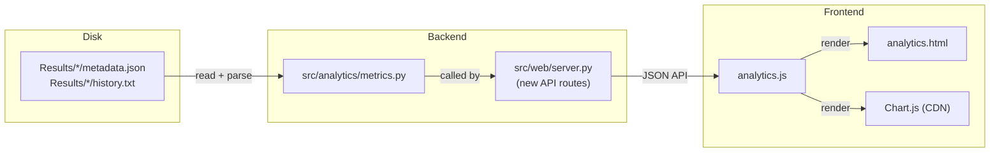

# Analytics Suite — Intrinsic Diffusion Metrics

## Current State

Saved runs in `Results/<timestamp>_llada/` contain:

- `metadata.json` — prompt, params (steps, gen_length, block_length, temperature, cfg_scale, remasking), final_text, optional remask_edits
- `history.txt` — frame-by-frame text snapshots with `░` for masked tokens
- `final.txt`, `diffusion.gif`

**Missing data:** elapsed time is computed during generation (`frame["elapsed"]` in [server.py](src/web/server.py) line 304) but is **not persisted** to metadata.json. Per-frame timing is also not saved. No `created_at` timestamp exists.

## Architecture




## Metrics (all intrinsic — no reference model)

Computable from existing `history.txt` data:

- **Convergence curve** — count `░` characters per frame, derive `% resolved` at each step. Produces an array of `(frame_index, mask_count, mask_ratio)`.
- **Token churn** — compare consecutive frames: count positions where a non-`░` character changed to a different non-`░` character. This measures instability in the diffusion process. Produces an array of `(frame_index, changed_count)`.
- **Final mask ratio** — fraction of `░` remaining in the last frame (should be 0 for a healthy run).

New data to persist (requires save-flow changes):

- **Total elapsed seconds** — capture from the last frame's `elapsed` field before sending to save.
- **Per-frame timestamps** — array of elapsed seconds per frame, enabling per-step timing charts.
- `**created_at`** — ISO-8601 timestamp for sorting by recency.

## Step 1: Enhance Save Flow

**Client-side** ([app.js](src/web/static/app.js)): Track elapsed time per frame during generation. Add `elapsed_seconds` (total) and `per_frame_elapsed` (array) to the save payload.

**Server-side** ([server.py](src/web/server.py)): Accept and persist the new timing fields in `SaveRunRequest` and `_save_run_blocking`. Add a `created_at` ISO timestamp to `metadata.json`.

Updated `metadata.json` schema:

```json
{
  "backend": "llada",
  "model": "GSAI-ML/LLaDA-8B-Instruct",
  "created_at": "2026-03-01T14:30:00",
  "prompt": "...",
  "final_text": "...",
  "elapsed_seconds": 42.5,
  "per_frame_elapsed": [0.0, 0.3, 0.6, ...],
  "params": { "steps": 128, "gen_length": 128, ... },
  "remask_edits": []
}
```

## Step 2: Metrics Module

New file: `src/analytics/__init__.py` (empty) and `src/analytics/metrics.py`.

`metrics.py` will contain:

- `parse_history(history_path: Path) -> list[str]` — split `history.txt` into frame strings
- `compute_convergence(frames: list[str]) -> list[dict]` — `[{frame, mask_count, total_chars, resolved_ratio}]`
- `compute_churn(frames: list[str]) -> list[dict]` — `[{frame, changed_count}]`
- `load_run_metadata(run_dir: Path) -> dict` — read and validate `metadata.json`
- `list_runs(results_dir: Path) -> list[dict]` — scan all subdirectories, return sorted run summaries

## Step 3: API Endpoints

Add to [server.py](src/web/server.py):

- `GET /api/analytics/runs` — returns list of all run summaries (metadata without full history). Supports optional query params for sorting.
- `GET /api/analytics/runs/{run_id}/metrics` — parses that run's `history.txt`, computes convergence + churn + timing metrics, returns JSON.
- `GET /api/analytics/compare?ids=id1,id2,...` — returns metrics for multiple runs for overlay comparison.

`run_id` is the directory name (e.g., `2026-03-01_14-30-00_llada`).

## Step 4: Analytics Page (Frontend)

Three new files in `src/web/static/`:

- `analytics.html` — standalone page, linked from the main app header
- `analytics.js` — all client logic
- `analytics.css` — page-specific styles (reuses CSS variables from [style.css](src/web/static/style.css))

Uses [Chart.js](https://cdn.jsdelivr.net/npm/chart.js) from CDN (no build step, ~60KB).

### Page Layout

- **Header** with nav link back to Generator
- **Runs Table** (left or top): sortable columns for prompt (truncated), steps, gen_length, block_length, temperature, cfg_scale, elapsed, created_at. "Group by" dropdown collapses rows by a selected parameter.
- **Detail Panel** (right or bottom, appears on run selection):
  - Run metadata summary
  - **Convergence Chart** — line chart: X = frame index, Y = % tokens resolved
  - **Token Churn Chart** — bar chart: X = frame index, Y = number of changed tokens
  - **Timing Chart** — line chart: X = frame index, Y = cumulative elapsed seconds (only if per_frame_elapsed exists in metadata)
- **Comparison Mode** — checkbox-select multiple runs, overlay their convergence curves on one chart (different colors, legend shows params)

### Navigation

Add an "Analytics" link to the existing header nav in [index.html](src/web/static/index.html) (alongside About, Help, Settings). Route `/analytics.html` is served by the existing static mount.

## Backward Compatibility

Runs saved before this change won't have `elapsed_seconds`, `per_frame_elapsed`, or `created_at`. The metrics module and frontend will handle missing fields gracefully (show "N/A" for timing, still compute convergence/churn from history.txt).

## Out of Scope (for now)

- External reference model scoring (perplexity, etc.)
- Remask edit analytics (the interactive remasking data is tracked but not visualized in this phase)
- Token-ID-level persistence (currently only text is saved; token IDs would enable richer analysis later)

