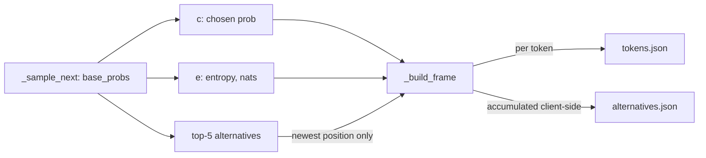

## AR Phase C: alternatives, entropy, and substitution resume

Three independently shippable commits, in order. Commit 3 is the largest and is the natural stopping point if the session runs short.

### Commit 1: rename `Results/` to `results/`

Purely mechanical. One functional line, the rest is copy.

- [src/web/server.py](src/web/server.py) line 74: `RESULTS_DIR = Path("results")`. Every other Python reference routes through this constant ([src/analytics/metrics.py](src/analytics/metrics.py) and [src/web/ui_state.py](src/web/ui_state.py) both take the root as a parameter), and `tests/web/test_ui_state_reconcile.py:28` monkeypatches it, so no test changes.
- [.gitignore](.gitignore): `Results/` to `results/`.
- Copy and comments: [src/web/static/analytics.js](src/web/static/analytics.js) lines 1942, 1955, 1963; [src/web/static/analytics.html](src/web/static/analytics.html) lines 304, 321; the Help modal in [src/web/static/index.html](src/web/static/index.html) lines 370, 372, 387; docstrings in [src/analytics/metrics.py](src/analytics/metrics.py) lines 3, 199 and [src/web/ui_state.py](src/web/ui_state.py) line 8; the comment at [desktop.py](desktop.py) line 32; plus [README.md](README.md), [ROADMAP.md](ROADMAP.md), [HANDOFF.md](HANDOFF.md).
- **Maintainer step:** `mv Results results` with the server stopped, since `RESULTS_DIR` is relative and resolves against the process CWD, and the run folders are untracked.

### Commit 2: top-k capture, entropy, hover popover, Entropy overlay

**Signal capture.** In [src/inference/ar_sampler.py](src/inference/ar_sampler.py), `_sample_next` (line 134) already computes the untempered softmax as `base_probs`, so both new signals come off that tensor. Return a small `NamedTuple` (`_StepPick`: `token_id`, `confidence`, `entropy`, `alternatives`) rather than growing the tuple:

- **Entropy**, always on: `-(p * log p).sum()` over `base_probs` in nats, rounded to 4dp. Stored raw and normalized only at display time against a documented reference (`OVERLAYS_ENTROPY_REF_NATS = 5.0`), because normalizing by `log(vocab)` on a ~128k vocab bunches every real value into the bottom tenth of the scale.
- **Top-k alternatives**, opt-in, k fixed at 5: `torch.topk(base_probs, 5)` decoded to `{id, t, p}`.

**Payload shape.** A token's top-k is fixed the moment it is sampled, so it travels once: `_build_frame` (line 156) adds `e` to each token record and an `alts` key carrying only the newest position's alternatives. Frames stay O(n) and the wire cost is O(n·k) instead of O(n²·k).

**Plumbing.** Add an `alternatives` BOOL `ParamSpec` (default False) to `SMOLLM3` in [src/backends/registry.py](src/backends/registry.py), mirroring DiffusionGemma's `entropy_signal` spec at line 193; thread it through `_validate_generate` and `handle_generate` in [src/backends/smollm3_worker.py](src/backends/smollm3_worker.py).

**Persistence.** `TokenRecord` in [src/web/server.py](src/web/server.py) line 1074 is strict pydantic, so entropy is silently dropped without an explicit field:

- `TokenRecord` gains `e: Optional[float] = None` (kept out of masked records by the existing `exclude_none` in `_dump_frame_tokens`).
- New `TokenAlternative(BaseModel)` with `id: int`, `t: str`, `p: float`; `SaveRunRequest` gains a position-indexed `alternatives` field; `_save_run_blocking` writes `alternatives.json` beside `tokens.json`.
- `load_run_frames` in [src/analytics/metrics.py](src/analytics/metrics.py) reads it and reports `alternatives_available`, passed through `_compute_run_frames` (server.py line 1348).

**Frontend.**

- [src/web/static/overlays.js](src/web/static/overlays.js): add `entropyColor(e)` beside `heatColor` (line 18), on a distinct hue ramp so it never reads as the green confidence Heatmap.
- [src/web/static/app.js](src/web/static/app.js): `handleFrame` (line 1333) accumulates `data.alts` into a `positionAlts` array keyed by position; `buildOverlaySelect` (line 1717) gains an `Entropy` option gated on data presence rather than `model_type`, so it lights up for any future model that emits `e`; `applyTokenColor` (line 1552) gets an `entropy` branch; `renderFrameWithTokens` (line 1942) adds an entropy line to the token `title`.
- **Hover popover:** a new `#token-alts-popover`, shown from delegated `mouseover`/`mouseout` on `#output-area` (mirroring the existing click delegation at line 3803), listing the 5 alternatives with probabilities. Suppressed during guided edit.
- **Entropy profile:** a `<canvas>` in a new row inside `#scrubber-section` in [src/web/static/index.html](src/web/static/index.html) (alongside `#diff-overlay-controls` at line 165), one column per position, height from normalized entropy, with a marker for the current frame. This is the sequence profile we agreed on, not a per-position trajectory.
- [src/web/static/analytics.js](src/web/static/analytics.js): matching `entropy` option in its `buildOverlaySelect` (line 1067, note it keys the confidence overlay as `"heatmap"` where the generator uses `"conf"`), a `renderEntropyOverlay` next to `renderHeatmapOverlay` (line 1148), and the same popover when `alternatives_available`.
- Styles in [src/web/static/style.css](src/web/static/style.css) and [src/web/static/analytics.css](src/web/static/analytics.css).

### Commit 3: substitution resume

**Protocol.** In [src/backends/protocol.py](src/backends/protocol.py), add `supports_substitution: bool = False` to `ModelCapabilities` and `MSG_SUBSTITUTE = "substitute"`. A distinct message keeps `supports_resume` meaning diffusion remask-and-resume, so flipping this flag does not unhide Edit Frames (gated at app.js line 2243) with its diffusion-only copy and randomize-remasks slider. Add `handle_substitute` to the `Backend` base in [src/backends/worker_base.py](src/backends/worker_base.py) (raising `NotImplementedError` like `handle_resume` at line 95) and dispatch it in `create_worker_app` next to the `MSG_RESUME` branch at line 262.

**Worker.** [src/backends/smollm3_worker.py](src/backends/smollm3_worker.py) retains a `last_run_state` analogous to `LladaBackend.last_run_state` ([src/backends/llada_worker.py](src/backends/llada_worker.py) line 262): prompt inputs, generated ids, per-position confidences, entropies, captured alternatives, and the sampling params. `handle_substitute` validates the position is in range and the requested id is in that position's captured top-k, then streams.

**Sampler.** A `streaming_substitute` generator in [src/inference/ar_sampler.py](src/inference/ar_sampler.py): one prefill forward over prompt plus `generated_ids[:position]`, force the chosen id at `position` with its captured probability as confidence, then continue the existing loop from `position + 1`, emitting frames from that index. Defaults to greedy so the counterfactual is a clean intervention rather than partly RNG noise from re-seeding in a different context.

**Frontend.** One-step interaction, since frame index and position are the same choice for AR:

- A `#btn-what-if` entry point in `#scrubber-controls`, shown when `supports_substitution`. In that mode, clicking a token opens the commit-2 popover with each alternative clickable.
- On pick, truncate the frame arrays at `position` and send `{type: "substitute", position, token_id}`, reusing the existing `resumeFrameOffset` / `isResuming` splice path (app.js lines 2817 to 2824) so `handleFrame` appends onto the truncation.
- On done, a Confirm/Retry review reusing `enterReviewMode` / `confirmGuidedEdit` / `retryGuidedEdit` (lines 2891, 2918, 2927).
- Record the substitution as an existing `RemaskEdit` (`frame_index = position`, `token_positions = [position]`). No server schema change, and the analytics Edited column plus the durable diff both work unchanged.
- **Un-gate Diff vs Original** for AR runs that carry edits, in both `buildOverlaySelect` sites (app.js line 1747, analytics.js line 1077), instead of omitting it by `model_type`. Verify `overlaysBuildDiffLayers` handles an original and edited run of differing length; the shared builder already clamps past the original's final frame.

### Verification

- `.venv/bin/python -m pytest`. New `tests/inference/test_ar_sampler.py` is runnable in-sandbox: `.venv` has `torch==2.8.0` and `ar_sampler` imports only torch, so the entropy computation, top-k extraction, and `_top_p_filter` boundaries can be tested on small CPU tensors. Add a `tests/web` case that entropy and alternatives survive the pydantic round-trip, which is the exact failure mode the strict `TokenRecord` would otherwise hide.
- `py_compile` on changed modules, using `.venv-ar/bin/python` for the AR worker and sampler.
- `node --check` on each changed `.js`, plus ReadLints on everything touched.
- **Manual checklist** (no CUDA or display here): a SmolLM3 run with alternatives off and on, the hover popover, the Entropy overlay and profile, a substitution resume, Diff vs Original on the resulting edited AR run, and the same overlays post-hoc in Analytics.

### Docs pass

Update [README.md](README.md) (features plus Implementation Status), [ROADMAP.md](ROADMAP.md) (Phase C shipped, and correct the "per-position trajectory" framing to the sequence profile), [HANDOFF.md](HANDOFF.md), and the About/Help modals in [src/web/static/index.html](src/web/static/index.html) for the new hyperparameter, overlay, profile, and What If flow. No em-dashes.