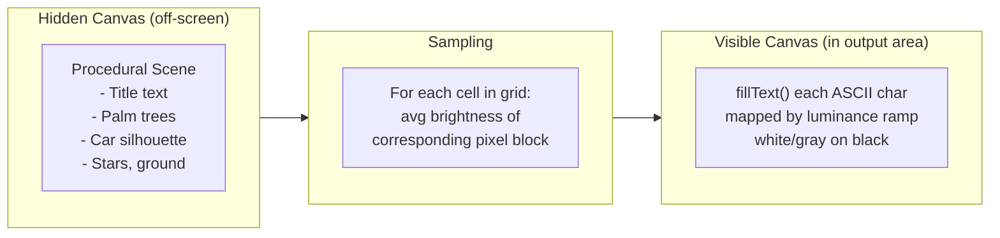

# ASCII Scene Renderer

## Technique Overview

The effect uses two canvases: a **hidden canvas** draws the procedural scene (shapes, text, motion), and a **visible canvas** samples the hidden one at grid resolution, maps each cell's average brightness to an ASCII character, and draws the result with `fillText()`. This is the same luminance-to-ASCII technique seen on [inceptionlabs.ai](https://www.inceptionlabs.ai/).

## Scene Composition

The procedural scene on the hidden canvas, all drawn with simple canvas 2D primitives (no external assets):

- **Background**: black with small scattered stars (random white dots, some twinkling)
- **Title** (upper third): "Discrete Diffusion LLM" rendered large. Animated with a **diffusion-style reveal** -- starts as random characters, progressively resolves letter-by-letter over ~3 seconds, holds for ~4 seconds, then fades back to noise and loops. Implemented by drawing the real text with variable per-character opacity (0 = hidden/noisy, 1 = resolved).
- **Ground**: a thin lighter strip along the bottom edge
- **Palm trees**: 3-4 silhouettes at fixed horizontal positions, simple trunk (filled rect) + frond arcs. Drawn in white/light gray so they register as bright ASCII.
- **Car**: a simple car silhouette (body rectangle + roof trapezoid + two wheel circles) that scrolls continuously from right to left, wrapping at the edges. Moves at ~60px/sec for a relaxed pace.

All shapes are drawn bold and thick so they survive the downsampling to ASCII resolution. Thin lines vanish.

## ASCII Conversion Pipeline (per frame)

1. `requestAnimationFrame` loop (~30-60 fps)
2. Draw the scene to the hidden canvas (same pixel dimensions as the visible canvas)
3. Call `getImageData()` on the hidden canvas
4. For each ASCII grid cell (col, row):
  - Compute the average brightness of the corresponding pixel block: `(R + G + B) / 3` averaged over all pixels in the block
  - Map to a character from the density ramp: `" .:-=+*#%@"` (space = black, `@` = brightest)
5. Clear the visible canvas (fill black)
6. Draw each character with `fillText()` at the grid position, in white/light gray

**Grid sizing**: computed from the visible canvas pixel dimensions and a target character cell size (~10x16 px per cell, matching a monospace aspect ratio). Recomputed on `resize` events.

## New File: `ascii_scene.js`

A self-contained module at [src/web/static/ascii_scene.js](src/web/static/ascii_scene.js) (~200-250 lines). Exposes two functions on `window`:

- `window.startAsciiScene(container)` -- creates both canvases inside `container` (the output area), starts the `requestAnimationFrame` loop
- `window.stopAsciiScene()` -- cancels the animation frame, removes canvases

Internal structure:

- `drawScene(ctx, time)` -- draws the procedural scene onto the hidden canvas
- `drawPalmTree(ctx, x, groundY)` -- draws one palm tree silhouette
- `drawCar(ctx, x, groundY)` -- draws the car silhouette
- `drawDiffusionTitle(ctx, time)` -- draws the title with diffusion reveal animation
- `asciiConvert(hiddenCtx, visibleCtx, cols, rows, cellW, cellH)` -- samples + renders ASCII

## Changes to Existing Files

### [src/web/static/index.html](src/web/static/index.html)

- Add `` before the existing `app.js` script tag
- Add a **Settings** link in the header nav (next to About / Help)
- Add a **Settings modal** (same pattern as the About/Help modals) containing:
  - "Idle Display" label with a `<select>` dropdown: "Default" (ASCII scene) | "donut.c" (spinning torus)

### [src/web/static/app.js](src/web/static/app.js)

- Add state variable: `var idleDisplayMode = "default"` (or `"donut"`)
- Add DOM refs for the Settings modal and the display mode `<select>`
- Refactor idle animation startup: replace direct `startDonut()` call at boot with a `startIdleAnimation()` dispatcher that checks `idleDisplayMode` and calls either `startDonut()` or `window.startAsciiScene(outputArea)`
- Refactor `stopDonut()` into a generic `stopIdleAnimation()` that stops whichever is running
- Wire the Settings modal open/close (same pattern as About/Help)
- On display mode `<select>` change: stop the current idle animation, update `idleDisplayMode`, start the new one (only if `!hasEverGenerated`)

### [src/web/static/style.css](src/web/static/style.css)

- Add `#output-area.scene-active` styling (same flex-centering approach as `.donut-active`, but the canvas fills the container)
- Style the `<canvas>` inside the output area: `width: 100%; height: 100%; display: block`
- Style the Settings modal select element (consistent with existing `#param-remasking` select)

## Files NOT Modified

- `src/web/server.py` -- no backend changes
- `src/inference/`* -- no changes (per project constraint)

## Performance Notes

- `getImageData()` is the bottleneck. For a canvas of ~1000x500 pixels, this is ~2MB of pixel data per frame. At 30fps this is well within budget for modern browsers.
- The ASCII grid will be roughly 100-130 columns by 30-40 rows (~4000 characters per frame). `fillText()` for each is fast.
- Using `requestAnimationFrame` instead of `setInterval` ensures smooth frame pacing and automatic throttling when the tab is backgrounded.
- The hidden canvas can be smaller than the visible one (e.g., half resolution) to reduce `getImageData` cost if needed, since the ASCII sampling discards detail anyway.

