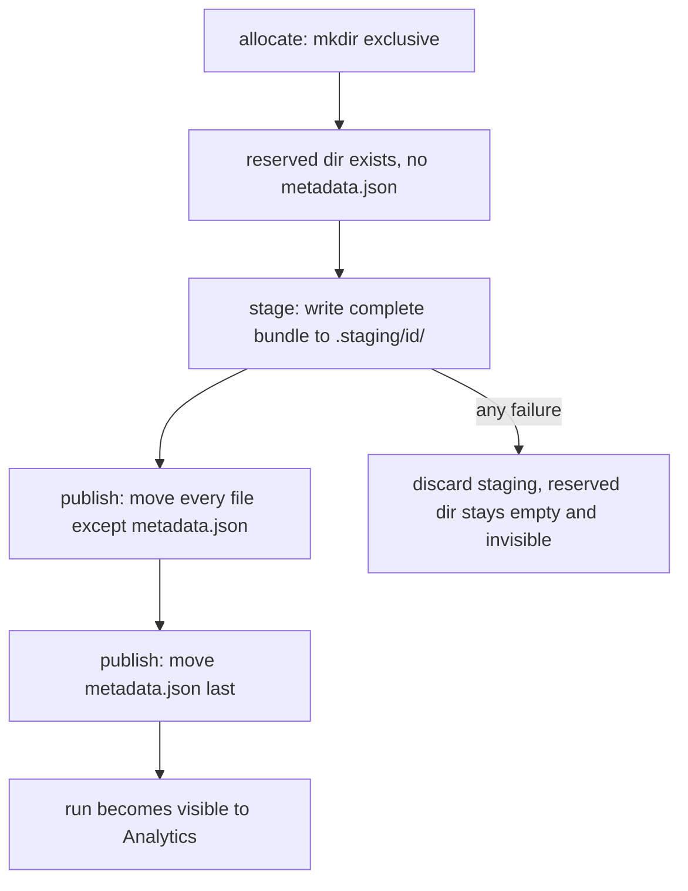

# Audit stage 3, pass one: the run-store boundary

Governed by [docs/audit/IMPLEMENTATION_BRIEF.md](docs/audit/IMPLEMENTATION_BRIEF.md), state in [docs/audit/IMPLEMENTATION_LEDGER.md](docs/audit/IMPLEMENTATION_LEDGER.md). This pass is `ORG-01` then `DATA-01`, stopping at that finding boundary. `DATA-05`, `DATA-04`, and `RUNTIME-02` are pass two.

Settled: no migration of the 180 existing runs; run IDs keep their shape with a `-2` suffix only on a real collision; `history.txt` becomes a human artifact with `frames.jsonl` as the machine format (pass two); `DATA-04` lands its envelope without a token.

Carried in: an uncommitted one-line ledger edit recording that the `META-02` clone test passed. It goes in the first commit here.

## 1. ORG-01: extract `run_store`, behavior preserving

New [src/web/run_store.py](src/web/run_store.py), importing only the standard library. The Verification clause asks for tests that run "without importing FastAPI or model libraries", so a test asserts exactly that by importing the module with `sys.modules` poisoned against `fastapi` and `torch`. That constraint is what forces the boundary to be real rather than nominal.

It owns the operations the finding names, over a plain `RunBundle` frozen dataclass rather than the FastAPI-coupled `SaveRunRequest`:

- `resolve_run_dir(root, run_id)`: the **one** guarded resolver. Today the same traversal check is copy-pasted into `_existing_run_dir` (server.py:1286), `_compute_run_frames` (1585), and `_delete_run_blocking` (1699), and is **missing entirely** from `_compute_run_metrics` (1521), which the DATA-03 ledger entry recorded as belonging to this stage. One resolver closes that gap. It also requires `metadata.json` to exist rather than just the directory, which matters once reserved directories exist in step 2.
- `allocate`, `write_bundle`, `publish`, `list_ids`, `delete`, `display_path`.

[src/web/server.py](src/web/server.py) keeps every route declaration and every Pydantic model. `_save_run_blocking` shrinks to: build metadata, build a `RunBundle`, call the store, render the GIF. That should take it well under the complexity ceiling it currently breaches at 22.

GIF rendering stays exactly where it is in this commit. Moving it is `RUNTIME-02`'s job and this commit changes no behavior.

## 2. DATA-01: publish transactionally

**The visibility barrier is `metadata.json`, not the directory.** Every reader treats a folder without `metadata.json` as not a run: [src/analytics/metrics.py](src/analytics/metrics.py) `list_runs` skips it silently at line 301. So a reserved-but-unpublished directory is already invisible, and moving `metadata.json` in last is the single atomic operation that publishes a complete bundle.

This is a small deviation from the Direction's "publish with one atomic rename" of the directory, and it is deliberate: renaming a directory onto a reserved name requires `rmdir` first, which opens a window where another thread can take the name. Publishing on the metadata rename has no such window. Recorded in the ledger.

The rest:

- **Allocation** keeps `YYYY-MM-DD_HH-MM-SS_model` and creates with `exist_ok=False`, retrying `-2`, `-3` up to a small bound. Exclusive `mkdir` is the atomic primitive, so exactly one caller can win a name.
- **Staging** lives at `<root>/.staging/<id>/`. Dot-prefixed entries get skipped explicitly in `list_runs` and in `_existing_run_ids` (server.py:1783), rather than relying on the accident that they contain no metadata.
- **In-place edits become compare-and-swap.** A `revision` integer goes in `metadata.json`; absent means 0, which is what all 180 existing runs are. The save request gains `expected_revision`, the response gains `run_id` and the new `revision`, and [src/web/static/app.js](src/web/static/app.js) retains it across the edit. A mismatch is rejected with 409 rather than silently winning. Replacement stages a complete fresh bundle, so a sidecar the new request omits is genuinely absent afterwards rather than lingering from the old bundle.
- **Deletion** renames into `<root>/.trash/` before `shutil.rmtree`, so a reader never observes a half-deleted run.

Note this is a save-response and save-request shape change, additive in both directions. The client and server change in the same commit.

## Tests

`tests/web/test_run_store.py`, driving the store directly with threads and `tmp_path`, no FastAPI:

- Path traversal through the one resolver: `../`, absolute paths, symlinks, and a name that resolves outside the root.
- Many same-model saves under a frozen clock, asserting distinct directories and no interleaving.
- A failure injected at each file in the bundle in turn: nothing published, no partial visible, staging discarded.
- Two replacements from one base revision: exactly one commits, and the loser's omitted sidecars are absent from the winner.
- A staging directory is invisible to `list_runs`.
- Legacy reads: a run with no `revision` is editable, treated as revision 0.
- The import-purity check described above.

The one Verification item I cannot honestly satisfy in-process is "kill the process mid-save". What I can prove is the property that matters after such a kill: a staging directory and a reserved empty directory are both invisible to Analytics. The ledger will say so plainly rather than claiming the clause is met.

## 3. Pulled forward: the parameter-key XSS

A separate small commit, first, because it is independent of everything above and is a security fix sitting in `DATA-05`'s territory two passes away.

[src/web/static/analytics.js](src/web/static/analytics.js) line 1808 concatenates saved metadata parameter **keys** into `innerHTML` with only `.replace(/_/g, " ")`, while escaping the values on the very next line. `metaRowHtml` a few lines down already escapes both, so the fix is to route through it. Requires a poisoned run folder, so the practical risk is low, but it is five lines and the surrounding code shows the author knew the rule.

## Verification

Per commit: `.venv/bin/python -m pytest`, `.venv/bin/python scripts/lint_ratchet.py`, `node --check` and `node --test tests/web/static/*.test.js` for the JS changes, and ReadLints.

Two things need your hardware at the pass boundary, both because they touch real saves against your 180 runs: save a fresh run and confirm it appears in Analytics with its GIF, and run a guided edit through Confirm to exercise the compare-and-swap replacement path. The automated tests cover the store; what they cannot cover is the full browser-to-disk round trip.

## Ledger

Updated in the same commit as each change. Deviations to record: the metadata-rename publication barrier and why it beats a directory rename, the traversal gap in `_compute_run_metrics` closed by the single resolver, the kill-mid-save clause and what was proven instead, and the XSS pull-forward.