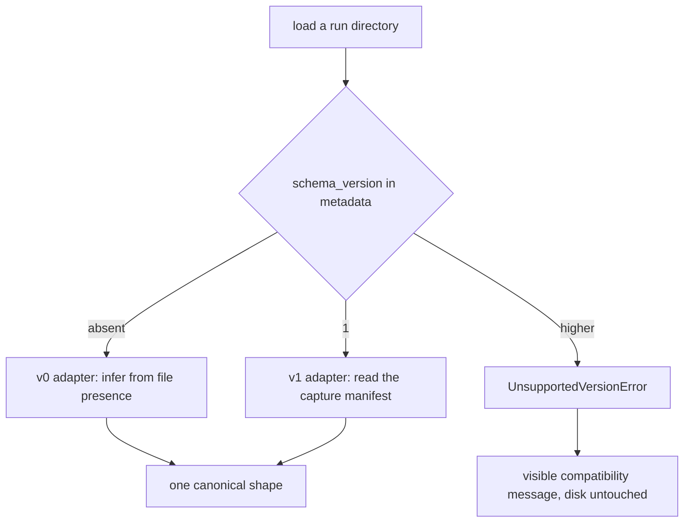

# Audit stage 3, pass two: version, provenance, and the GIF

Governed by [docs/audit/IMPLEMENTATION_BRIEF.md](docs/audit/IMPLEMENTATION_BRIEF.md), state in [docs/audit/IMPLEMENTATION_LEDGER.md](docs/audit/IMPLEMENTATION_LEDGER.md). Order: `DATA-05`, `DATA-04`, `RUNTIME-02`. `DATA-05` first because three Analytics findings are blocked behind it; `RUNTIME-02` last because it depends only on `DATA-01` and is the natural thing to drop if the session runs short.

Settled before pass one: no migration of the 182 existing runs, `history.txt` demoted to a human artifact with `frames.jsonl` as the machine format, `DATA-04`'s envelope without the validation token that `LIFE-03` owns. Settled now: the GIF samples temporally within a budget, labels the actual model, and a malformed run becomes a visible row rather than vanishing.

Carried in: a ledger line clearing `DATA-01`'s two hardware checks, which you confirmed. It goes in the first commit.

## 1. DATA-05: an explicit contract

### Reject unknown fields (own commit, small)

`extra="forbid"` on `SaveRunRequest`, `TokenRecord`, `TokenAlternative`, and `RemaskEdit` in [src/web/server.py](src/web/server.py). Today Pydantic's default silently drops an undeclared field, which the source and [tests/web/test_save_signals.py](tests/web/test_save_signals.py) both call out as a quiet data-loss path. The browser currently sends a clean payload, so nothing breaks; what changes is that the next agent who adds a signal to the client without the model gets a 422 instead of a run saved without it.

### Version, manifest, and the machine format (the core commit)

New metadata fields on save:

- `schema_version: 1`. Absent means v0, which is every existing run.
- `capture`: which signals this run actually recorded. Readers infer that today from file presence and from `isinstance(frame[0], dict)`, and combinations of optional signals are not a version.

New `frames.jsonl`, one object per line, carrying the frame text. `history.txt` keeps being written, unchanged, for a person to read. The forgery the finding describes is real and I verified it: `===== FRAME 0 =====` is written verbatim around model output and matched back with `^={5}\s+FRAME\s+\d+\s+={5}$`, so a model emitting that line splits a frame. New runs stop depending on it; the 182 existing ones keep the risk, which is the price of not migrating.

Version dispatch in [src/analytics/metrics.py](src/analytics/metrics.py), which is already the read boundary:

The canonical shape is what `load_run_frames` and the two server helpers already return, because the frontend is written against those payloads and should not have to change. The v0 adapter is today's behavior moved, not rewritten: roughly twenty inference points, and the subtle ones are the missing-file defaults, the first-populated-frame test for legacy id-only streams, the elapsed repair, and the truthy (not `is not None`) check on `canvas_index`.

`frames.jsonl` carries frame text and nothing more. `ANALYTICS-02` wants convergence from token counts rather than character counts, and adding that here would be doing its analysis early; a version scheme exists precisely so the next finding can extend the format cheaply.

Bundle validation goes into [src/web/run_store.py](src/web/run_store.py) between `stage` and `publish`, which is the seam `DATA-01` created for exactly this: metadata must be an object, must carry a version this code can write, and the manifest must match the files actually staged.

### Invalid runs and compatibility errors (own commit)

`list_runs` catches `JSONDecodeError` and `AssertionError` but not the `TypeError` that `data["run_id"] = ...` raises on a scalar `metadata.json`, so **one bad folder currently returns no catalog at all**, not one missing row. It becomes an entry: `{run_id, invalid: true, error}`. The table needs only `run_id` and degrades the rest to "N/A" already, so the row renders; opening it explains instead of charting. A run whose `schema_version` is from the future produces the same kind of entry with a version message, and nothing is written to disk.

### Fixtures

`tests/analytics/fixtures/` with golden bundles for each era the corpus actually contains, since a v0 adapter is only as good as the shapes it was checked against: a run with no `tokens.json` (9 of 182), one with tokens but no tokenizer block, one modern, and a v1 run. Each must load into one canonical result. Plus the cases the finding names: a delimiter line inside generated text round-tripping through `frames.jsonl`, scalar metadata becoming an invalid entry, and a future version refusing visibly.

## 2. DATA-04: provenance from the worker

The report says a run can be saved with another model's processor, versions, and tokenizer, and it is right. `_build_metadata` reads `manager.active_versions`, `manager.active_tokenizer`, and `manager.active_context_length`, all cached at `/health`, and `_describe_processor` reads `manager.active_device`, which is the device the supervisor **requested**.

Two corrections to the finding's picture, both narrowing it. DiffusionGemma refuses CPU outright rather than falling back, so the silent-fallback problem is LLaDA and SmolLM3 only. And SmolLM3 already stores its resolved device as `self.device`; LLaDA computes and discards it.

- Each backend records its effective device. `Backend.provenance_envelope()` returns model id, effective device, versions, tokenizer, and context length.
- The envelope rides the terminal frame. There are **six** places a `done` is constructed: four samplers plus two synthetic ones in [src/backends/llada_worker.py](src/backends/llada_worker.py) and [src/backends/dgemma_worker.py](src/backends/dgemma_worker.py) that bypass `FrameStreamer` entirely. Rather than edit six sites, `FrameStreamer` stamps the envelope onto any `done` it forwards, exactly as it already stamps `elapsed`, and the two synthetic sites route through one shared send helper.
- The browser stores it beside `lastRunPromptLen`, carries it through `saveSessionState` and `restoreSessionState` so a trip to Analytics does not lose it, and sends it as `provenance`.
- `_build_metadata` prefers the envelope and falls back to manager state when a request carries none, so a session snapshot taken before this change still saves.

No validation token, so the server records what the client sends. That is the agreed scope: the token is `LIFE-03`'s, and the envelope alone converts a confidently wrong reproducibility block into a correct one.

## 3. RUNTIME-02: bound the GIF

`history_to_gif` builds one 900x700 RGB image per frame and holds them all: 1.89 MB each, so about 242 MB at 128 frames and 3.87 GB at the 2,048-frame ceiling.

**A correction to the Direction, which says to stream frames into the encoder "where supported".** For GIF in Pillow it is not: `GifImagePlugin._write_multiple_frames` accumulates every frame in `im_frames` because delta encoding compares each against the previous. A generator is still worth passing, since it drops our RGB list and leaves only Pillow's palette-mode copies, cutting peak by roughly three quarters. But **the budget is the actual bound**, not streaming.

- `GIF_MAX_FRAMES` with even temporal sampling, always keeping the first and last frame. Set so a default 128-step run is untouched and only the experimental extremes are sampled, with the memory arithmetic in a comment.
- Frames are yielded from a generator rather than accumulated.
- The header takes the real model name instead of the hardcoded "LLaDA RESPONSE (Diffusion):" that currently labels DiffusionGemma and SmolLM3 output.
- Tests build synthetic histories at 128, 1,024 and 2,048 frames and assert the sampled count respects the budget, that first and last survive, and that the label follows the model. Peak RSS is measured rather than asserted tightly, since it is environment-sensitive.

## Verification

Per commit: `.venv/bin/python -m pytest`, `.venv/bin/python scripts/lint_ratchet.py`, `node --check` on changed JS, `node --test tests/web/static/*.test.js`, and ReadLints.

The read path gets exercised against the real corpus once, read-only: load all 182 runs through the adapters and assert every one produces a canonical shape. That is the strongest available check that v0 reproduces today's behavior, and it costs nothing to run.

At the pass boundary you would need: a save and a guided edit again (the metadata shape changes), one run per model to confirm the provenance block names the right processor and tokenizer, and a look at a GIF from a long run to judge whether sampled playback reads well.

## Ledger

Updated in the same commit as each change. Expected deviations: Pillow's encoder not supporting streaming the way the Direction assumes, the catalog crash being total rather than per-row, DiffusionGemma having no fallback to attest, and `frames.jsonl` deliberately carrying no token counts.