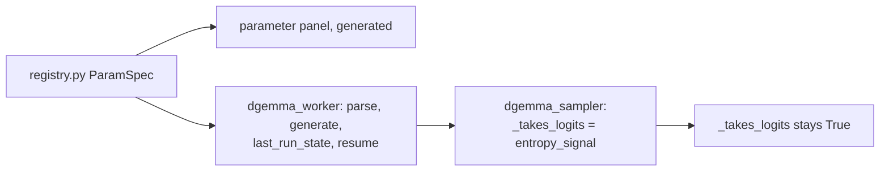

# Stop making DiffusionGemma's confidence optional

## Why the toggle has to go

It is misnamed, and that is most of the case. It emits argmax
confidence, not entropy: DiffusionGemma never writes an `e` field at
all, and a saved run carries exactly `t`, `m`, `id`, `c`. So the
switch does not pick between two signals. It picks whether the
primary confidence channel exists, the one that mask opacity, the
Heatmap and the candidate reveal all read, and a run without it is
not cheaper, it is a run with a hole where the measurement goes.

## Order of operations: make it cheap, then delete the gate

The gate protects a real number, so answer that first or the deletion
is a bet on one machine's headroom.

```144:156:src/inference/dgemma_sampler.py
    @staticmethod
    def _from_logits(
        logits: torch.Tensor,
    ) -> tuple[List[int], List[float]]:
        tensor = logits
        if hasattr(tensor, "dim") and tensor.dim() > 2:
            tensor = tensor[0]
        probs = torch.softmax(tensor.float(), dim=-1)
        conf, ids = probs.max(dim=-1)
```

At 256 positions by roughly 262K vocabulary that softmax is about
256 MiB, and `.float()` copies before it, so peak transient is around
half a gigabyte per denoising step.

Max probability needs neither tensor. It is
`exp(max_logit - logsumexp(logits))`, two reductions, and chunking
over positions bounds the transient to one slice: at 32 positions a
chunk that is roughly 33 MiB, a 16x reduction. It is also the
numerically stable form, and it generalises to entropy and top-k,
which is `ROADMAP-03`'s stated direction ("numerically stable
reductions over logits ... without retaining a full probability
tensor longer than required").

Test it by equivalence: on a small random tensor the chunked result
must match `torch.softmax(...).max(-1)` to within float tolerance,
with a chunk size that does not divide the canvas evenly so the
ragged tail is exercised.

## Then the gate, which is eight sites and no migration



- [src/backends/registry.py](src/backends/registry.py): drop the
  `entropy_signal` `ParamSpec`. The panel is generated from
  `param_specs`, so the control disappears with it and no frontend
  work is needed.
- [src/backends/dgemma_worker.py](src/backends/dgemma_worker.py):
  four sites, at the request parse, the generate call, the
  `last_run_state` record, and the resume call.
- [src/inference/dgemma_sampler.py](src/inference/dgemma_sampler.py):
  two `streamer._takes_logits = entropy_signal` assignments become
  unconditional, and the two `entropy_signal` parameters go.

`_takes_logits` itself stays. It is a transformers protocol
attribute, and `put_draft` must keep handling both shapes because the
library decides what it hands over.

No migration. The Analytics detail panel renders params
model-agnostically and `_compare_label` skips specs it cannot find,
so the runs already saved with the signal off keep displaying it.

## And the stability proxy, which is the real cleanup

With logits always arriving, the stability branch in `_emit` is
unreachable:

```183:190:src/inference/dgemma_sampler.py
            if conf_override is not None:
                conf = float(conf_override[i])
            elif committed:
                conf = 1.0
            else:
                conf = min(
                    self._stable[i] / STABLE_WINDOW, 1.0
                )
```

Removing it strands `_stable`, which is also carried in the resume
checkpoint. It goes too, and the reason is not that unread state is a
smell. The ROADMAP justifies keeping it by saying the revision glow
has `_prev` and `_stable` "already in hand", but that is the wrong
layer: `overlaysComputeCommitSteps` already derives a per-position
temporal quantity from nothing but the frame stream, every token
record carries `id` on every frame, and the client holds the pre-edit
run too. Leaving the counter in the sampler would send whoever builds
that feature looking in the wrong place.

Sites: `_stable` and `STABLE_WINDOW`,
`DgemmaFrame.stable` and its `nbytes`, the assert in
`_record_checkpoint`, the restore in `restore()`, the reset in
`put()`, and the assertions in
[tests/inference/test_dgemma_resume.py](tests/inference/test_dgemma_resume.py)
and [tests/inference/test_checkpoint.py](tests/inference/test_checkpoint.py).
`DgemmaFrame` keeps its class, since `FramePayload` discriminates on
it; it just keeps only `seen_revealed`. `_prev` is untouched, because
it derives the mask flag and has nothing to do with confidence.

Two behavioural notes worth pinning with tests rather than
discovering. The no-logits path in `put_draft` survives as the
library contract, and with the stability branch gone it must write no
`c` at all for an unsettled position, which the existing gate already
does and which the new opacity curve draws as solid. And `mean_conf`
stops mixing two quantities: it becomes a true mean over real
probabilities on every frame, where today it is a stability average
or a probability average depending on a switch.

## Docs

- README and the Help modal (`#modal-help`) lose the toggle and the
  "stability proxy" explanation, and gain a plain statement that
  DiffusionGemma reports true max-softmax confidence.
- [docs/MANUAL_VERIFICATION.md](docs/MANUAL_VERIFICATION.md): four
  items gate on the signal, at lines 1625, 1645, 1778 and 1845. Each
  needs its condition dropped, and 1845 needs care, because "a run
  with the signal off draws solid masks" stops being reproducible
  and becomes a statement about already-saved runs only. New items
  for a DiffusionGemma run after the change, and for a resumed edit,
  since the checkpoint shape changed.
- Comments in [src/web/static/overlays.js](src/web/static/overlays.js)
  and the two mask tests name "DiffusionGemma without the Entropy
  Signal" as a live source of absent `c`. It becomes a historical
  one: going forward only LLaDA's opening frame and older saved runs
  produce it.
- [docs/audit/IMPLEMENTATION_LEDGER.md](docs/audit/IMPLEMENTATION_LEDGER.md)
  gets a note, since the cheap reduction is a down payment on
  `ROADMAP-03`. `AUDIT_REPORT.md` is not edited; the report stands.

## ROADMAP, which carries three corrections beyond this change

- Mark the accepted direction done, and record that the toggle was
  misnamed rather than merely redundant.
- Correct the revision-glow entry, which points at `_prev` and
  `_stable` in the sampler when the data belongs in the client
  alongside `overlaysComputeCommitSteps`.
- Scope the flicker onto layer three of the candidate-reveal entry,
  as a second rendering of the same capture rather than a new item:
  the measured 24x step-rate gap (LLaDA 40ms per step against
  DiffusionGemma 960ms, so five candidates get 8ms and 192ms
  respectively), the display clock separated from the data clock,
  latch and smooth both built for comparison, capture rate tied to
  display rate rather than step rate, the duty cycle self-selecting
  so a cap is a motion budget rather than a selection rule, reduced
  motion as a hard requirement, and the reserved-width tension that
  makes flicker and reveal alternatives rather than stackable.
- Add the remasking ablation to settled decisions, beside the entropy
  one: same prompt and step count, median top-1 among masked
  positions 0.145 under `low_confidence` against 0.992 under
  `random`, because low-confidence remasking defines the masked set
  as the low-confidence tail. Note what was not controlled, since
  both runs used seed -1 and both carry an edit. Include the
  consequence, that the strategy would show up as how much a
  flickering canvas moves: 63 positions in visible motion per frame
  against 15.
