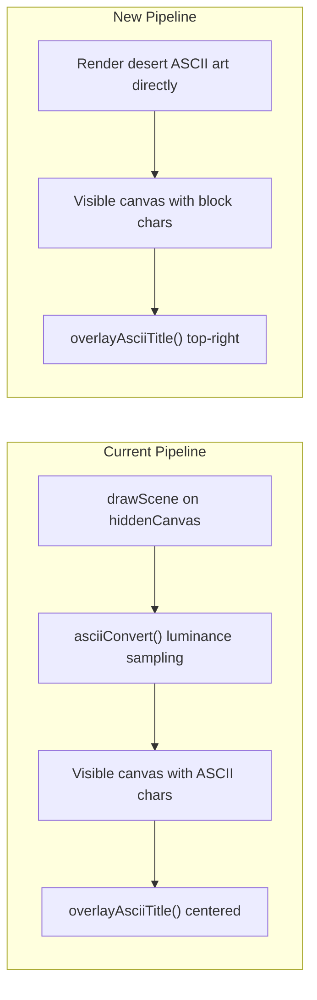

# Desert ASCII Scene Overhaul

## Current Architecture

The welcome screen in `[src/web/static/ascii_scene.js](src/web/static/ascii_scene.js)` uses a two-canvas pipeline:

1. **Hidden canvas** -- procedural shapes (car, palms, seagulls, sun/moon, stars) drawn with Canvas 2D API
2. **Luminance sampling** -- `asciiConvert()` reads pixel brightness from hidden canvas, maps it to a density ramp (`" .:-=+*#%@"`), and renders ASCII chars on the visible canvas
3. **Title overlay** -- `overlayAsciiTitle()` renders the "Diffusion LLM" text centered at the top with a diffusion-reveal animation




## Feasibility

The desert art in `[ascii-art(4).txt](ascii-art(4)`.txt) is **35 lines x ~119 characters**. At the current cell size of 10x16 px, a typical 1200x560 output area gives ~120 cols x 35 rows -- an almost exact match. The block characters (░▒▓█) each carry inherent "density" that maps directly to brightness, so the hidden canvas and luminance-sampling step can be eliminated entirely.

## Changes Required

### 1. Rewrite `ascii_scene.js` -- remove procedural scene, render static art

**Remove entirely:**

- `drawStars()`, `drawGround()`, `drawSeagulls()`, `drawCelestialBody()`, `drawPalmTree()`, `drawCar()`, `drawScene()`
- All associated state: `stars[]`, `seagulls[]`, `PALM_POSITIONS`, `CAR_SPEED`, `CELESTIAL_CYCLE`, `STAR_COUNT`, `SEAGULL_COUNT`
- `asciiConvert()` -- no longer needed since we render chars directly
- The hidden canvas creation and management

**Add:**

- `DESERT_ART` -- embed the 35-line ASCII art as a JS string array (from `ascii-art(4).txt`)
- A character-to-brightness map for the block chars:

```javascript
var CHAR_BRIGHTNESS = {
  " ": 0.0,
  "░": 0.25,
  "▒": 0.50,
  "▓": 0.75,
  "█": 1.0,
};
```

- `renderDesertArt(vCtx, cols, rows, cellW, cellH, time)` -- iterates over `DESERT_ART`, centers it on the canvas grid, and draws each character with the green tint (`rgba(0,255,65, brightness)`) directly on the visible canvas. A subtle time-based shimmer (e.g. `+/- 0.03 * sin(time)` per cell) would keep the scene from feeling completely static.

**Simplify the frame loop:**

- Remove hidden canvas entirely -- only the visible canvas is needed
- Frame function: clear visible canvas -> `renderDesertArt()` -> `overlayAsciiTitle()`

### 2. Move "Diffusion LLM" title to top-right

In `overlayAsciiTitle()`, change the horizontal positioning from centered:

```javascript
// Current: centered
var startCol = Math.floor((cols - TITLE_WIDTH) / 2);
```

To right-aligned with a small margin:

```javascript
// New: top-right with ~2-column right margin
var startCol = cols - TITLE_WIDTH - 2;
if (startCol < 0) { startCol = 0; }
```

`startRow` stays at `1` (top). The diffusion reveal animation is kept as-is.

### 3. Scaling strategy

When the canvas grid is larger than the 35x119 art:

- **Vertically**: center the art rows in the grid, leaving dark rows above/below
- **Horizontally**: center the art columns, leaving dark columns on the sides

When the grid is smaller (narrow window):

- Clip the art to fit, anchoring from top-left (the cactus and foreground stay visible)

### 4. No changes needed

- `[src/web/static/style.css](src/web/static/style.css)` -- the `scene-active` and `#ascii-scene-canvas` rules work as-is
- `[src/web/static/app.js](src/web/static/app.js)` -- `startAsciiScene()`/`stopAsciiScene()` API is unchanged
- `[src/web/static/index.html](src/web/static/index.html)` -- no structural changes

## Animation Considerations

The old scene had constant motion (car scrolling, palms swaying, sun/moon arc, seagull flight). The new static art will be less animated, but two elements provide visual interest:

- The **title diffusion reveal** continues cycling (3s reveal, 4s hold, 2s fade)
- A **subtle brightness shimmer** on the desert art simulates heat haze

If more animation is desired later, we could add a slow parallax drift or a twinkling effect on the lighter (sky) regions.