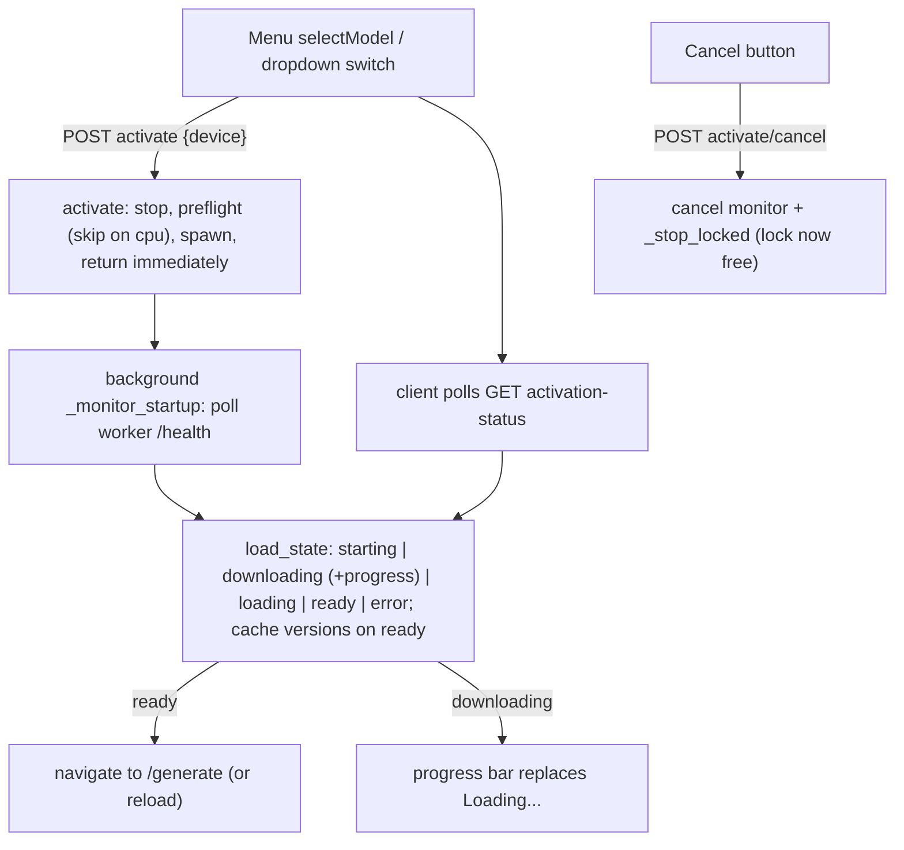

# Device-aware Activation and UX Refinements

Follow-ups to Phase A, grouped into commit-sized units on top of one shared foundation. Ordered so each group is independently shippable and validated.

## Findings that shape this

- SmolLM3 and LLaDA download weights identically (`from_pretrained` auto-download from the HF Hub on first activation); DiffusionGemma is the local pre-quantized exception. The prior slowness was the ~6 GiB first-time SmolLM3 download. Nothing to change in the download mechanism; the transformers-embedded modeling code is an advantage over LLaDA's `trust_remote_code`. The improvement is a progress bar (benefits LLaDA too).
- The VRAM-on-close leak is rooted in blocking activation: `manager.activate` holds `_lock` through `_await_health` (up to 180s), so the shutdown hook's `manager.stop()` cannot terminate a still-loading worker; the daemon supervisor thread is then killed after `desktop.py`'s 35s join, orphaning the worker. Making activation non-blocking removes the held lock and fixes this; `PR_SET_PDEATHSIG` is the belt-and-suspenders.
- Toggle highlight bug is pure CSS specificity: `.menu-device-btn:hover:not(:disabled)` (0,3,0) outranks `.menu-device-btn.is-active` (0,2,0) at [style.css:2321-2327](src/web/static/style.css).

## Foundation: track and expose the active device (all groups depend on this)

- `ModelManager` ([server.py](src/web/server.py) ~232-237): add `active_device: Optional[str]`, set in `activate` (from the resolved device) and cleared in `_stop_locked`.
- `_models_snapshot` ([server.py](src/web/server.py) ~449-486): add `active_device`, `cpu_name`, `free_ram_gib`. New module helpers `_cpu_name()` (read `/proc/cpuinfo` "model name", fall back to `platform.processor()`) and `_free_ram_gib()` (via `psutil`, already pinned in [requirements.txt](requirements.txt)). Supervisor stays torch-free.

## Group 1: quick, low-risk UX + Analytics processor

- **Toggle CSS**: change the hover selector to `.menu-device-btn:not(.is-active):hover:not(:disabled)` so the active (green) state wins while hovered.
- **Menu system readout** ([menu.js](src/web/static/menu.js) `renderSystem` 83-106, [menu.html](src/web/static/menu.html) 40-45, [style.css](src/web/static/style.css) `.menu-system` 2161): render a GPU line and a CPU line (name + free RAM), styled like the analytics chart headers ([analytics.css:300-306](src/web/static/analytics.css): 10px, `--accent`, uppercase, letter-spaced). Format: `GPU  <name> - <free> GiB free` / `CPU  <name> - <free> GiB free`.
- **Diffusion GPU tags** ([menu.js](src/web/static/menu.js) `buildRow`): a static, non-interactive green `GPU` pill (a span reusing `.menu-model-device` / `.menu-device-btn.is-active`) on LLaDA and DiffusionGemma rows, in the AR toggle's position.
- **Analytics Processor column**: persist `processor` ("GPU"|"CPU") and `processor_name` in `metadata.json` from `manager.active_device` + `_gpu_name()`/`_cpu_name()` (`_save_run_blocking` [server.py](src/web/server.py) ~703-737). Add `<th data-key="processor">Processor</th>` after Model in [analytics.html](src/web/static/analytics.html) (72-89); add `"processor"` to `TABLE_KEYS` ([analytics.js:512](src/web/static/analytics.js)) and a `paramVal` case returning `run.processor || "Unknown"`; add to Group By options ([analytics.js:1956](src/web/static/analytics.js)).
- **Per-run timing header** ([analytics.js](src/web/static/analytics.js) `renderTimingChart` 1246-1258): use the opened run's `processor_name` (from the `run` passed to `loadRunCharts`), falling back to the global `gpuName` for older runs.
- **Docs**: note in README/HANDOFF that weights auto-download from HF on first activation and what "Resident" means.

## Group 2: device-aware bounds + Generation-page device dropdown

- **Device-aware `ParamSpec` bounds (general mechanism)**: add an optional `overrides: Dict[str, DeviceBounds]` to `ParamSpec` ([protocol.py](src/backends/protocol.py) 27-42), where a device key ("cpu") may override `default`/`recommended`/`experimental`. SmolLM3 `max_new_tokens` gets `overrides={"cpu": {default:128, recommended:(16,128)}}` ([registry.py](src/backends/registry.py)). Client `activeLimits()` ([app.js:482-499](src/web/static/app.js)) and the default/`buildParamInput` path pick the override for `active_device`; the worker's validation uses the same override (replacing the hardcoded `_CPU_MAX_NEW_TOKENS` clamp in [smollm3_worker.py](src/backends/smollm3_worker.py)). Transparent, and future params can opt in.
- **Dropdown device tags + uniform confirm**: `renderModelSelector` ([app.js:419-437](src/web/static/app.js)) renders each option with a right-aligned device control (static `GPU` pill for diffusion, `GPU/CPU` toggle for AR) matching the Analytics/menu pills; the collapsed value shows the current model + device. Any switch (different model, or a device toggle, per your decision) opens a small confirm popover near the dropdown with a memory estimate (`~N GiB VRAM` from `min_vram_gib`, or `~6 GiB RAM` for CPU) and green-check / red-X. Confirm calls `switchModel(id, device)` (extended to pass device); the option-click handler ([app.js:3321-3331](src/web/static/app.js)) routes through the popover instead of switching immediately.

## Group 3: non-blocking activation, cancel, and download progress

- **Non-blocking `manager.activate`** ([server.py](src/web/server.py) ~266-330): under `_lock`, stop current + preflight + spawn + set `active_id`/`active_device`/`_port`, then return without awaiting health. Launch `self._monitor_task = asyncio.create_task(self._monitor_startup(proc, port))` which polls the worker `/health`, maps it to `load_state` + `load_progress`, caches `active_versions` on ready, and records `load_error` on failure/exit. The lock is no longer held during load, which fixes the shutdown deadlock/leak.
- **Endpoints**: `POST /api/models/{id}/activate` returns `{ok, state:"starting"}`; `GET /api/models/activation` returns `{active, device, state, progress, message}`; `POST /api/models/activate/cancel` cancels the monitor task and calls `_stop_locked` (terminating the worker, freeing VRAM).
- **Worker `/health` downloading state** ([worker_base.py](src/backends/worker_base.py) 137-165): read an optional `backend.load_progress`; report `downloading` (+ `progress`) when set and not ready, else `loading`. A shared helper (e.g. `src/inference/hf_download.py`) runs `snapshot_download(repo_id, tqdm_class=...)` before `from_pretrained`, updating `self.load_progress`; wired into [smollm3_worker.py](src/backends/smollm3_worker.py) `load` and [llada_worker.py](src/backends/llada_worker.py) `load` (DiffusionGemma is local, no download). Cached models skip straight to `loading`.
- **Menu + switch UI**: `selectModel` ([menu.js](src/web/static/menu.js) 338-370) posts activate then polls `activation-status`, rendering a progress bar (downloading) or the existing Loading cycle (loading), with a Cancel button that hits the cancel endpoint and resets the row; navigates on ready, shows the error on failure. `switchModel` ([app.js:853-884](src/web/static/app.js)) uses the same poll-then-reload flow.
- **Orphan safety net**: spawn the worker with `start_new_session=True` and a `preexec_fn` setting `prctl(PR_SET_PDEATHSIG, SIGTERM)` (Linux) so a hard-killed supervisor never leaves a worker holding VRAM.

## Verification

- In-sandbox: `.venv/bin/python -m py_compile` changed modules, `node --check` changed JS, `.venv/bin/python -m pytest`, ReadLints.
- Manual (needs GPU/model): toggle highlight flips instantly; menu shows GPU+CPU lines and diffusion GPU tags; activate with a fresh cache shows a download progress bar and a working Cancel that frees VRAM; closing the window mid-load leaves no orphaned worker; CPU run's `max_new_tokens` field caps at 128 (GPU at 256); dropdown device switch confirms with a memory note and reloads; Analytics shows a Processor column and the timing header reflects CPU/GPU name per run.