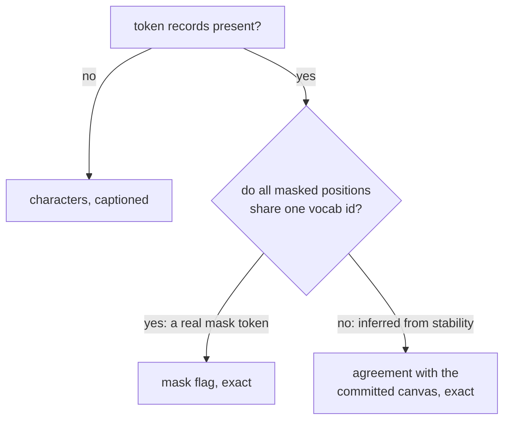

# Two readings of a diffusion run that are currently wrong

Both are read-path work on the generator and Analytics. Neither touches a worker, a sampler or the saved-run format, so both are verifiable in the sandbox and both apply retroactively to all 222 saved runs.

## Commit 1: convergence measures settlement

The defect is recorded in the ledger from your hardware pass. For DiffusionGemma the chart reads 90.2% resolved on a canvas where 8.6% of positions hold what the canvas commits and the model's mean confidence in those same tokens is 0.165. The model has no mask token, so `_emit` in [dgemma_sampler.py](src/inference/dgemma_sampler.py) infers resolution from a position holding the same id as the previous step. Stability, not settlement, and the filler doing it is the model's highest-frequency token.

**The design is settled by measurement, not preference.** Two candidate measures, each correct for exactly one model:

- **LLaDA's mask flag is ground truth.** All 8,379 masked positions in a sampled run carry a single vocab id (126336) and a single glyph. Nothing to improve.
- **Agreement-with-committed is wrong for LLaDA.** On your edited run it starts at 18.1% rather than 0%, because the 18.1% of positions still masked at the end trivially agree with the end from frame zero. That rules out the single unifying measure I proposed earlier.
- **Agreement is right for DiffusionGemma**, where no masks remain at a canvas boundary, so the spurious floor cannot arise.

So the reader picks per run, and asks the run's own data rather than a registry:



That test needs no new stored field and no registry change, and it degrades safely: a run with no masked positions at all falls to the mask-flag path and gets the same answer either way.

Work in [metrics.py](src/analytics/metrics.py):

- A `masks_are_real(token_frames)` predicate implementing the id test.
- A `convergence_from_settlement(token_frames, canvas_index)` counting agreement against each canvas's own final frame. DiffusionGemma commits per canvas, so a run-wide final would measure canvas 1 against canvas 4's content. `canvas_index` is already saved and already threaded into `_run_convergence` for the throughput series.
- A third basis alongside the existing two, so the caption in [analytics.js](src/web/static/analytics.js) can distinguish "exact, from the mask" from "exact, from settlement" from the character fallback.

**Deliberately not changed: the throughput numerator.** It reads `mask_count` off the convergence series today, so moving convergence to agreement would silently move throughput too. That would re-break what item 174 just confirmed: the live footer sums the sampler's own reveal counts and cannot know agreement, which is retrospective, so the two would disagree again. The charts answer different questions, one about how settled the canvas is and one about how fast the model is producing, and the captions should say so. `tokens_produced_series` therefore keeps taking the stability-based counts, which means passing it the mask-flag series even when the chart shows the settlement one.

Tests: agreement is exact on a synthetic canvas; the id test separates a real-mask fixture from an inferred one; per-canvas boundaries are respected; the LLaDA path is unchanged, pinned against the 18.1% floor that made agreement wrong there; throughput is unchanged for a run whose convergence basis moved.

## Commit 2: the step readout follows the scrubber

```1739:1739:src/web/static/app.js
  statusStep.textContent = displayStep;
```

That line and the session restore are the only two writes. `navigateToFrame` updates `scrubberLabel`, the "Frame N / M" text, and nothing else, so a finished DiffusionGemma run sits on "Step 87, Canvas 4" whichever frame is showing.

- Extract the readout into one helper taking a frame index, used by both the live path and the scrub path, so they cannot drift.
- `runFrames.canvasIndex` is already per frame, which covers the DiffusionGemma half.
- The LLaDA and autoregressive half needs the step total, which is currently read off `data.total_steps` and discarded. Capture it into a `lastRunTotalSteps` alongside the existing `lastRunPromptLen` and `lastRunProvenance`, and add it to the session snapshot so scrubbing still works after a trip to Analytics.
- Check the resumed-run case against `resumeFrameOffset` while implementing: the array index and the sampler's own step number agree today, and the helper should not be the thing that assumes it.

Tests: a source-inspection test in the established style asserting one helper owns the readout, that `navigateToFrame` calls it, and that the total survives the snapshot.

## Commit 3: records

- Mark both found-while-verifying entries in [IMPLEMENTATION_LEDGER.md](docs/audit/IMPLEMENTATION_LEDGER.md) done, keeping the mechanism and adding the counter-evidence that killed the single-measure idea, since that is the part a future session would otherwise retry.
- Correct the README caveat written last session. It currently says counting is exact while what is counted is stability, which stops being true here.
- Note in ROADMAP that the candidate-reveal and adaptive-stopping items still want the `c`-on-unresolved capture change; nothing in this session provides it.
- Manual items: convergence on a multi-canvas DiffusionGemma run should now climb rather than spike to 90% and sawtooth, an LLaDA run's curve must be unchanged, throughput must still match the generator footer, and the step readout must track the scrubber on all three models.

## Verification

`.venv/bin/python -m pytest`, `.venv/bin/python scripts/lint_ratchet.py`, `node --check` on changed JS, `node --test tests/web/static/*.test.js`, ReadLints. Worth re-running the archive measurement from last session as a regression: the catalog should still be about 71 KiB over 222 runs.