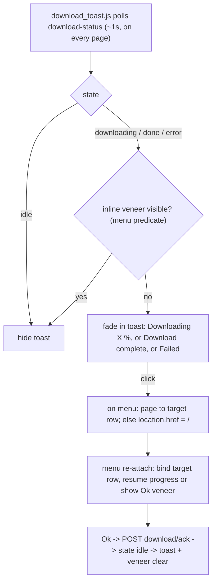

## Why this works (from the code)

The download is already a global, server-side, I/O-only task (`_download_task`, [server.py](src/web/server.py) 621-672) that survives navigation; `GET /api/models/download-status` returns `{ target, state, progress, message }` (977-987). The only gaps are client-side: the veneer/progress is per-row per-page and not re-attached, and the server leaves `download_state="done"` forever (`_run_download` 670-672; `completeDownload` never acks, [menu.js](src/web/static/menu.js) 937-953). Concurrent activation of a different model is already permitted and safe (independent task/lock, and only already-downloaded models are activatable, so no double-fetch).

## Backend ([server.py](src/web/server.py))

- **Ack endpoint**: add `POST /api/models/download/ack` -> `manager.ack_download()` that, only when `download_state in {done, error}`, resets `download_state="idle"` and clears `download_target` / `download_progress` / `download_error` (no-op mid-download). Mirrors `cancel_download` (674-691) but does not touch the task.
- **Toast label**: add `target_name` to the `download-status` payload (983) via `REGISTRY[self.download_target].display_name`, so the toast can say "Downloading LLaDA-8B... 42%".
- **Verify (decision 2)**: confirm `manager.activate` (~469-548) reads/writes only `load_*` / `active_*`, never the `download_*` fields, so concurrent activation is safe. Expected: no change.

## Shared toast module (new [src/web/static/download_toast.js](src/web/static/download_toast.js))

A dedicated, self-initializing module included on all four pages (after `overlays.js`): [index.html](src/web/static/index.html), [menu.html](src/web/static/menu.html), [analytics.html](src/web/static/analytics.html), [settings.html](src/web/static/settings.html).

- Polls `/api/models/download-status` (~1s); creates a `#download-toast` element on `document.body` (upper-right, app aesthetic, fade in/out; styled via a `.download-toast` class in [style.css](src/web/static/style.css)).
- Shows when `state in {downloading, done, error}` AND an optional inline-visibility predicate returns false; hides otherwise. Content per state: "Downloading `target_name` X%", "Download complete", "Download failed".
- Click handler: if a menu-registered `navigateToTarget` callback exists (we are on the menu), call it (page to the row, no reload); else `location.href = "/"`.
- Exposes: `downloadToastRegisterInlineCheck(fn)`, `downloadToastRegisterNavigate(fn)`, `downloadToastRefresh()` (force immediate re-eval on menu page/confirm changes), and `downloadToastAck()` (POST ack helper).

## Menu ([src/web/static/menu.js](src/web/static/menu.js))

- **Re-attach on load**: after `renderModels` in `loadModels` (~1078), call `reattachDownload()`: fetch download-status; if a `target` is downloading/done/error, set `currentPage` to the target's page, `renderCurrentPage()`, then bind the target row: downloading -> ensure veneer, `downloadRow = li`, resume `pollDownload`; done -> build a veneer if the (now-downloaded) row lacks one and `showVeneerMessage("...successful...!", false, ok)`; error -> `showVeneerMessage(..., true, ok)`.
- **Keep inline binding in sync** on every `renderCurrentPage` and confirm begin/end: if the download `target` is on the current page and not confirm-collapsed, (re)bind it; otherwise unbind (`downloadRow = null`). Then call `downloadToastRefresh()`.
- **Register predicates**: `downloadToastRegisterInlineCheck(() => !!downloadRow && !confirming)` and `downloadToastRegisterNavigate(pageToDownloadTarget)`.
- **Ack wiring**: `completeDownload` (937) and the re-attach/error Ok callbacks call `downloadToastAck()` before/after removing the veneer, so the server clears to idle and the toast disappears.
- **Decision 1**: keep A's Cancel button as-is (no gating added). Concurrent activation stays allowed (no guard added); the inline-visibility predicate already returns false during a confirm, so the toast correctly appears while A's row is collapsed by B's confirm.

## Verification

- In-sandbox: `node --check` on `menu.js` / `download_toast.js`; `.venv/bin/python -m py_compile src/web/server.py`; `.venv/bin/python -m pytest`; ReadLints. A quick TestClient-free check that `download-status` returns `target_name` and that the ack endpoint clears `done`.
- Manual (hand back): start a download, navigate to Analytics/Settings/Generation and page away on the menu -> toast fades in with live %; return to the menu / target page -> toast fades out and the inline bar resumes; on completion while away -> toast reads "Download complete", clicking it opens the menu on the target row's "Ok" veneer, and Ok removes the veneer and clears the toast; start activating a different (downloaded) model mid-download and confirm both proceed with no breakage.

## Notes

- This is a new feature on top of the still-uncommitted menu work (Settings page, commit-order overlay, pagination, gear). Recommend committing that first (its own docs pass) so this lands as its own cohesive commit.
- Docs (`HANDOFF.md` / `README.md` / `ROADMAP.md`) update after validation, then a commit; no push.