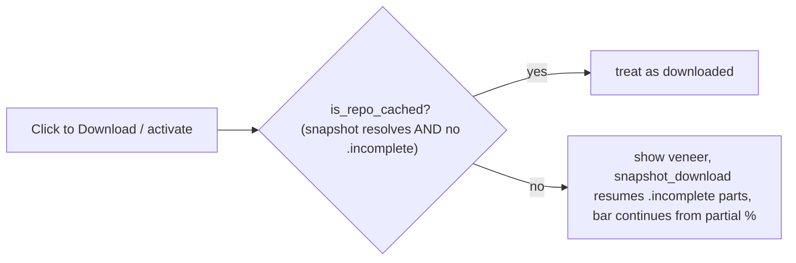

## 1. Toast placement + magnetic drag ([download_toast.js](src/web/static/download_toast.js), [style.css](src/web/static/style.css))

- **Default lower-left**: change `.download-toast` from `top: 20px; right: 24px` to `bottom: 20px; left: 24px` so it clears the header nav on every page.
- **Drag + snap**: in `download_toast.js`, add pointer handlers on the toast. `pointerdown` records the start; `pointermove` past a ~5px threshold sets `dragging = true`, adds an `.is-dragging` class (`transition: none`) and positions the toast under the pointer (inline `top`/`left`, clearing `bottom`/`right`); `pointerup` computes the toast center's screen quadrant (`cx < innerWidth/2 ? left : right`, `cy < innerHeight/2 ? top : bottom`), calls `applyCorner(corner)` (sets the matching inline offsets, clearing the others) which animates via the existing CSS transition, and persists the corner. Reconcile with the existing click-to-navigate via a `justDragged` flag that suppresses the click fired right after a drag.
- **Persist the corner**: add `"diffusion_download_toast_corner"` to `PERSIST_KEYS` ([overlays.js](src/web/static/overlays.js) 234) and to `UI_STATE_KEYS` ([ui_state.py](src/web/ui_state.py) 33, small max length). On init, `applyCorner` from `localStorage` (default `bottom-left`); on drop, `persistSet(CORNER_KEY, corner)`. `persistSet` is already global (loaded before this module).

## 2. Remove Cancel + harden partial-cache detection (the real fix)

Cancel cannot truly stop the daemon-thread fetch, and a partial cache is misread as complete, so an interrupted download bricks the row (looks downloaded, hangs on load).

- **Completeness helper** ([hf_download.py](src/inference/hf_download.py)): add `_has_incomplete(blobs_dir)` (any entry name ends with `.incomplete`) and `is_repo_cached(repo_id)` (returns True only if `snapshot_download(local_files_only=True)` succeeds AND `not _has_incomplete(_repo_blobs_dir(repo_id))`). Use it in the fast path (replace the bare `snapshot_download(local_files_only=True)` at lines 118-122): only fast-return when `is_repo_cached`, else fall through to the fetch, which resumes the `.incomplete` parts and the disk-size poller continues from the partial size.
- **Snapshot gate** ([server.py](src/web/server.py) `_is_downloaded` 311-321): for repo checkpoints, `return is_repo_cached(checkpoint)`. This flows to `data["downloaded"]` (line 875), so a partial cache shows the "Click to Download" veneer again and re-clicking resumes.
- **Remove Cancel wiring**: drop the veneer's cancel button + its handler ([menu.js](src/web/static/menu.js) 431-438) and `cancelDownload()` (~971-982); keep `resetDownload` (still used by the error-retry Ok). On the backend, remove the `cancel_download` endpoint (~990-994) and `manager.cancel_download()` (674-691), and drop the now-unused `_download_cancelled` flag, simplifying `_run_download` (646-672) to just set `error` on failure and `done` on completion.

## 3. Flicker guard ([menu.js](src/web/static/menu.js) `reattachDownload`)

- Only re-render when the target's page actually differs: wrap the `renderCurrentPage()` at line 1218 in `if (targetPage !== currentPage)`, avoiding the redundant `innerHTML = ""` repaint on load. Leave the dual-poller as-is for now; if the flicker survives this plus a reboot, revisit unifying on the `downloadToastOnStatus` broadcast.

## Verification

- In-sandbox: `node --check` on `download_toast.js` / `menu.js`; `.venv/bin/python -m py_compile src/web/server.py src/inference/hf_download.py`; `.venv/bin/python -m pytest`; ReadLints; and a quick check that `is_repo_cached` returns False when a fake `*.incomplete` blob is present.
- Manual (hand back): toast defaults lower-left and no longer blocks Analytics/Settings; dragging it snaps to the nearest corner and the choice persists across pages/reload; no Cancel button on the veneer; simulate a partial download (start then quit) and confirm the model shows "Click to Download" again and resumes from the partial percentage rather than hanging; re-check the menu flicker (and reboot if it persists).

## Notes

- This folds into the still-uncommitted download-navigation feature; docs (`HANDOFF.md` / `README.md` / `ROADMAP.md`) and the commit(s) come after validation, no push.