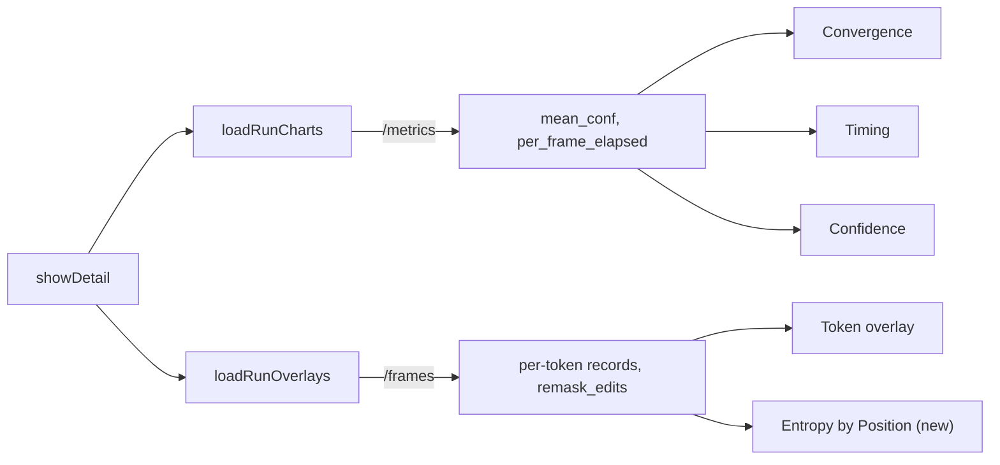

# Entropy by Position chart (Analytics)

## Why per position, and why bars

The three existing charts are per frame. For an autoregressive run that axis is
weak: [src/inference/ar_sampler.py](src/inference/ar_sampler.py) computes
`mean_conf` as `conf_sum / count` over the tokens generated so far, a cumulative
mean that flattens by construction, so a per-frame mean entropy chart would just
be a second flat curve. An AR model decides each position exactly once, so the
informative axis is token position.

Rendering it as a **bar** chart rather than a line is deliberate: bars read as
independent categories where lines read as a time series, and it matches the
generator's existing entropy profile, whose per-bar color comes free from
`entropyColor`.

## Where it hooks in

The per-position entropy lives in the frames payload, not the metrics payload,
and both are already fetched when the detail modal opens
([analytics.js](src/web/static/analytics.js) `showDetail` calls `loadRunCharts`
then `loadRunOverlays`). So the new chart renders from inside `loadRunOverlays`,
reusing the fetch that already powers the Entropy overlay. No backend change and
no second request.

## Changes

**[src/web/static/analytics.html](src/web/static/analytics.html)**: a fourth
`.chart-section` with `id="entropy-section" hidden` after `confidence-section`
(line 254), copying that block exactly: `<h3>Entropy by Position</h3>`, the four
`.zoom-btn` buttons with `data-chart="entropy"` (including the eye
`tooltip-toggle-btn`), and `<canvas id="chart-entropy">`. No new CSS: it inherits
`.chart-section` / `.chart-wrap`.

**[src/web/static/analytics.js](src/web/static/analytics.js)**:

- `var chartEntropy = null;` beside the others (line 271), `entropy: true` in
  `tooltipEnabled` (line 254), and `tooltipEnabled.entropy = true;` in
  `resetTooltipToggles` (line 807). The delegated `handleZoomClick` and
  `setChartTooltip` are keyed off `data-chart`, so both work once
  `chartInstances.entropy` is set.
- In `loadRunOverlays` (line 1041), destroy and hide the section synchronously
  before `fetchFrames` so a stale chart never survives a run switch, then call
  `renderEntropyChart(data)` after `overlayData = data`. Leave a one-line comment
  in `loadRunCharts` pointing at it, since a reader looking for chart code will
  start there.
- `renderEntropyChart(data)`: gate on the existing `overlayEntropyAvailable(data)`
  (line 936), which checks data presence rather than `model_type`, matching how
  both `buildOverlaySelect` sites gate the Entropy overlay. Read values off the
  final frame via `overlayFinalFrameIndex(frames)` (line 901), the same source as
  the generator's `entropyProfileValues`. Per-bar `backgroundColor` from
  `entropyColor(v)`, `barPercentage` and `categoryPercentage` at 1.0 for
  contiguous columns.
- `entropyChartOptions()` mirroring `confidenceOptions()` (line 1839): x title
  "Position", y title "Entropy (nats)", `beginAtZero: true` plus
  `suggestedMax: OVERLAYS_ENTROPY_REF_NATS` so runs stay visually comparable
  without clipping an outlier, and `zoom: zoomPluginOptions()`.
- A `positionTooltipTitle` helper, because the shared `tooltipTitle` (line 458)
  hard-codes `"Frame " + label`. Tooltip body shows the value in nats and the
  token text, run through `overlaysAltDisplay` so a leading-space token reads as
  `\u00b7the` instead of looking blank.
- `substitutionMarkerPlugin(positions)`, a near-copy of `canvasBoundaryPlugin`
  (line 772) using `xScale.getPixelForValue`, drawing a dashed vertical line at
  the union of `token_positions` across `data.remask_edits`. `remask_edits` rides
  the same frames payload ([server.py](src/web/server.py) line 1423), and a What
  If branch records `{frame_index: position, token_positions: [position]}`
  ([app.js](src/web/static/app.js) line 3051), so the marker lands exactly on the
  substituted position and separates the shared prefix from the new continuation.
  Using `token_positions` rather than `frame_index` also generalizes to diffusion
  runs, where it is a set of remasked positions.

## Docs

Help modal in [src/web/static/index.html](src/web/static/index.html): an
**Entropy chart** entry beside "Confidence chart" (line 413), stating that it is
per position rather than per frame and appears for runs saved with the signal.
Then [README.md](README.md) (Analytics feature list plus Implementation Status),
[ROADMAP.md](ROADMAP.md), and [HANDOFF.md](HANDOFF.md) ("Recently shipped" plus a
checklist line).

## Verification

`node --check` on the changed JS, ReadLints, and a line-width audit against the
baseline (70 columns). `.venv/bin/python -m pytest` should stay at 54 passing
since nothing server-side changes. GUI cannot be exercised here, so the manual
checks are: an AR run with entropy shows a third chart whose bars match the
generator's profile; hover names the token; zoom, pan, reset, and the eye toggle
all work; a What If branch shows the dashed marker at the substituted position; a
legacy AR run saved before entropy hides the section; and a diffusion run is
unaffected.
