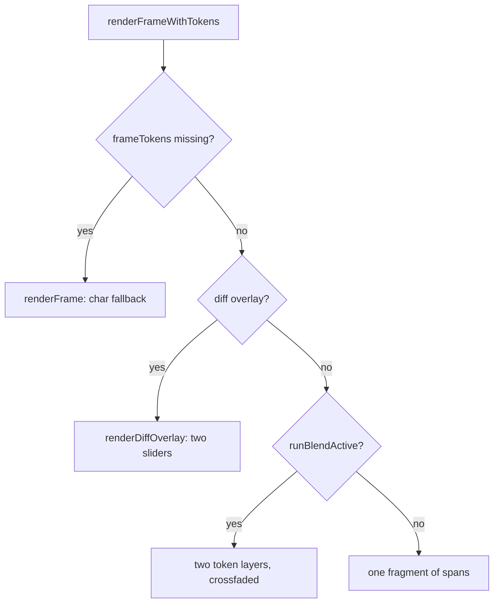

# Generator crossfade and two-layer token stack

## What is already in place

More of this exists than the framing suggests, which keeps the scope narrow:

- The generator already stacks two layers for **Diff vs Original**: `renderDiffOverlay` ([src/web/static/app.js](src/web/static/app.js):1572) calls the shared `overlaysBuildDiffLayers`, with its own Original/Edited sliders and difference blend in `#diff-overlay-controls`.
- The pre-edit run is fully in memory and survives the branch: `originalFrameTokens`, `originalFrameHistory`, `originalPositionAlts` (app.js:225-235), populated once in `handleDone` and never touched by `truncateRunArraysAt`. Nothing needs re-fetching.
- `setTokenHighlight` (app.js:2155) lights **every** span matching a `data-pos`, so cross-highlighting already works across a stack unchanged.
- The candidate popover already paginates Original/Edited with the original page correctly read-only (app.js:1948-1976, 4767).

So the work is the control, stacking the other four overlays, and one gap in the shared builder.

## 1. Extend the shared span builder ([src/web/static/overlays.js](src/web/static/overlays.js))

`overlaysBuildTokenSpan` (overlays.js:296) hard-codes what the generator cannot express. Add three optional, pure callbacks alongside the existing `colorFor` / `titleFor`, each defaulting to today's behavior so the Analytics call sites are unchanged:

- `maskedFor(index, tok)` overrides `!tok || !!tok.m`. Required because a user-remasked position renders `MASK_CHAR` even when its token is resolved.
- `classFor(index, tok, masked)` returns extra classes (`token-remasked`, `token-clickable`, `token-substitutable`).
- `opacityFor(index, tok, masked)` returns an inline opacity, for the generator's confidence-graded masks (`maskOpacity`, app.js:2466). This is the one that genuinely co-occurs with a stack: scrub to a mid-run frame and that fade is the point of the view. Analytics never hit it because its masks are flat.

`.token-remasked` (style.css:1787) is declared after `.token-mask` (style.css:1749) at equal specificity, so a span carrying both renders orange. No CSS change needed there.

## 2. Split the generator's color and title so it can use the builder

`applyTokenColor` (app.js:1635) both sets a color **and** appends tooltip lines (`"\nResolved at step: N"`, `"\nwas: X"`). Split it into two pure functions mirroring the `overlayColorFn` / `overlayTitleFn` pair in [src/web/static/analytics.js](src/web/static/analytics.js):2327-2349:

- `tokenColorAt(index, tok)` returns a color or null.
- `tokenTitleExtra(index, tok)` returns the commit and diff trailing lines.

Then rewrite `renderFrameWithTokens` (app.js:2474) to route both paths through the shared builder:

`runBlendActive()` is `diffAvailable() && remaskMode === null`. That gate resolves the interaction hazard for free: `token-clickable` needs `remaskMode === "edit"` and `token-substitutable` needs `substitutionMode`, which implies `remaskMode === "substitute"` (app.js:3265), so neither can appear while a stack is up. Clicking a token in the run you cannot edit is structurally impossible.

The stacked path mirrors `renderDiffOverlay`: clamp the original with `Math.min(frameIndex, originalFrameTokens.length - 1)`, add `token-layers` to `#output-area`, and hand the pointer to the more opaque layer via `overlaysEditedOwnsPointer(1 - runBlend, runBlend)`. Each layer's `titleFor` uses its own token-array length for `tokenLabel`, since the two runs can differ in length.

## 3. The crossfade control ([src/web/static/index.html](src/web/static/index.html), [src/web/static/style.css](src/web/static/style.css), app.js)

New `#run-blend-row` in `#scrubber-section`, immediately before `#diff-overlay-controls` (index.html:183), mirroring the analytics markup ([src/web/static/analytics.html](src/web/static/analytics.html):157-164) and reusing `.diff-slider-label` / `.diff-orig-label` / `.diff-edit-label`. The two rows are mutually exclusive by construction.

- `var runBlend = 1;` (1 = full Edited), named for the `#run-blend` DOM id.
- `resetRunBlend()` beside `resetDiffOverlay()` (app.js:1752), called from `activateScrubber` (app.js:2841), so each run including a completed branch opens on Edited.
- `updateRunBlendControls()` beside `updateDiffOverlayControls()` (app.js:1742), hidden unless `overlayMode !== "diff" && runBlendActive()`. Add to all three existing call sites: app.js:1724, 2848, 3380.
- `onRunBlendInput()` restyles the layers **in place** rather than rebuilding: several hundred spans per slider step would also drop the popover mid-drag. Same approach as `applyTokenLayerBlend` (analytics.js:3207), followed by `drawEntropyProfile()`.

Deliberate: the crossfade resets to Edited on a session restore rather than persisting, matching how Analytics resets per run open. Say so if you would rather it survived the round-trip.

## 4. Blend the entropy strip

Add `originalEntropyProfileValues()` reading `originalFrameTokens[last]`, beside `entropyProfileValues()` (app.js:1996). In `drawEntropyProfile` (app.js:2015), when `runBlendActive()` and the original carries entropy:

- Compute `step` from `Math.max(edited.length, original.length)` so columns stay aligned when the branch is a different length than the original.
- Draw the original series at `globalAlpha = 1 - runBlend` and the edited at `runBlend`, keeping the existing per-bar 0.68 / 1.0 emphasis. The `i === current` emphasis stays on the edited series only, since `currentScrubFrame` indexes the branch.
- `drawEntropyProfileGlow` and `updateEntropyReadout` follow the favored run (`runBlend < 0.5` picks the original), so the nats readout names the run you are actually looking at.

This path is reachable today: What If pushes a real `remaskEdits` entry (app.js:3278), so `diffAvailable()` is true after an autoregressive branch, which is exactly where the strip lives.

## 5. Popover default page

Add `defaultAltsPage()` returning `runBlend < 0.5 ? "original" : "edited"` and use it in `showAltsPopover` (app.js:1925), which currently hard-codes `"edited"`. Straight port of analytics.js:1722.

## 6. Docs and verification

Update the generator sections of [README.md](README.md), the shipped list in [ROADMAP.md](ROADMAP.md), [HANDOFF.md](HANDOFF.md) (recently-shipped plus new checklist items), and the Help modal copy in index.html. No em-dashes.

Verify with `node --check` on each changed JS file, ReadLints, `.venv/bin/python -m pytest`, and the 70-column audit. The stack, the strip, and the popover all need a display and a real branch, so hand back with a manual checklist covering: the crossfade appears only after a branch and only outside Diff mode, mid-run masks keep their confidence fade in stacked mode, the more opaque layer takes hover, remask and What If modes still render single-layer and stay clickable, the strip's bars and nats readout follow the slider, and the popover opens on the favored run.