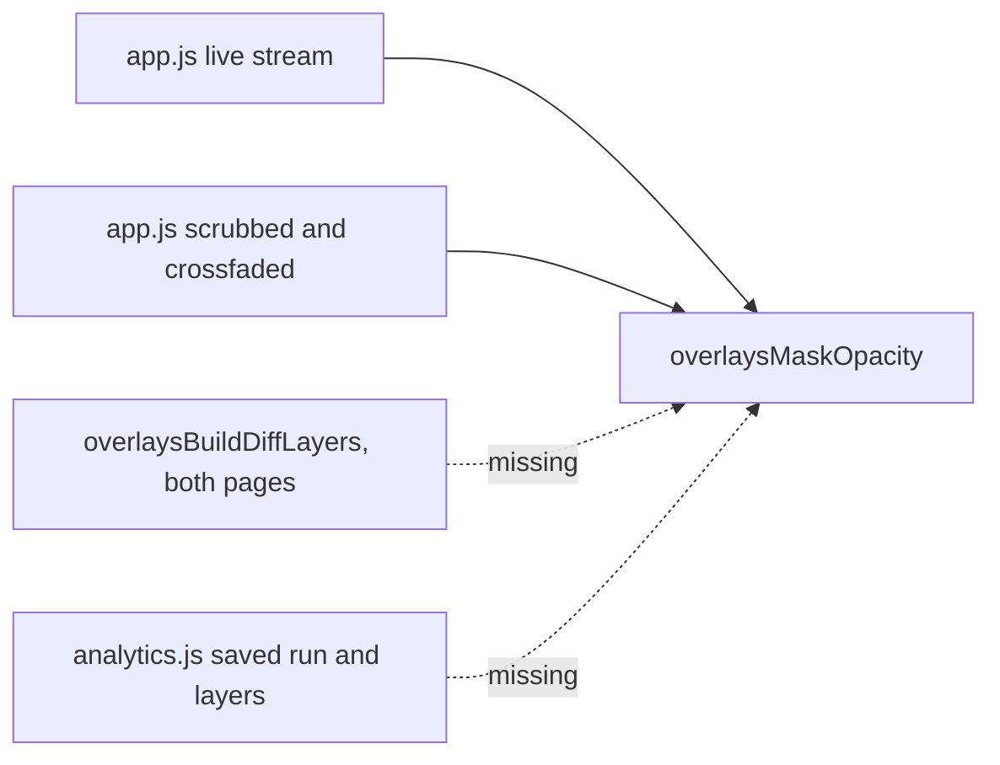

# Grade every mask, on both pages

## What the measurement says

The grading works. It just spends almost none of the channel. Running
your saved LLaDA run through the current curve, the opacity actually in
use across a frame's masked positions:

- Frame 20, 120 masked: p10 0.48, p50 0.58, p90 0.65, none at full.
- Frame 78, 63 masked: p10 0.46, p50 0.54, p90 1.00, 16 at full.

A 1.35x spread on 14px monospace is below what the eye resolves, which
is why the canvas reads as one shade of green. Two causes, both in one
place:

```4629:4638:src/web/static/app.js
var MASK_OPACITY_FLOOR = 0.35;
var MASK_OPACITY_CAP = 0.4;

function maskOpacity(c) {
  if (typeof c !== "number" || c <= 0) {
    return MASK_OPACITY_FLOOR;
  }
  var frac = Math.min(c / MASK_OPACITY_CAP, 1);
  return MASK_OPACITY_FLOOR + (1 - MASK_OPACITY_FLOOR) * frac;
}
```

The floor spends a third of the range before confidence says anything,
and the linear map is applied to a distribution whose median sits
between 0.11 and 0.21 for the whole run, so everything crowds into the
bottom of what is left.

## The curve

Concave, because the data is skewed low. The cap disappears: `sqrt`
saturates at `c = 1` on its own.

```javascript
var MASK_OPACITY_FLOOR = 0.05;

function overlaysMaskOpacity(c) {
  if (typeof c !== "number") {
    return 1;
  }
  var clamped = Math.max(0, Math.min(1, c));
  return MASK_OPACITY_FLOOR
    + (1 - MASK_OPACITY_FLOOR) * Math.sqrt(clamped);
}
```

Measured against the same two frames this gives 0.32 / 0.41 / 0.46 and
0.30 / 0.37 / 0.94, with nothing below 0.15. A real ramp, and a
low-confidence token you have to look for without a canvas you cannot
read.

**Absent now means solid, and that is the load-bearing change.** Today
absent and zero both return the floor. That is harmless at 0.35 and
catastrophic at 0.05: LLaDA's frame 0 carries no `c` by construction,
every run saved before the capture has none, and a DiffusionGemma run
without the Entropy Signal writes none at all, so all three would render
as a blank canvas. Unmeasured is not the same claim as measured and
hopeless, so it draws solid.

One consequence to watch on hardware rather than argue here: frame 0
goes from uniformly dim to uniformly solid, so a run now opens on a full
field of blocks and drops to the ramp on frame 1. That reads as
informative to me, but it is a visible step and it is new.

## Who gets the hook

Four render paths draw masked positions. One asks for grading, three do
not, and nothing but history explains the split.



- [src/web/static/analytics.js](src/web/static/analytics.js): the three
  build sites already touched for the reveal (`renderOverlayTokens`,
  `renderOverlayLayers`, and the diff options) gain an `opacityFor`
  alongside the `revealMask` they now carry. Analytics has no remask
  selection, so its hook is just the curve over `tok.c` when masked.
- [src/web/static/overlays.js](src/web/static/overlays.js):
  `overlaysBuildDiffLayers` passes an opacity hook through to both
  layers. Its `overlaysDiffColorFor` already returns null for masked
  positions so the mask class colors them, explicitly "keeping the mask
  glyph identical to the single-layer paths"; without the opacity it no
  longer does.

Per your call, one ramp for both reveal states: a faint `░` and a faint
word make the same claim, so nothing branches on the setting.

## Two fixes from verification

**Confirm and Retry persist while reviewing.** The gate is one condition:

```5809:5819:src/web/static/app.js
      if (currentScrubFrame === runFrames.history.length - 1) {
        guidedEditStatus.textContent =
          "Edit complete. Confirm to save, or"
          + " retry from the start.";
        btnConfirmEdit.hidden = false;
        btnRetryEdit.hidden = false;
      } else {
        guidedEditStatus.textContent =
          "Reviewing edited run. Return to the last"
          + " frame to confirm or retry.";
      }
```

Neither action reads the scrubber. `confirmGuidedEdit` calls `saveRun`,
which serializes `runFrames` wholesale, then `activateScrubber`, which
sets the last frame itself; `retryGuidedEdit` swaps the arrays back and
navigates to frame 1. So both `hidden = false` lines move above the
branch and only the status text stays conditional, naming the frame
being reviewed.

**The convergence tooltip stops growing with the selection.** Its
`afterLabel` at [src/web/static/analytics.js](src/web/static/analytics.js)
joins every remasked position, which is why 44 of them ran the box off
the chart while the timing and T/s charts stayed narrow on
`"Resume point (44 tokens remasked)"`. Bounded to five plus a count, via
a small pure helper in `overlays.js` so it is unit-testable instead of
source-inspected.

## Tests

- New node test for the curve in `tests/web/static/`: floor at zero,
  solid when absent, monotonic, concave (the midpoint sits above the
  linear chord), clamped above one. This is the payoff of the hoist:
  `overlays.js` loads into a `vm`, `app.js` does not.
- The same file covers the remask summary helper: under the cap it lists
  everything, over it lists five and counts the rest, and one position
  stays singular.
- [tests/web/test_live_mask_opacity.py](tests/web/test_live_mask_opacity.py)
  reads `app.js` for `function maskOpacity(c)` and for the
  absent-equals-zero conflation. Both move: the file keeps its wiring
  assertions and hands the curve's behavior to the node test, and the
  conflation test is rewritten around why the two must now differ.
- [tests/web/test_mask_reveal_wiring.py](tests/web/test_mask_reveal_wiring.py)
  is already the file that pins "every path that draws a token asks for
  the preference". It gains the same assertions for the opacity hook,
  including the diff layers.
- Source inspection for the review-phase buttons: shown unconditionally,
  status text still conditional.

## Docs

README and the Help modal describe masks rising "toward a shatter" from
"a solid floor". Both need the new shape: a mask now starts nearly
invisible and firms up, which is a different picture and a better match
for the reveal wording landed last session.

ROADMAP takes the decision record, because the curve choice was made
from measurements that would otherwise have to be redone: the observed
compression, the four candidates, and why concave rather than linear.

MANUAL_VERIFICATION gains items for the retuned ramp on both models,
Analytics agreeing with the generator on the same saved run, the frame 0
step, and the two UI fixes.

Also queued in ROADMAP, not built here: removing DiffusionGemma's
Entropy Signal toggle, with the finding that it is misnamed (it emits
argmax confidence, and DiffusionGemma never writes an `e` field at all),
that the surface is eight code sites with no frontend or migration work,
and that the ~256 MiB float32 softmax the gate exists to avoid is
answerable with a chunked log-sum-exp before the gate comes out.
