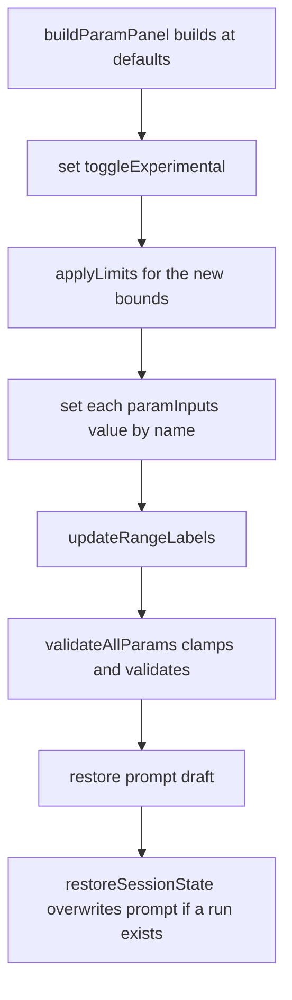

## Highlight refinements and persistence

Three commits. Commit 1 is the four refinements, commit 2 relocates the highlight-tokens control, commit 3 adds session-scoped form state. Splitting 2 and 3 because they are opposite persistence tiers (server-backed durable vs. session-only) on disjoint surfaces.

---

## Commit 1: comparison-surface refinements

### 1a. Crossfade moves to the Token overlay row

In [src/web/static/analytics.html](src/web/static/analytics.html), move the `#run-blend-row` block (lines 138-150) out of `#detail-header` and into `#overlay-viewer-header` (lines 157-165) as its last child, then delete the `#detail-header` wrapper so `<h2 id="detail-title">` sits bare again.

In [src/web/static/analytics.css](src/web/static/analytics.css):

- Delete `#detail-header` and `#detail-header h2` (lines 224-236); both existed only to host the crossfade.
- `#overlay-viewer-header`: `justify-content: space-between` becomes `flex-start`, and add `#overlay-viewer-header .overlay-legend { margin-left: auto; }` so the legend and the crossfade cluster on the right with the existing 12px gap. Without this, three children under `space-between` would strand the legend mid-row whenever Commit Order is active.
- Adjust `#run-blend-row` (lines 846-854) margins for the new context.

No JS change: `runBlendRow` is resolved by id, and `resetRunBlend` only toggles `.hidden`. Nesting it inside `#overlay-viewer` is a bonus, since it now inherits the viewer's hidden state.

### 1b. Token highlight sticks when leaving the entropy chart

Root cause is a Chart.js contract detail: `options.onHover` is only invoked when the pointer is inside `chartArea`, so moving into the axis gutter or off the canvas never delivers the empty-elements call that would clear the token. The current wiring depends on exactly that call ([analytics.js](src/web/static/analytics.js) lines 2770-2774).

Replace it with an inline plugin using `afterEvent`, which Chart.js notifies for every event in `options.events` (including `mouseout`) after `_active` has been recomputed, so `getActiveElements()` is authoritative:

```javascript
var tokenLinkPlugin = {
  id: "tokenLink",
  afterEvent: function (chart) {
    var active = chart.getActiveElements();
    setTokenHighlight(
      active.length > 0 ? active[0].index : null
    );
  }
};
```

Register it in the entropy chart's `plugins` array (lines 2697-2701) beside `entropyHoverPlugin`, which already reads active elements the same way, and drop the `onHover` option. Add `clearTokenHighlight()` to `clearEntropyChart` (lines 2522-2529) so a teardown cannot leave the class behind.

The generator needs no change here: `#entropy-profile` already has a `mouseleave` that clears both ([app.js](src/web/static/app.js) lines 4689-4695).

### 1c. One consolidated token highlight theme

In [src/web/static/style.css](src/web/static/style.css) lines 2232-2248, collapse the two rules into one selector list carrying the white-plus-glow declarations:

```css
.token-hover-highlight .token-span:hover,
.token-cross-highlight {
  background: rgba(255, 255, 255, 0.16);
  border-radius: 2px;
  box-shadow: 0 0 6px rgba(255, 255, 255, 0.22);
}
```

Both existing comment blocks explicitly justify the orange/white split and the ungated cross-highlight, so they get rewritten rather than kept. `style.css` is loaded by all three pages, so this is the single home.

Analytics currently never applies `token-hover-highlight` at all, which is why its tokens show nothing on hover. Add a small `updateOverlayHoverHighlight()` in `analytics.js` that toggles the class on `#overlay-output`, called unconditionally in commit 1 and rewired to the checkbox in commit 2. The token-to-bar direction is already wired and unconditional (analytics.js lines 2104-2123), so this makes the existing link legible from both ends.

Also update the now-stale comment at app.js lines 4676-4679 ("so a direct token hover does not also paint the token"), which describes the distinction this retires.

### 1d. Entropy profile: off-by-one plus the floating tick

The reported artifact is the current-frame marker, and it is on the wrong column. `var current = currentScrubFrame - 1;` (app.js line 2033) assumes a leading empty frame, but the AR worker emits none: `_build_frame` is called after `trace.append(pick)` ([src/inference/ar_sampler.py](src/inference/ar_sampler.py) lines 423-435), so the first frame message already carries one token and `handleFrame` pushes it straight into `frameHistory` (app.js line 1376). Frame index `k` therefore introduces position `k`. At the resting final frame that makes `current` land on N-2, the second-to-last position.

Drop the `- 1`, with a comment recording the mapping and noting the profile is AR-only today (gated on `tok.e`), so the diffusion all-mask frame-0 convention does not apply. One line, three fixes:

- the tick's column (lines 2049-2052)
- the full-opacity current bar, `i === current ? 1 : 0.68` (line 2039)
- the resting nats readout (lines 2059-2061)

Then replace the 2px top tick with a faint full-height guide at roughly `rgba(255, 255, 255, 0.06)`, drawn *before* the bar loop so it sits behind the bars rather than washing over them. This mirrors the hover guide's visual language (`drawEntropyProfileGlow`, line 2074, at 0.1) so it reads as a position marker instead of a broken bar.

---

## Commit 2: highlight-tokens control moves onto the token views

### Schema and default

In [src/web/static/overlays.js](src/web/static/overlays.js): flip `SETTINGS_DEFAULTS.highlightTokens` to `true` (line 550) and give `parseSettings` the `gpuTicker` treatment, `settings.highlightTokens = parsed.highlightTokens !== false;` (line 572), so an absent key means on while anyone who explicitly saved it off keeps their value. Add two small shared helpers for read and write-through via `parseSettings` plus `persistSet(SETTINGS_KEY, ...)`.

### The control

Both pages already have an `#overlay-drawer-content` hosting the Overlay picker ([index.html](src/web/static/index.html) line 137, [analytics.html](src/web/static/analytics.html) line 173). Add a matching checkbox there on both. `app.js` points it at `appSettings.highlightTokens` plus `updateHoverHighlight()`; `analytics.js` points it at `updateOverlayHoverHighlight()` from 1c.

Known consequence worth accepting deliberately: `#overlay-select-group` is hidden until a run exists on both pages, so the checkbox appears with the token view. That is also the only time it has any effect.

### Retire the old surfaces

- [settings.html](src/web/static/settings.html): delete the row at lines 75-84. The Appearance panel keeps its two remaining rows.
- [settings.js](src/web/static/settings.js): delete the `settingHighlightCb` ref, its `syncControls` branch, and its `wireControls` listener. **Keep the field in `parseSettings` and `cloneSettings`** so a Settings save round-trips it untouched; dropping it there would make Save clobber whatever the checkbox set.
- `app.js`: delete the highlight branch of `updateStatusPrefs` (lines 2426-2432) and the `statusHighlight` ref (lines 86-87); remove `#status-highlight` from index.html line 222.

---

## Commit 3: session-scoped hyperparameters, prompt draft, and Reset to Defaults

### The gap

`boot()` builds every control from `specDefault(spec)` and then `restoreSessionState()` restores run artifacts without ever touching `paramInputs`:

```5080:5090:src/web/static/app.js
      if (activeModel) {
        buildParamPanel(activeModel);
        applyUniformParamWidth(list);
      }
      setMaskChar();
      var restored = false;
      try {
        restored = restoreSessionState();
      } catch (_e) {
        restored = false;
      }
```

The snapshot's `params` field is `lastRunParams`, captured at run completion (line 1450) and consumed only by the save payload (line 4179). It never flows back into the DOM.

### A separate session key, not the run snapshot

`diffusion_last_run` cannot carry this: `saveSessionState()` bails unless a run completed (lines 4907-4913), and `clearSessionState()` fires at the *start* of every generate (line 3981), so params would be wiped on Generate and lost if you navigated mid-run.

Add `PARAM_STATE_KEY = "diffusion_param_state"` in `sessionStorage`, keyed by model id:

```javascript
{ "<modelId>": { experimental: false, params: { name: rawValue }, prompt: "" } }
```

Store raw `input.value` / `input.checked` rather than `getParamValues()` output, so a mid-edit value round-trips and `validateAllParams` does its normal job on restore. Deliberately **not** added to `PERSIST_KEYS`, so it dies with the app as intended.

Write from the listeners that already exist: the per-input `input`/`change` handlers (lines 899-903) and `toggleExperimental`'s `change` (lines 4352-4354). The prompt needs a new `input` listener, since its only current listener is the `keydown` Enter-to-generate at line 4307.

### Restore

One call site suffices. `buildParamPanel` is only ever called from `boot()` (line 5081), and a model switch ends in `location.reload()` (line 1230), so a `restoreParamState()` immediately after `applyUniformParamWidth` covers both fresh loads and model switches. sessionStorage survives that reload, which is exactly why the per-model keying is needed.

Order inside, mirroring how the live controls behave, since `specDefault` resolves through `specOverride` to `experimental ? spec.experimental : spec.recommended`:



Restoring by name degrades safely if `param_specs` change between sessions: unknown names are ignored, missing ones keep their default. And `restoreSessionState` runs after, setting `promptInput.value` when the snapshot has one, so a completed run's prompt still wins over the draft with no special casing.

### Reset to Defaults

Add `#btn-param-defaults` at the right end of `#mode-row` (index.html lines 92-102) with `margin-left: auto`, using the `&#8634;` glyph already established as the reset affordance on the analytics `.zoom-btn` controls. Placed on that row because it resets the Experimental toggle too, and to keep it away from Save and Generate in `.param-group-btn`.

Handler: clear Experimental, `applyLimits()`, set each control to `specDefault(spec)`, `updateRangeLabels()`, `validateAllParams()`, then drop the stored state. Add a `paramsAtDefaults()` predicate driving the button's disabled state from the same listeners, mirroring how the Settings page drives Save/Reset off `settingsEqual`.

---

## Docs and copy

Several places assert the "always on, separate from the Highlight tokens setting" distinction that commit 1c retires, and the Settings relocation invalidates the rest:

- index.html Help: line 358 (the independence claim), line 400 (the Settings list item), line 403 (the status-bar sentence, now removed entirely), line 419 (Analytics chart copy, still accurate but worth aligning).
- [README.md](README.md): line 313 (independence claim), line 317 (Settings Appearance description), line 399 (Implementation Status).
- [HANDOFF.md](HANDOFF.md): line 777 (a verification item premised on the setting being off), plus a new Recently shipped section and a rewritten Where to pick up.
- [ROADMAP.md](ROADMAP.md): move these off the deferred list.

New copy needed for the drawer checkbox, the Reset button, and the session-persistence behavior. No em-dashes.

---

## Verification

`node --check` on each changed JS file, ReadLints on everything touched, `.venv/bin/python -m pytest` as a regression check, and the 70-column audit. No Python changes are expected, so pytest is purely a guard.

Manual checklist for handback, since none of this is exercisable without a display: crossfade position at both modal widths and with Commit Order active; highlight clearing on all three exit paths (gutter, off-canvas, modal close); profile marker at the first and last frames plus mid-scrub; the consolidated highlight on remasked and heatmap-colored tokens; checkbox surviving a reload, a Settings save, and a page switch; params surviving Analytics navigation both before and after a run; params resetting on app restart; Reset covering Experimental; and a model switch preserving each model's own values.