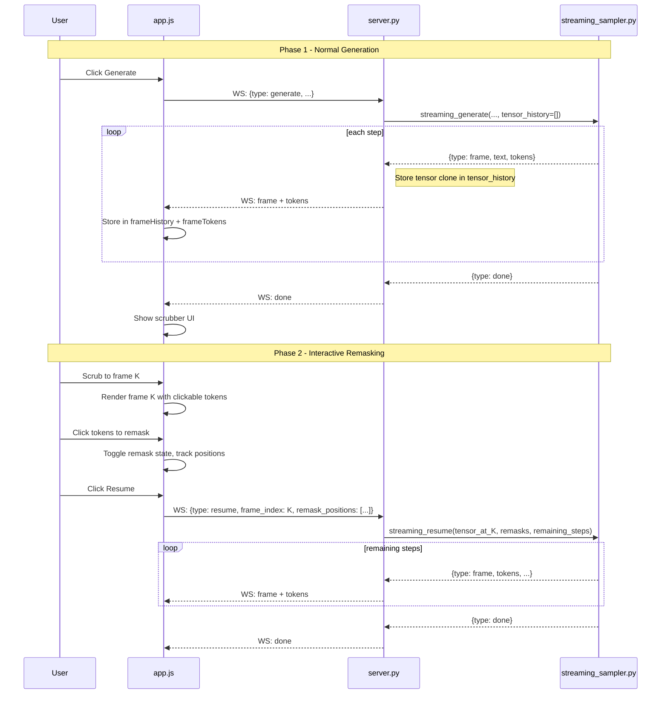

# Interactive Token Remasking

## Problem

After generation completes, the user has no way to inspect individual frames, select tokens, or explore alternative diffusion paths. All frame data is stored client-side as plain text strings with no token-level structure, and the server discards the tensor state immediately after streaming.

## Key Design Decisions

### Token-level data must flow from server to client

Currently, frames are decoded text strings. To make tokens clickable and resumable, the frontend needs to know **token boundaries** (one token can span multiple characters, e.g. `" example"` is a single token). The server will include a `tokens` array with each frame message:

```json
{
  "type": "frame",
  "index": 5,
  "text": "Hello░░ world",
  "tokens": [
    {"t": "Hello", "m": false, "id": 9906},
    {"t": "\u2591", "m": true, "id": 126336},
    {"t": "\u2591", "m": true, "id": 126336},
    {"t": " world", "m": false, "id": 1917}
  ]
}
```

Overhead is ~2-3KB per frame (160 tokens x ~15 bytes each), trivial over WebSocket.

### Server-side tensor history for accurate resume

Re-encoding decoded text back to tokens is lossy. Instead, the server stores a clone of the token tensor after every diffusion step in a module-level `last_run_state` dict. Memory cost: ~128 frames x 1 x ~300 ints x 8 bytes = ~300KB. Trivial compared to the 17GB model.

### Resume uses "remaining steps, full region" strategy

When the user remasks tokens at frame K and hits Resume:

1. Server loads the token tensor at frame K
2. Sets the user-specified positions back to `MASK_ID`
3. Runs `total_steps - K` remaining diffusion steps
4. Uses `block_length = gen_length` (entire generation region as one block) so remasked tokens in any original block can be resolved
5. Streams new frames as usual

This avoids block-boundary issues where a remasked token in an earlier block would be unreachable.

## Architecture




## File Changes

### 1. [src/inference/streaming_sampler.py](src/inference/streaming_sampler.py)

**Add token-level data to frame yields:**

- After decoding step text, also produce a `tokens` list by iterating over `x[0, prompt_len:]` and decoding each token individually via `tokenizer.decode([token_id])`
- Apply same sanitization (mask token -> `\u2591`)
- Include in yielded dict: `"tokens": [{"t": text, "m": is_mask, "id": token_id}, ...]`

**Add `tensor_history` parameter to `streaming_generate`:**

- New kwarg `tensor_history: list[torch.Tensor] | None = None`
- After each step (and the initial frame), append `x[:, prompt_len:].clone().cpu()` to the list
- Only the generation region is stored (not the prompt), keeping it compact

**Add `streaming_resume` async generator function:**

```python
async def streaming_resume(
    model, tokenizer, *,
    base_tokens: torch.Tensor,    # (1, gen_length)
    prompt_ids: torch.Tensor,     # (1, prompt_len)
    attention_mask: torch.Tensor,
    remask_positions: list[int],
    remaining_steps: int,
    gen_length: int,
    temperature: float = 0.0,
    cfg_scale: float = 0.0,
    remasking: str = "low_confidence",
    cancel_event: asyncio.Event | None = None,
    tensor_history: list[torch.Tensor] | None = None,
) -> AsyncGenerator[Dict[str, Any], None]:
```

This reconstructs `x = [prompt_ids | base_tokens]`, applies remasks at the given positions, then runs `remaining_steps` of diffusion with `block_length = gen_length` (single block). Yields frames and tokens in the same format as `streaming_generate`.

### 2. [src/web/server.py](src/web/server.py)

**Module-level state for last run:**

```python
last_run_state: dict[str, Any] | None = None
# Stores: tensor_history, prompt_ids, attention_mask,
#         gen_length, total_steps
```

**Modify generation handler in `websocket_endpoint`:**

- Create `tensor_history = []` before calling `streaming_generate`
- Pass it as a kwarg
- After generation completes, store in `last_run_state` along with prompt_ids, attention_mask, gen_length, total_steps
- Strip non-serializable data before `ws.send_json` (the `tokens` list is already JSON-safe)

**Add `resume` message handler:**

- Validate: `last_run_state` exists, `frame_index` is valid, `remask_positions` are within `[0, gen_length)`
- Extract the tensor at `frame_index` from `tensor_history`
- Compute `remaining_steps = total_steps - frame_index`
- Call `streaming_resume(...)` and stream results the same way
- Append new tensors to `tensor_history` (extending it from the branch point)

**Extend `SaveRunRequest` model:**

- Add optional `remask_edits: list[RemaskEdit] | None` field
- `RemaskEdit`: `{frame_index: int, token_positions: list[int]}`
- Include in `metadata.json` when saving

### 3. [src/web/static/index.html](src/web/static/index.html)

Add a **scrubber section** between `#output-section` and `#status-bar`:

```html
<section id="scrubber-section" hidden>
  <div id="scrubber-controls">
    <button id="btn-scrub-start" title="First frame">|<</button>
    <button id="btn-scrub-prev" title="Previous frame"><</button>
    <input type="range" id="scrubber-slider" min="0" max="0" value="0" />
    <button id="btn-scrub-next" title="Next frame">></button>
    <button id="btn-scrub-end" title="Last frame">>|</button>
    <span id="scrubber-label">Frame 0/0</span>
  </div>
  <div id="remask-controls" hidden>
    <span id="remask-count">0 tokens remasked</span>
    <button id="btn-clear-remask">Clear</button>
    <button id="btn-resume">Resume</button>
  </div>
</section>
```

### 4. [src/web/static/app.js](src/web/static/app.js)

**New state variables:**

- `frameTokens = []` - parallel to `frameHistory`, stores per-frame token arrays
- `scrubberActive = false` - whether scrubber mode is on
- `currentScrubFrame = 0` - which frame is displayed
- `remaskedPositions = new Set()` - token positions toggled for remask
- `remaskEdits = []` - history of all remask edits for save metadata

**Scrubber activation:**

- In `handleDone()`, show `#scrubber-section`, set slider range to `[0, frameHistory.length - 1]`, position at last frame
- Slider `input` event calls `navigateToFrame(value)`

**Token-level rendering (`renderFrameTokens`):**

- New function that renders from the `tokens` array instead of raw text
- Each token becomes a `<span>` with `data-pos="{index}"` and class `token-mask` or `token-resolved`
- Resolved tokens also get class `token-clickable` and a click handler
- If the token's position is in `remaskedPositions`, it gets class `token-remasked` and renders as `\u2591`

**Click-to-remask handler:**

- On click, toggle the token position in `remaskedPositions`
- Re-render the current frame to reflect the visual change
- Update remask count display; show/hide Resume button

**Resume flow:**

- On Resume click: send `{type: "resume", frame_index, remask_positions: [...remaskedPositions]}`
- Record the edit in `remaskEdits`
- Truncate `frameHistory` and `frameTokens` at `frame_index`
- Enter generating state; new frames append as usual
- On done: re-show scrubber at the new end

**Save extension:**

- Include `remask_edits` in the save payload if any exist

### 5. [src/web/static/style.css](src/web/static/style.css)

New styles:

- `#scrubber-section`: horizontal bar with flexbox layout, matching the dark terminal theme
- `#scrubber-slider`: custom range input styled to match the UI
- `.token-clickable`: `cursor: pointer`, subtle underline or border on hover
- `.token-remasked`: distinct color (orange/amber) to distinguish from natural masks (green), with a glow effect
- `#remask-controls`: inline flex with count label, clear button, and resume button
- `.btn-resume`: accent-colored, visually prominent

## Edge Cases to Handle

- **Resume with zero remasks**: Disable the Resume button when `remaskedPositions` is empty
- **Multiple sequential resumes**: Each resume extends the frame history; the scrubber range grows
- **Server restart between generate and resume**: `last_run_state` is lost; show an error message if the user tries to resume
- **Clicking mask tokens**: Only resolved (non-mask) tokens should be clickable for remasking; mask tokens are already masked
- **Frame 0 (fully masked)**: No tokens to remask; disable clicking
- **Large gen_length**: Token data per frame grows linearly; at 1024 tokens this is ~15KB/frame, still fine

