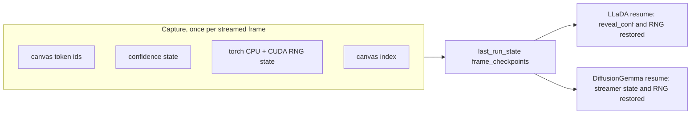

# Intervention checkpoints for reproducible edits (XAI-01)

## What is wrong today

Both diffusion backends retain **token ids and nothing else** per frame, then
reinvent the rest at resume. The two do it in opposite directions, which is
why one fix serves both.

LLaDA hands every surviving token a confidence of `1.0`:

```515:518:src/inference/streaming_sampler.py
    # Pre-resolved positions from the prior run are treated as
    # committed (confidence 1.0); revealed positions update below.
    reveal_conf = torch.zeros(gen_length, device=x.device)
    reveal_conf[x[0, prompt_len:] != MASK_ID] = 1.0
```

So an edited branch's Heatmap and mean confidence are fabricated for every
position the user did not touch.

DiffusionGemma builds a **fresh** `FrameQueueStreamer` on resume
([dgemma_sampler.py:508](src/inference/dgemma_sampler.py)), so `_prev`,
`_stable` and `_seen_revealed` all start empty. Because `_emit` marks a
position unresolved when `self._prev is None`
([dgemma_sampler.py:158-168](src/inference/dgemma_sampler.py)), the first
resumed frame renders the **entire canvas as masked**, confidence then climbs
from zero, and the surviving prefix is re-reported as born a frame later. That
last one is the bug LLaDA's resume already fixes deliberately
([streaming_sampler.py:525-531](src/inference/streaming_sampler.py)); the
DiffusionGemma path never got it.

Neither captures RNG. LLaDA's resume calls no `_apply_seed` at all and its
state does not even keep the seed
([llada_worker.py:382-391](src/backends/llada_worker.py)); DiffusionGemma
re-seeds to the *run* seed twice
([dgemma_sampler.py:492](src/inference/dgemma_sampler.py),
[dgemma_sampler.py:301](src/inference/dgemma_sampler.py)). The report rejects
reseeding as a fix because it does not reconstruct the chosen frame.

## The shape

One bounded record per frame, replacing two ad-hoc histories.



The confidence field means different things per backend and that is fine:
LLaDA stores `reveal_conf` (a float per generation position),
DiffusionGemma stores its stability counters plus the previous canvas and the
seen-born set. The record is a typed container, not a pretence that the two
models are the same.

## Files

**New `src/inference/checkpoint.py`** holds the record and the bound. A frozen
dataclass `FrameCheckpoint(ids, canvas_index, rng, extra)`, plus
`rng_capture()` / `rng_restore(state)` wrapping `torch.get_rng_state` and
`torch.cuda.get_rng_state` behind one availability check, plus a
`CheckpointHistory` that appends and reports its own byte size.

`numpy` needs no capture: it is imported only for `np.inf`
([streaming_sampler.py:241](src/inference/streaming_sampler.py)), so
`_apply_seed`'s `np.random.seed` is vestigial for sampling. Leave it.

**The bound.** `CHECKPOINT_RNG_BYTES_MAX`, mirroring `AR_CACHE_BYTES_MAX` in
[ar_sampler.py:1118](src/inference/ar_sampler.py). Ids and confidence are
always kept (they are small and correctness depends on them). RNG state is the
only droppable part: CPU state is 5056 bytes a frame, so a 129-frame LLaDA run
costs about 650 KiB and the bound is a rail rather than a live constraint. Past
it, stop capturing RNG, keep capturing everything else, and let a resume from
an RNG-less frame fall back to today's reseed and say so.

**`src/inference/streaming_sampler.py`.** The four
`tensor_history.append(x[:, prompt_len:].clone().cpu())` sites (lines 336, 406,
520, 577) collapse into one `checkpoint_append(history, x, prompt_len,
reveal_conf)`. `streaming_resume` gains `base_conf` and `base_rng`; lines
515-518 become a restore, with remasked positions zeroed because a remasked
token is genuinely unknown again. Keep that as a pure helper
(`resume_reveal_conf(base_conf, remask_positions)`) so it tests without a
model.

**`src/backends/llada_worker.py`.** `_store_state` gains `seed` (missing today)
and its `tensor_history` key becomes `frame_checkpoints`; `_validate_resume`,
`handle_resume` and `_commit_resume` follow. `_commit_resume`'s staging
contract at [llada_worker.py:103-114](src/backends/llada_worker.py) is
unchanged: still list concatenation, still refuses an empty candidate.

**`src/inference/dgemma_sampler.py`.** `_emit` records its own checkpoint
keyed by `self._index` (monotonic across canvases, never reset). The
**consumer** loop at
[dgemma_sampler.py:327-341](src/inference/dgemma_sampler.py) still owns the
append, because the queue is bounded and the producer may run ahead of a
consumer that breaks on cancel; recording producer-side would put frames in the
history that the client never saw. So the streamer exposes
`take_checkpoint(index)` and the consumer pops it, asserting presence. Nothing
new crosses the wire. `streaming_resume` seeds the new streamer's `_prev`,
`_stable` and `_seen_revealed` from the record, and `_run_streamed` takes an
optional RNG state that takes precedence over its `_seed(seed)`.

**`src/backends/dgemma_worker.py`.** `_store_state` shape is unchanged; the
entries are richer.

## The capture change that rides along

One condition, in the same `_emit` this plan already rewrites:

```188:189:src/inference/dgemma_sampler.py
            if not unresolved:
                token["c"] = round(conf, 4)
```

The consumer is built and idle. `tokenOpacityFn` already asks every masked
token for its confidence
([app.js:4589-4594](src/web/static/app.js)), and `maskOpacity` treats absent
and zero identically:

```4540:4546:src/web/static/app.js
function maskOpacity(c) {
  if (typeof c !== "number" || c <= 0) {
    return MASK_OPACITY_FLOOR;
  }
  var frac = Math.min(c / MASK_OPACITY_CAP, 1);
  return MASK_OPACITY_FLOOR + (1 - MASK_OPACITY_FLOOR) * frac;
}
```

So every DiffusionGemma mask sits at the floor purely because no `c` ever
arrives for it.

**Gate on `conf_override`, not on nothing.** The ROADMAP says "writing it
unconditionally is the whole capture change"
([ROADMAP.md:1225-1229](docs/ROADMAP.md)), and that is slightly wrong. An
unresolved position is by definition one that just changed, so `_emit` reset
`self._stable[i]` to `0` on the same pass and the stability branch computes
exactly `0.0`. Given `maskOpacity` above, writing that is pure payload for an
identical picture. So: write `c` when the token is resolved (as today) **or**
when `conf_override` supplied a real softmax confidence, which happens only
when Entropy Signal is on and `put_draft` receives logits
([dgemma_sampler.py:234-248](src/inference/dgemma_sampler.py)). The extra
payload then lands only on runs that already opted into logits streaming.
Correct that ROADMAP line and unblock its layer two while implementing.

Two pieces of Help copy go stale the moment this lands, both in
[index.html](src/web/static/index.html): the Entropy signal glossary entry at
line 438 should say the signal also fades each unsettled token by the model's
certainty, and line 468's flat claim that "masked / unresolved tokens
report 0" stops being true with the signal on.

## What this does and does not buy

It satisfies the report's verification exactly: resume the same frame twice with
intervening random work and get identical frames. It does **not** make a resume
reproduce the original run frame for frame, because LLaDA's resume already
re-enters as a single block rather than the original schedule
([streaming_sampler.py:506-513](src/inference/streaming_sampler.py)). That is
pre-existing and out of scope; worth one sentence in the docs so nobody expects
otherwise.

## Tests

`tests/inference/test_checkpoint.py` for the record, the byte accounting, the
bound's degrade-not-drop behaviour, and RNG round-trip (draw, capture, draw,
restore, redraw, compare). `tests/inference/test_llada_resume_conf.py` with a
small stub model to prove a survivor keeps its recorded confidence and a
remasked position does not. `tests/inference/test_dgemma_resume.py` reusing the
`_StubModel` already in
[test_dgemma_cancel.py:68](tests/inference/test_dgemma_cancel.py) to prove the
first resumed frame is not all-masked, the prefix is not re-born, and stability
continues. Extend
[test_llada_resume_state.py](tests/backends/test_llada_resume_state.py) for the
renamed key and the seed.

For the capture change, two assertions in the DiffusionGemma file: an
unresolved token carries `c` when the streamer was handed logits, and carries
none when it was not. `_StubModel` already drives both paths, since
`_takes_logits` is just a flag on the streamer.

## ANALYTICS-02's persist half

Close as superseded, do not implement. Its Direction offered persisting counts
*or* repairing from token records as alternatives, and last session shipped the
repair. All five counts it named (canvas tokens, unresolved, newly revealed,
canvas index, cumulative produced) are derivable from `frame_tokens` and
`canvas_index`, both already saved
([server.py:1677-1686](src/web/server.py)). Storing them now would duplicate
data and widen the save format for no correctness gain. Record the reasoning in
the ledger.

## Verification

`.venv/bin/python -m pytest`, `scripts/lint_ratchet.py`, ReadLints. The
end-to-end claim needs hardware, so hand back manual items: an edited LLaDA
branch whose Heatmap shows varied rather than uniform confidence, a resumed
DiffusionGemma canvas that does not flash fully masked, and the same seeded
frame resumed twice with a generation in between producing identical frames.

One more, and it is a real observation rather than a formality: a multi-canvas
DiffusionGemma run with Entropy Signal on, watching whether the canvas
brightens together toward each boundary and resets dim at the next. That
pattern is predicted from the adaptive-stopping thresholds in the ROADMAP and
nobody has seen it. If the canvas does not brighten, the confidence means
something other than what the reveal and stopping-readout items assume, and
those should be rethought before they are built.