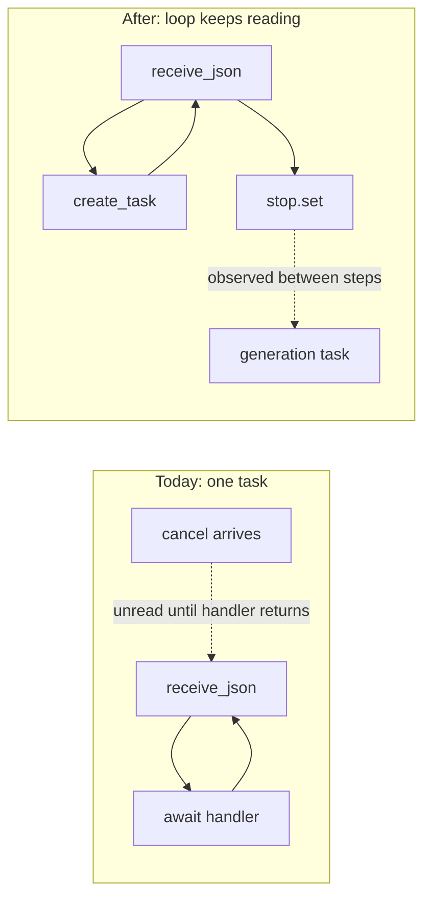

# LIFE-04: bounded interruption, with RUNTIME-01's queue bound

## What is actually broken

The cancel machinery already exists and is unreachable. `MSG_CANCEL` sets an event ([worker_base.py:918](src/backends/worker_base.py)), and all three samplers check it between steps. But the loop awaits the whole generation inline:

```914:931:src/backends/worker_base.py
            while True:
                data = await ws.receive_json()
                mtype = data.get("type")

                if mtype == MSG_CANCEL:
                    cancel_event.set()
                    continue

                if mtype in streaming:
                    if gen_lock.locked():
                        await _send_busy(ws, mtype, data)
                        continue
                    async with gen_lock:
                        cancel_event.clear()
                        await streaming[mtype](
                            ws, data, cancel_event, stream
                        )
                    continue
```

While `streaming[mtype]` runs, `receive_json` is not reached, so a cancel sits unread in the socket buffer until the run it was meant to stop has finished. Disconnect has the same shape. Three further gaps sit behind it: DiffusionGemma's cancel only stops *yielding* while `finally: await task` waits out the full `model.generate` ([dgemma_sampler.py:304](src/inference/dgemma_sampler.py)); the AR and DiffusionGemma thread bridges are unbounded `queue.Queue()` ([ar_sampler.py:1248](src/inference/ar_sampler.py), [dgemma_sampler.py:356](src/inference/dgemma_sampler.py)); and a stopped run ends three different ways (LLaDA sends no terminal, the other two send an ordinary `done`).

Note the queue bound is not a borrowed step: `LIFE-04`'s own Direction says "bound the thread-to-async queue". It is also `RUNTIME-01`'s first step, which is why they meet here.



## Commit 1: thread-safe stop and bounded producer queues

- Change the signal from `asyncio.Event` to `threading.Event` in [worker_base.py:874](src/backends/worker_base.py) and the `cancel_event` annotations across the samplers and workers (8 files, mechanical: the call sites only use `is_set`/`set`/`clear`). The reason is concrete, not stylistic: DiffusionGemma's new stopping criterion runs inside `model.generate` on a worker thread, and the bounded put needs a timed `wait` callable from a thread. `asyncio.Event` offers neither safely.
- Give both thread bridges `maxsize`, and replace the bare `out_queue.put(...)` in the producer with a helper that puts with a short timeout and re-checks the stop event, so a producer never blocks forever against a consumer that went away. That is the "disconnect-safe backpressure" the report asks for.
- Bound: **32 frames**, as a named constant with the arithmetic in the comment. At the recommended 256-token ceiling that is at most 8,192 queued token records; at the experimental 2,048 ceiling it is 65,536, roughly 3 percent of the run's own 2,098,176, so the bound caps the burst while the append-only frame variant remains the real fix. At observed AR speed it is about 0.6 s of slack, enough to ride out a paint or a GC pause without ever stalling a healthy client.
- Give DiffusionGemma an event-backed `StoppingCriteria` so a cancel ends `model.generate` itself rather than only ending the yield loop.

Tests: new `tests/inference/test_frame_queue.py` (depth never exceeds the bound under a slow consumer; producer returns rather than blocking once the stop is set and nobody drains), and a criterion test that it reports stop exactly when the event is set.

## Commit 2: read the socket while generating

Restructure the loop so it always owns `receive_json` and a streaming request runs as a task:

- Keep a single `current: Optional[asyncio.Task]`. Busy checks become `current is not None and not current.done()`, which is synchronous and race-free on one event loop, and lets `gen_lock` go: it existed only to serialize generation, and one task reference now does that without the loop ever awaiting a lock. `MSG_PROBE` uses the same predicate, so a probe still refuses during a run instead of blocking the reader.
- `MSG_CANCEL` sets the stop immediately, because the loop is at `receive_json`.
- `WebSocketDisconnect` sets the stop and awaits the in-flight task before returning, so no work is orphaned.
- Attach a done-callback that logs the task's exception, so a failure inside a spawned generation cannot be swallowed.

No supervisor change is needed. `_pipe` already cancels the surviving direction and closes the worker socket when the browser goes ([server.py:1491](src/web/server.py)), and a loop parked at `receive_json` now observes that close at once.

**This changes behaviour users will feel: leaving the page mid-run now stops the run.** Today navigating to Analytics during a generation leaves the worker computing for a browser that is gone, and the frames it produces go nowhere, so the run was already lost and the only thing the change removes is the wasted GPU time. It is still a change worth stating plainly, and worth a line of Help copy in commit 4.

Tests: extend [tests/backends/test_worker_dispatch.py](tests/backends/test_worker_dispatch.py), whose parked-generation harness was built for exactly this. A cancel sent during a parked generation now sets the stop before the generation is released; a second generate during one in flight is still refused busy; a disconnect during a parked generation sets the stop. Replace the existing `test_cancel_is_swallowed_rather_than_answered`, whose comment currently documents the gap.

## Commit 3: one cancelled terminal outcome

Every stopped run ends with `done` carrying `cancelled: true`, routed through `FrameStreamer` so it still gets `elapsed`, provenance and the run token ([worker_base.py:161](src/backends/worker_base.py)). That keeps a stopped run identifiable and savable while refusing to call it finished.

- LLaDA generate currently returns with no terminal at all and still commits partial state via `_store_state`; it gains the `send_done` its resume path already has ([llada_worker.py:496](src/backends/llada_worker.py) is the model to follow).
- AR and DiffusionGemma already synthesize a `done`; they flag it.
- Retained state stays **explicitly partial**, matching the LIFE-07 precedent that a cancelled resume commits: the run remains editable, and the client can save it.
- The save carries `partial: true` into run metadata beside `run_token` in `_stage_and_publish` ([run_store.py:449](src/web/run_store.py)), so a truncated run cannot read as complete later. Surface it wherever a run's metadata is already displayed in Analytics.

Tests: per-backend terminal assertions; `tests/web/test_run_store.py` gains partial round-trip and absent-by-default cases.

## Commit 4: Stop in the browser

- Generate becomes Stop while a run is in flight. Today it greys out for the whole run ([app.js:5775](src/web/static/app.js)); `currentGenerateLabel` and `updateGenerateButton` ([app.js:4784](src/web/static/app.js)) grow a third state, so the primary slot stops sitting inert for 40 seconds. Clicking it sends `{type: "cancel"}`, which the client has never sent.
- `handleDone` ([app.js:1800](src/web/static/app.js)) branches on `cancelled`: status reads "Stopped." rather than "Done.", frames and the scrubber are preserved, and the run is marked interrupted so nothing presents it as complete.
- `ws.onclose` ([app.js:1484](src/web/static/app.js)) leaves the generating state into the same interrupted state rather than stranding `isGenerating` true. The report rejected *merely* clearing the flag; reaching a labelled interrupted state is the accepted form.
- **Help and About copy in the same commit**, which `AGENTS.md` requires for anything a user would notice, and a Stop button plus an interrupted state plus leaving-the-page-stops-the-run is three such things. `#modal-help` in [index.html](src/web/static/index.html) gains: how to stop a run, that a stopped run keeps its frames and stays scrubbable and savable while being recorded as partial, and that navigating away now ends the run rather than leaving it running unseen.

Tests: a source-inspection test in the style of [tests/web/test_save_is_explicit.py](tests/web/test_save_is_explicit.py), asserting the cancel send exists, the button reaches a Stop state, and the close handler routes to interrupted.

## Commit 5: records, and the copy the experiment falsified

### Correct the entropy Help copy

The ablation disproved a claim shipped one commit earlier. [index.html:478](src/web/static/index.html) currently opens "A long flat stretch near zero usually means repetition rather than mastery" and closes "a floor at a hundredth of a nat is repetition". Prompt A used 41-plus distinct standard-library modules with no repeated function and flatlined anyway, so repetition is not the cause. It is the only place in the frontend that makes this claim, so this is a single paragraph rewrite that leads with domain and demotes repetition to the slope on top.

### Fold the ablation into ROADMAP's settled decisions (line 1030)

Six findings, all from the one experiment:

- **Domain sets the floor.** Code is intrinsically low-entropy even when content is genuinely varied. Mean confidence roughly 90 percent for A against 65 to 70 for B.
- **Repetition is a slope on that floor, not the floor.** A's profile declines rather than sitting flat, because the recipe scaffolding stays constant while the payload changes.
- **The original code run was both effects stacked**, domain plus verbatim body repetition, which is how it reached near zero.
- **The spikes land on real decision points**, with troughs on forced syntax. This is evidence the strip measures uncertainty rather than token frequency, which is the closest thing to a validation the entropy feature has.
- **Models pad code far more readily than prose.** B stalled near 670 tokens across several seeds until explicitly licensed to keep inventing subjects.
- **Method note:** keeping "occupies 2048 tokens" in both prompts was deliberate, since the length demand is itself a variable and dropping it would have moved two things at once.

### The rest of the records

- Per-run notes to ROADMAP's XAI backlog (line 1143), explicitly post-audit: notes attached to a run, the ability to reference and collate groups of runs, the soft overlap with Analytics collections as the open question, and the possibility that it grows into a graph rather than a list.
- `RUNTIME-01` ledger: **one added line, not a correction.** The entry at [IMPLEMENTATION_LEDGER.md:1096](docs/audit/IMPLEMENTATION_LEDGER.md) is accurate as written, and its genuinely new material (the 30-to-45-second save, the ten-second Analytics paint, and the finding that the wall is the sessionStorage quota rather than the on-disk format or the reader) appears nowhere in the report. Add only that the report's projection of 2,098,176 at 2,048 tokens ([AUDIT_REPORT.md:1191](docs/audit/AUDIT_REPORT.md)) corroborates the observed 2,096,128. Then record that the queue bound landed here and the append-only frame variant remains open.
- `ANALYTICS-03` ledger note: it gained evidence without anyone touching it. `list_runs` scans all 211 run directories per load, and a single long run now measures around ten seconds to paint on top of that. Two costs that compound, which is the argument for pagination.
- New manual items for LIFE-04's Verification clause: cancel and disconnect during each model's generation, confirming compute stops within a bounded time, the worker accepts a new generation immediately after, and the page recovers without a reload.

## Verification

`.venv/bin/python -m pytest`, `.venv/bin/python scripts/lint_ratchet.py`, `node --check` on changed JS, ReadLints on everything touched. The sandbox has no GPU, so the stop-actually-stops-the-GPU half is a manual checklist.