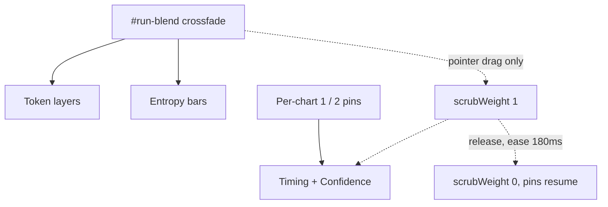

## Line chart comparison layer

### Scope note found during research

`renderTimingChart` and `renderConfidenceChart` each build exactly **one** dataset, and `original_per_frame_elapsed` / `original_mean_conf` appear nowhere in [analytics.js](src/web/static/analytics.js). The data is saved by `addOriginalRunSignals` in [app.js](src/web/static/app.js) (4051) and returned by the metrics route in [server.py](src/web/server.py) (1400-1406), so this is pure consumption, but the second series is new work, not a restyle.

### Governance model

The slider and the pins stay fully decoupled. No slider repositioning, no dock, no both-off state.

Effective alpha per dataset is a lerp: `lerp(pinAlpha, blendAlpha, scrubWeight)`, where `pinAlpha` is 1 or 0 from the pin and `blendAlpha` is `1 - compareBlend` / `compareBlend`. At rest `scrubWeight` is 0 and the pins fully decide.

---

### 1. Second series on both line charts

In `renderTimingChart` (2316) and `renderConfidenceChart` (2467), build the original dataset when the field is present and non-empty, at **index 0** to match the entropy chart's existing `0 = Original, 1 = Edited` order (2721-2730).

- Labels run to `max(edited.length, original.length)`; the shorter series pads with `null` and keeps `spanGaps: true`.
- Timing: run `original_per_frame_elapsed` through `buildCumulativeTiming(raw, {})` (633) for uniformity. It is a single unbranched segment, so this is a pass-through.
- Confidence: same `v * 100` mapping already used at 2484-2491.
- The `segment.borderColor` / `borderWidth` callbacks (2368-2386) stay on the **edited** dataset only. The original run has no resume ranges or remask frames.
- Styling per the agreed convention: original is **solid**, edited is `borderDash: [5, 3]`. Original uses a neutral grey (`#8b93a1`) so it does not collide with timing's `#00aaff`, `TIMING_RESUMED`, or the amber canvas-boundary markers. Tunable in one constant each.
- **Fill:** when two datasets are present, set `fill: false` on both. Two overlapping translucent fills are unreadable at the both-on default. Single-series runs keep `fill: true` and look exactly as they do today.
- Dataset `label` becomes `"Original"` / `"Edited"` when two series exist so the index tooltip names them; keep the current single label otherwise. Units move into the `label` callback.

### 2. Per-chart pins

Two buttons per chart in the existing `.zoom-controls` group in [analytics.html](src/web/static/analytics.html) (251-297), matching the eye-toggle convention exactly (`class="zoom-btn compare-pin-btn"`, `data-chart`, plus `data-series="original|edited"`).

- Text `1` and `2`; lit state is a `.is-on` class giving `color: var(--accent)`.
- Three reachable states only. Clicking the sole lit pin is a no-op, and that button renders non-interactive so the deadness is visible before the click.
- Module state `linePinState` keyed by chart, reset to both-on per run alongside `resetTooltipToggles` (1200-1211).
- Hidden entirely when the chart has no original series.
- Pin clicks never touch `#run-blend`.

### 3. Scrub preview

- New shared plugin factory beside `compareBlendPlugin` (1171-1187), registered in the `plugins` array of both charts next to `canvasBoundaryPlugin` and `burnThroughPlugin`. Same `save`/`restore` guard pairing, same `datasets.length < 2` no-op.
- `pointerdown` on `#run-blend` sets `scrubWeight = 1`; `pointerup` and `pointercancel` on **window** (release often lands off-element) ease it back to 0 over ~180ms with a rAF loop calling `chart.update("none")`.
- `onRunBlendInput` (2780) gains `chartTiming` / `chartConfidence` updates.
- Keyboard is deliberately excluded: arrow keys move the tokens and bars, the line charts stay on their pins. Documented in a comment.
- Pins get a dimming class while `scrubWeight > 0` to show they are temporarily overridden.
- Tooltip `filter` on both charts drops rows whose effective alpha is near zero, so a pinned-off series contributes no tooltip row.

### 4. Zoom controls into the chart corner

Only `+`, `-`, and reset move. The eye toggle stays in the header.

- New `.chart-zoom-dock` inside each `.chart-wrap` (which is already `position: relative`, [analytics.css](src/web/static/analytics.css) 302-309), absolutely positioned bottom-left, on all four charts including entropy and convergence.
- Segmented pill: flex row, no gap, shared 1px border, `border-radius: 4px`, `overflow: hidden`, 18x18px buttons with `border-left` dividers and `:first-child` cleared. Resting `opacity` around 0.55, full on `.chart-wrap:hover`.
- The gutter corner measures roughly 40-45px wide against a ~56px pill, so add `layout: { padding: { bottom: 16 } }` to `convergenceOptions`, `timingOptions` (2413), `confidenceOptions` (2522), and `entropyChartOptions` (2814). That lifts the x-axis title and reserves a clean strip rather than overlapping the first tick label.
- `handleZoomClick` (3065) is a document-level delegate keyed on `data-chart` / `data-action`, so **no JS handler changes are needed** for the move.

### 5. GPU label into the run summary

- Delete the `#gpu-label` span (analytics.html 256), its `.gpu-label` CSS (analytics.css 608-615), the `gpuLabel` DOM ref (31), and the write in `renderTimingChart` (2326-2333). `run` then becomes unused in that signature, so drop the parameter and update the call at 1263.
- Add a `.meta-row` in `renderDetailMeta` (932-971) before the `Elapsed` row. `run.processor` is already normalized server-side to `"GPU"` / `"CPU"` / `"Unknown"` (server.py 1239-1248), so the label is that value and the value is `run.processor_name`, keeping the existing `|| gpuName` fallback for older runs and falling back to `GPU:` when `processor` is absent or `Unknown`.

### 6. Docs and verification

- Help copy in [index.html](src/web/static/index.html): Timing (428, drop "displayed in the chart header"), Confidence (430), Chart controls (437), and a sentence on pins plus the drag preview near the crossfade paragraph (424).
- `README.md`, `ROADMAP.md`, `HANDOFF.md` per AGENTS.md, including a manual-verification checklist since charts cannot be exercised headless.
- `node --check` on changed JS, `ReadLints`, `.venv/bin/python -m pytest`, and a 70-column audit.

Manual checks to hand back: unedited run shows one series and no pins; edited run opens both-on; each pin state; sole-lit pin rejects; drag preview follows and eases back; keyboard arrows move tokens but not lines; pinned-off series absent from tooltips; zoom dock works on all four charts and does not collide with axis labels; GPU row present and correct for a CPU run.