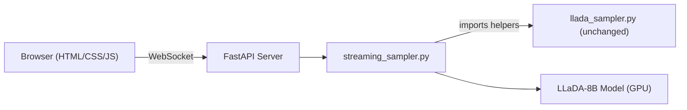

# Live LLaDA Diffusion Web UI

## Architecture




The core idea: create an **async generator** version of the generation loop that `yield`s decoded frames after each diffusion step, enabling real-time WebSocket streaming. The generator reuses `add_gumbel_noise()` and `get_num_transfer_tokens()` from [llada_sampler.py](src/inference/llada_sampler.py) without modifying that file.

## Key Design Decisions

- **WebSocket over SSE**: Bidirectional — client sends generation params, server streams frames, client can cancel mid-generation.
- **Streaming via async generator**: The existing `generate()` returns all frames at once. A new `streaming_generate()` async generator reimplements the outer loop (importing the same helpers) and `yield`s each frame. Model forward passes run via `asyncio.to_thread()` to avoid blocking the event loop (PyTorch releases the GIL during CUDA ops).
- **Single-generation lock**: One GPU means one generation at a time. An `asyncio.Lock` serializes requests; the UI disables controls during generation.
- **Model loads at startup**: Background thread loads model on server start. WebSocket clients receive status messages (`loading` / `ready`).

## WebSocket Protocol

- **Client -> Server**: `{"type": "generate", "prompt": "...", "steps": 128, "gen_length": 128, "block_length": 32, "temperature": 0.0, "cfg_scale": 0.0}`
- **Client -> Server**: `{"type": "cancel"}` (abort in-progress generation)
- **Server -> Client**: `{"type": "model_status", "status": "loading" | "ready"}`
- **Server -> Client**: `{"type": "frame", "index": 0, "total_steps": 128, "text": "░░░..."}`
- **Server -> Client**: `{"type": "done", "final_text": "..."}`
- **Server -> Client**: `{"type": "error", "message": "..."}`

## New Files

### 1. `src/inference/streaming_sampler.py`

Async generator that wraps the diffusion loop:

```python
async def streaming_generate(
    model, tokenizer, prompt, *,
    steps, gen_length, block_length,
    temperature, cfg_scale, remasking,
    cancel_event,
):
    # Tokenize (same as llada_generate_with_history)
    # Initialize masked tensor x
    # yield initial fully-masked frame
    for num_block in range(num_blocks):
        for i in range(steps_per_block):
            # Forward pass via asyncio.to_thread()
            # Sampling logic (uses imported helpers)
            # yield decoded frame text
            # Check cancel_event between steps
    # yield final result
```

Imports from [llada_sampler.py](src/inference/llada_sampler.py):

- `add_gumbel_noise` (line 11)
- `get_num_transfer_tokens` (line 25)

The sampling logic inside the loop (lines 86-140 of `generate()`) is reproduced in the generator. This is the minimal duplication needed for streaming — the helpers stay in `llada_sampler.py`.

### 2. `src/web/server.py`

FastAPI application:

- **Startup**: Loads model + tokenizer in a background thread, sets `model_ready` event
- `**GET /`**: Serves static files (the SPA)
- `**WS /ws`**: WebSocket endpoint — sends model status on connect, listens for `generate` / `cancel` messages, streams frames from `streaming_generate()`
- **Generation lock**: `asyncio.Lock` ensures one generation at a time

### 3. `src/web/static/index.html`

Single-page layout:

- Header with title
- Parameter controls bar (prompt textarea + sliders/inputs for steps, gen_length, block_length, temperature, cfg_scale)
- Main output area (monospace, dark background, ░ characters resolving into text)
- Status bar (step counter, elapsed time)
- Model loading overlay

### 4. `src/web/static/style.css`

Dark terminal aesthetic:

- Background: near-black (#0a0a0a)
- Font: system monospace (JetBrains Mono via Google Fonts as enhancement)
- Subtle animated grid: thin green (#00ff4120) lines via CSS `background-image` linear gradients, slowly translating
- Floating characters: CSS-animated positioned spans with low opacity, drifting slowly
- Mask character (░) styled with a dim green glow
- Resolved text styled in light gray/white
- Smooth transitions as masks resolve

### 5. `src/web/static/app.js`

Client-side logic:

- WebSocket connection management with auto-reconnect
- Parameter collection from form controls
- Frame rendering: receives frame text, splits into characters, renders each character with appropriate styling (mask vs resolved)
- Progress bar / step counter update
- Generate/Cancel button state management
- Model loading state handling

## Frame Rendering Strategy

Each frame is a string containing a mix of `░` (mask) and resolved text. The JS renderer:

1. Receives frame text from WebSocket
2. Replaces the output area content character by character
3. Mask characters get a dim green color + subtle glow CSS class
4. Resolved characters get a bright white color
5. Transition happens instantly per frame (the animation comes from the diffusion process itself producing new frames)

## Dependencies to Add

- `fastapi` — async web framework
- `uvicorn[standard]` — ASGI server
- `websockets` — WebSocket protocol support

These will be appended to [requirements.txt](requirements.txt).

## Startup

```bash
python -m uvicorn src.web.server:app --host 0.0.0.0 --port 8000
```

Or a convenience entry in [main.py](main.py) via `--serve` flag.