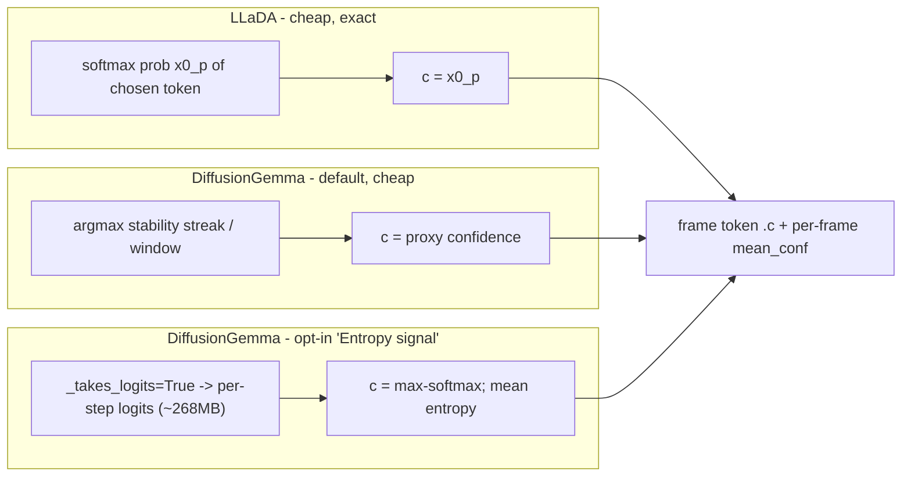

# Milestone 4 Visualization + Graceful VRAM Handling (Turn 2)

Scope confirmed with you: deliver the three remaining M4 features plus graceful OOM/VRAM handling. Thinking-mode split view already shipped.

## Confidence signal: the core decision (locked in)

Per-token confidence `c` in [0,1] is added to frame tokens. Source differs by model, cheap by default:

## 1. Frame protocol + samplers

- Extend frame tokens with optional `c` (0..1) and each `frame` message with `mean_conf` (mean confidence of resolved positions that step) and `canvas_index`.
- LLaDA [src/inference/streaming_sampler.py](src/inference/streaming_sampler.py): thread the already-computed `x0_p` out of `_diffusion_step` into `_build_token_list` so each resolved token carries `c`; compute `mean_conf`. `canvas_index` = 0 (single canvas).
- DiffusionGemma [src/inference/dgemma_sampler.py](src/inference/dgemma_sampler.py): default proxy in `FrameQueueStreamer` (per-position argmax-stability streak -> `c`; `mean_conf` = resolved fraction). Add an opt-in `entropy_signal` bool param that sets `_takes_logits=True`; in that mode `put_draft` receives `logits` only, so recover tokens via argmax and compute `c` = max-softmax + true mean entropy. (Both `put_draft` code paths per [generation_diffusion_gemma.py:781-786](.venv-dgemma/lib/python3.12/site-packages/transformers/models/diffusion_gemma/generation_diffusion_gemma.py).)
- Register `entropy_signal` in the DiffusionGemma schema in [src/backends/registry.py](src/backends/registry.py) (bool, default off, rendered as a mode toggle next to Thinking); wire it through [src/backends/dgemma_worker.py](src/backends/dgemma_worker.py).

## 2. Generator: per-token confidence heatmap

- [src/web/static/app.js](src/web/static/app.js): add a "Heatmap" toggle in the scrubber controls. When on, `renderFrameWithTokens` colors each resolved token by its `c` (in-memory `frameTokens[i].c`), leaving unresolved tokens as the mask glyph. Purely a view toggle over existing frame data (no persistence).
- [src/web/static/style.css](src/web/static/style.css): a theme-consistent intensity scale (dim -> bright accent) via a small set of `.heat-*` classes or an inline color.
- Decision: per-token confidence is generator-only (not persisted) to avoid bloating saved runs.

## 3. Analytics: multi-canvas timeline + stopping/confidence chart

- Persist lightweight per-frame aggregates: extend the save payload in [src/web/static/app.js](src/web/static/app.js) `saveRun` and `SaveRunRequest` in [src/web/server.py](src/web/server.py) with per-frame `canvas_index` and `mean_conf` (arrays; small). Store in `metadata.json`.
- [src/analytics/metrics.py](src/analytics/metrics.py): surface `canvas_boundaries` (frame indices where `canvas_index` increments) and `mean_conf` in the metrics response.
- [src/web/static/analytics.js](src/web/static/analytics.js): draw vertical canvas-boundary markers on the convergence and timing charts for multi-canvas runs; add a "Confidence" chart (mean_conf per frame) with the adaptive-stop frame marked. Gracefully no-op for runs lacking the new fields (older/LLaDA runs).

## 4. Graceful VRAM / OOM handling (for sharing the repo)

- [src/backends/registry.py](src/backends/registry.py): add `min_vram_gib` per model (LLaDA ~17, DiffusionGemma ~18).
- [src/backends/worker_base.py](src/backends/worker_base.py): wrap `backend.load()` in try/except; store `load_error`; `/health` reports `{status: "error", message}`; `/ws` emits an `error` frame instead of hanging on `loading`.
- [src/web/server.py](src/web/server.py) `ModelManager.activate`: (a) pre-flight free-VRAM check via `nvidia-smi` against `min_vram_gib`, refusing with a clear message before spawning; (b) poll `/health` until status leaves `loading`, so a load failure returns a real error to the browser instead of an endless spinner.
- [src/web/static/app.js](src/web/static/app.js): ensure `switchModel` surfaces activation errors (message + revert the selector), reusing the existing error path.

## Notes / risks

- The true-entropy path ships ~268 MB/step to CPU; it stays strictly opt-in and off the default hot path.
- I cannot fully verify the OOM refusal on your 4090 (both models fit); I will simulate it by temporarily inflating `min_vram_gib` so you can see the refusal, then set real values.
- Verify per feature: JS syntax + lints, a DiffusionGemma run with the proxy heatmap, an opt-in entropy run, and an analytics run showing canvas markers + the confidence chart.