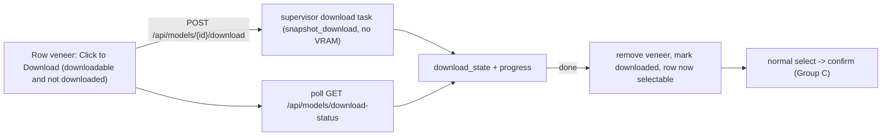

# Menu VRAM Headroom, Download, and UX Polish

Follow-ups from testing, grouped into commit-sized units on a shared foundation. Ordered so each group is independently shippable.

## Root-cause findings

- **VRAM leak is orphaned workers.** `ps` shows a stray `run_worker --model smollm3 --device cuda` (PID 50637) started well before the current `desktop.py`, still holding VRAM. It predates this session's PDEATHSIG code, so it was never armed. Immediate cleanup: close the app, `pkill -f "src.backends.run_worker"`, verify with `nvidia-smi`.
- **Fits miscalculation.** In [server.py](src/web/server.py) `_models_snapshot` (lines 631-639), `resident_reclaimable_gib` is set to the resident model's `min_vram_gib` regardless of device. When SmolLM3 is resident on CPU it reclaims 0 GPU, but this still adds 8 GiB to the free pool, so LLaDA/DiffusionGemma wrongly show "Available".

## Foundation

- **Fix reclaimable + expose headroom** ([server.py](src/web/server.py)): count `resident_reclaimable_gib` only when `manager.active_device == "cuda"`. Compute a per-model signed `vram_headroom_gib = round((free_vram + reclaimable) - min_vram_gib, 1)` (None when free VRAM is unreadable or `min_vram_gib <= 0`), and derive `fits` from the same number so the menu, the oblong, and the pre-flight all agree. Add `vram_headroom_gib` to each model in the snapshot.
- **Orphan safety** ([server.py](src/web/server.py) + [desktop.py](desktop.py)): add a startup sweep that terminates stray `src.backends.run_worker` processes not owned by this supervisor (match on the command line via `/proc`), and confirm PDEATHSIG actually fires from the daemon-thread launcher (harden if not, e.g. also kill the worker's process group on shutdown).
- **Download detection** ([server.py](src/web/server.py)): add `downloaded` and `downloadable` per model. `downloadable` = checkpoint is an HF repo id (not a local `~`/`/` path, so DiffusionGemma is not downloadable via the UI). `downloaded` = for repos, `huggingface_hub.snapshot_download(repo_id, local_files_only=True)` succeeds (offline, fast); for local paths, the dir exists. `huggingface_hub` is already pinned in [requirements.txt](requirements.txt).

## Group A: headroom oblong + text/icons

- **Signed-headroom oblong** ([menu.js](src/web/static/menu.js) `buildRow`/`buildDeviceToggle`/`buildStaticDeviceTag`, [app.js](src/web/static/app.js) `buildOptionDevice`, shared CSS in [style.css](src/web/static/style.css)): a decorative rounded panel extending left of the device tag showing `+1.3 GiB` (green) / `-1.2 GiB` (red) from `vram_headroom_gib`, dark background. Tooltip: negative -> "Insufficient VRAM. Required: X GiB, Available: Y GiB"; positive -> "Fits. Required: X GiB, Available: Y GiB" (Available = free + reclaimable). Remove the "~X GiB Available/Insufficient VRAM" text (`applyStatus`). The dropdown version (3d) is the same component, smaller.
- **Menu text** ([menu.js](src/web/static/menu.js) `makeSystemLine`, [style.css](src/web/static/style.css) `.menu-title`/`.menu-subtitle`): `GPU:` / `CPU:` colons on the readout tags; widen the title/subtitle gap.
- **Rename to "LLM Visualizer"** (surgical, product-name string only): [menu.html](src/web/static/menu.html) (`<title>` L6, `.menu-title` L36), [index.html](src/web/static/index.html) (`<title>` L6, header L24, About modal L219), [analytics.html](src/web/static/analytics.html) (`<title>` L7, header L39-40 -> "LLM Analytics"), and [desktop.py](desktop.py) `WINDOW_TITLE` L45 (keep `APP_ID` = `llm-xai-visualizer` so storage/`.desktop` identity stays stable). Move the green `title-accent` from "Diffusion" to "LLM". Leave all legitimate "diffusion" references (model descriptions, `diffusion-style text`, CSS classes) untouched.
- **Family icons**: a small inline SVG right of the model name driven by `capabilities.model_type` (diffusion = denoise/scatter motif; autoregressive = left-to-right chevrons), with a native tooltip via an SVG `<title>` child: "Model Family: Diffusion/Autoregressive". Rendered in [menu.js](src/web/static/menu.js) `buildRow` (and optionally the dropdown).

## Group B: dropdown polish

- **Width** ([app.js](src/web/static/app.js) `sizeModelSelect`, [style.css](src/web/static/style.css)): let `.model-select-list` size to its content (`width: max-content; min-width: 100%; right: auto`) and budget for the device pill + oblong so options never overflow (screenshot 2).
- **Confirm popover cursor** ([style.css](src/web/static/style.css) `.switch-confirm`, [app.js](src/web/static/app.js) `openSwitchConfirm`): the popover is a child of `#model-select` (cursor: pointer), so give `.switch-confirm` `cursor: default`, `stopPropagation` on its click (it currently also toggles the dropdown), and keep `cursor: pointer` only on the buttons.
- **Center + reword**: flex-center the check/X glyphs in their boxes; reword to "Unload the current model {current} and load {selected} on {GPU/CPU}?".

## Group C: menu select-to-confirm animation

Mirror the dropdown's confirm discipline on the menu. Clicking a model no longer activates immediately; instead the modal animates: other rows fade out, the modal contracts to the chosen row, the description text dissolves (model name + tag + oblong stay), and a confirm message with green check / red X appears in the freed space. Check runs the existing activation (loading bar + Cancel); ready -> Generation. X reverses the animation back to the full menu. State machine + CSS transitions in [menu.js](src/web/static/menu.js) / [style.css](src/web/static/style.css); reuses the existing `pollActivation` / cancel flow.

## Group D: "Click to Download" for uncached models

- **Supervisor download-only** ([server.py](src/web/server.py)): `POST /api/models/{id}/download` starts a background task running `download_with_progress` ([src/inference/hf_download.py](src/inference/hf_download.py)) against the checkpoint (no worker, no VRAM), tracked in new manager fields (`download_state`, `download_progress`, `download_target`, `_download_task`); `GET /api/models/download-status` for polling; best-effort cancel. Only for `downloadable` models.
- **Veneer UI** ([menu.js](src/web/static/menu.js), [app.js](src/web/static/app.js), [style.css](src/web/static/style.css)): when `downloadable && !downloaded`, overlay a thin translucent veneer with "Click to Download" (highlight on hover). Click -> start download, show the progress bar, and on completion remove the veneer and mark the row selectable (it does not auto-navigate; the user then selects normally). DiffusionGemma (not downloadable) keeps its current graceful "run the quantize script" activation error.
- To test the bar meanwhile: `rm -rf ~/.cache/huggingface/hub/models--HuggingFaceTB--SmolLM3-3B`.

## Docs and verification

- **Docs**: update README/HANDOFF for the rename, the VRAM-headroom display, the download veneer, and a note on clearing orphaned workers.
- **Verify**: `.venv/bin/python -m py_compile` changed modules, `node --check` changed JS, `.venv/bin/python -m pytest`, ReadLints. Manual (needs GPU/model): headroom oblong shows correct signed values and colors; fits is correct with SmolLM3 resident on CPU; orphan sweep frees stale workers; rename + icons + spacing render; dropdown no longer overflows and the confirm cursor/centering/copy are right; menu select animates to confirm; uncached model shows Click-to-Download, downloads with a bar, then becomes selectable.