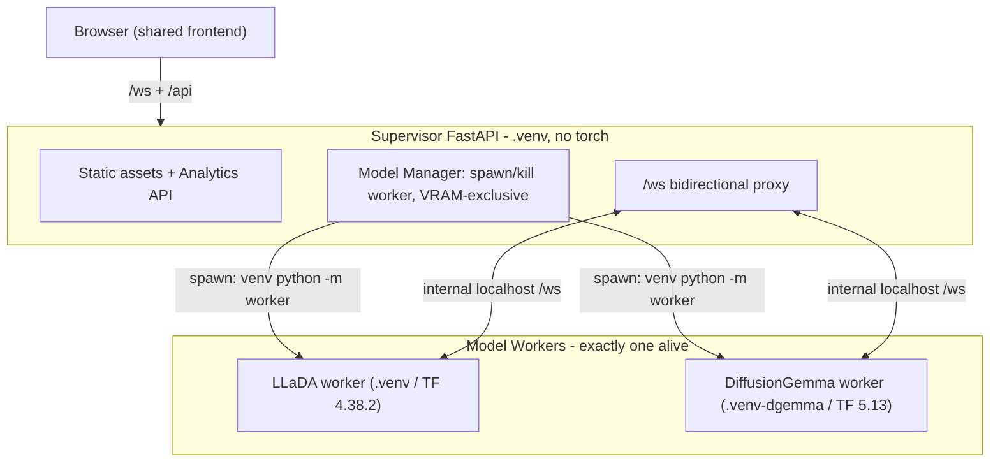

# Multi-Model Diffusion Visualizer: LLaDA + DiffusionGemma

## Goal and scope

Turn the single-model, single-process LLaDA app into a model-agnostic suite that also runs DiffusionGemma (4-bit) locally on the RTX 4090, preserving the frame-by-frame diffusion visualization. Confirmed decisions:

- Architecture: process isolation. A supervisor server spawns one per-model worker subprocess at a time, each in its own venv, streaming frames over a shared protocol.
- Quantization: quantize the bf16 base once into a saved ~13GB NF4 checkpoint, reload on startup.
- Phase 1 = generation + visualization + analytics for both models. Parked: DiffusionGemma interactive remask/resume (phase 2) and multimodal (phase 3). LLaDA keeps its existing remask/resume.

## Why process isolation

LLaDA needs Transformers 4.38.2 (`trust_remote_code` custom modeling in the HF cache); DiffusionGemma needs Transformers v5 (`DiffusionGemmaForBlockDiffusion`, fused MoE experts, `TextDiffusionStreamer`). The spike proved these coexist only in separate venvs (`.venv` untouched at 4.38.2; `.venv-dgemma` on 5.13.0). Only one ~15-16GB model fits in 24GB VRAM at a time, so a single-active-worker model is required regardless.

## Target architecture

- Supervisor runs in `.venv` (already has fastapi/uvicorn/websockets; will add `httpx` for proxying). It never imports torch/transformers.
- Each worker is a slim FastAPI app exposing the same `/ws` contract as today (`generate`/`resume`/`cancel` in; `model_status`/`frame`/`done`/`error` out). The LLaDA worker reuses the existing streaming code nearly verbatim; the DiffusionGemma worker wraps `TextDiffusionStreamer`.
- Model switch = Manager kills the current worker (frees VRAM), spawns the next with the correct venv Python, waits for `model_status: ready`.

## Shared contract (new `src/backends/`)

- `protocol.py`: pydantic models for the WS frame/param/message schema. Generalize the per-token shape to `{t, m, id, conf?}` where `m` means "unresolved" (LLaDA: MASK token; DiffusionGemma: not-yet-accepted), and optional `conf`/entropy powers future heatmaps. Add optional `canvas_index` and dynamic/`null` `total_steps` for adaptive runs.
- `registry.py`: typed model registry. Each entry: `id`, display name, venv Python path, worker module, checkpoint path, `param_schema` (list of params with type/min/max/default/step + recommended/experimental bounds), and `capabilities` (e.g. `supports_resume`, `unresolved_render`). Drives the frontend model selector and dynamic param panel.
- `worker_base.py`: shared worker FastAPI scaffolding (the `/ws` loop, cancel handling, elapsed timing) extracted from today's [server.py](src/web/server.py) `_stream_frames`/`websocket_endpoint`.

## Milestone 0 - Backend abstraction + supervisor/worker infra (LLaDA only)

Refactor without behavior change first; verify LLaDA still works end-to-end.

- Create `src/backends/{protocol,registry,worker_base}.py`.
- Split [src/web/server.py](src/web/server.py): supervisor keeps static mount, `/api/save`, `/api/analytics/*`, plus new `/api/models` (list + schema + status), `/api/models/{id}/activate` (kill+spawn), and a `/ws` proxy to the active worker. Model load/`generation_lock`/`last_run_state`/streaming move into the worker.
- `src/backends/llada_worker.py`: wraps [streaming_sampler.py](src/inference/streaming_sampler.py) (`streaming_generate`/`streaming_resume`) and existing model load. `MODEL_NAME`, `MASK_ID`, `sanitize_frame` become worker-local config.
- Frontend ([app.js](src/web/static/app.js), [index.html](src/web/static/index.html)): add a model-selector dropdown; fetch `/api/models` and render the param panel dynamically from `param_schema` (replaces hardcoded panel at index.html L60-117 and `LIMITS_*`/`validateAllParams` at app.js L11-33/L428-541); rebrand "LLaDA Diffusion Visualizer" to "Diffusion LLM Visualizer"; generalize frame rendering so unresolved-token display is per-model (keep `MASK_CHAR` for LLaDA). Gate remask/guided-edit UI behind `capabilities.supports_resume`.
- Save payload ([app.js](src/web/static/app.js) L1482-1501) and `SaveRunRequest` ([server.py](src/web/server.py) L78-97): `params` becomes a generic schema-driven dict; run dir + metadata carry model `id`.
- Regression check: LLaDA generate/scrubber/remask/resume/save/analytics all still work through supervisor+worker.

## Milestone 1 - DiffusionGemma NF4 quantization (highest risk; do early)

- `scripts/quantize_diffusiongemma_nf4.py` (runs in `.venv-dgemma`): load bf16 base from `~/models/diffusiongemma-26B-A4B-it-bf16` with CPU/offload, NF4-quantize the fused 3-D expert params (`DiffusionGemmaTextExperts.gate_up_proj`/`down_proj`, modeling L568-569) plus linears, and save a ~13GB checkpoint to `~/models/diffusiongemma-26B-A4B-it-nf4/`.
- Recommended approach: custom per-expert NF4 (proven to fit 24GB by the AndriejusNak gemma-4 work) with a subclassed/patched `DiffusionGemmaTextExperts.forward` that dequantizes only the top-8 active experts per token. Alternative to evaluate: vendoring bitsandbytes `Experts4bit` (draft PR). This custom NF4 expert dequant path is the core technical risk and must be validated here before Milestone 2.
- Extend `scripts/spike_diffusiongemma.py` to load the NF4 checkpoint, confirm VRAM footprint and that `TextDiffusionStreamer` frames decode sensibly.

## Milestone 2 - DiffusionGemma worker + model switching

- `src/inference/dgemma_sampler.py`: NF4 model load + a `CapturingStreamer(TextDiffusionStreamer)` that turns each `put_draft` (denoising step) and `put` (canvas commit) into protocol frames; emit per-token resolved flag + entropy (set `_takes_logits=True`) for the convergence signal and future heatmaps.
- `src/backends/dgemma_worker.py`: worker using `.venv-dgemma`; text-only (`AutoTokenizer`, not `AutoProcessor`, to avoid torchvision).
- Register DiffusionGemma in `registry.py` (venv path, NF4 checkpoint, `param_schema`: max_new_tokens, max_denoising_steps, entropy_bound, temperature schedule, thinking toggle, seed; `capabilities.supports_resume=false`).
- Add `httpx` to `.venv` (proxy) and `fastapi`/`uvicorn`/`websockets` to `.venv-dgemma` (worker).
- End-to-end model switch: select DiffusionGemma -> supervisor unloads LLaDA, spawns DGemma worker, streams live frames to the browser.

## Milestone 3 - Model-agnostic analytics + reproducibility

- [src/analytics/metrics.py](src/analytics/metrics.py): replace ░-counting `compute_convergence` (L59-98) with a resolved-flag/token-ID-based metric saved per frame, so DiffusionGemma's random-token unresolved state is handled; support variable/adaptive step counts and optional per-canvas segmentation.
- [analytics.js](src/web/static/analytics.js): schema-driven param columns/grouping (replace hardcoded LLaDA keys), show model id, and handle variable-length runs in the compare overlay (L735-757 assumes aligned fixed-length frames).
- Reproducibility (addresses a current gap): log seed, GPU, torch/transformers versions, and git commit into `metadata.json` for both models; add a seed param and deterministic seeding in both samplers.

## Milestone 4 - New experimental features (optional, incremental)

Enabled by DiffusionGemma's richer signals and done model-agnostically where possible: per-token entropy/confidence heatmap overlay; adaptive-stopping/entropy-vs-step chart; multi-canvas timeline; thinking-mode split view (`<|think|>` channel). Pick up after Phase 1 is stable.

## Parked (explicitly out of scope now)

- DiffusionGemma interactive remask/resume (phase 2): its encoder-decoder KV-cache + multi-canvas + adaptive-stopping make resume-from-frame non-trivial; `decoder_input_ids` (seed-canvas) is the eventual hook.
- Multimodal image input (phase 3): requires `AutoProcessor` + torchvision + vision-tower VRAM.

## Key risks

- Custom NF4 expert dequant in DiffusionGemma's forward path (Milestone 1) is the main unknown; validated early.
- WebSocket proxying and worker lifecycle/VRAM handoff must be clean (no orphaned workers holding VRAM on switch/crash).
- LLaDA regression through the new supervisor/worker indirection.