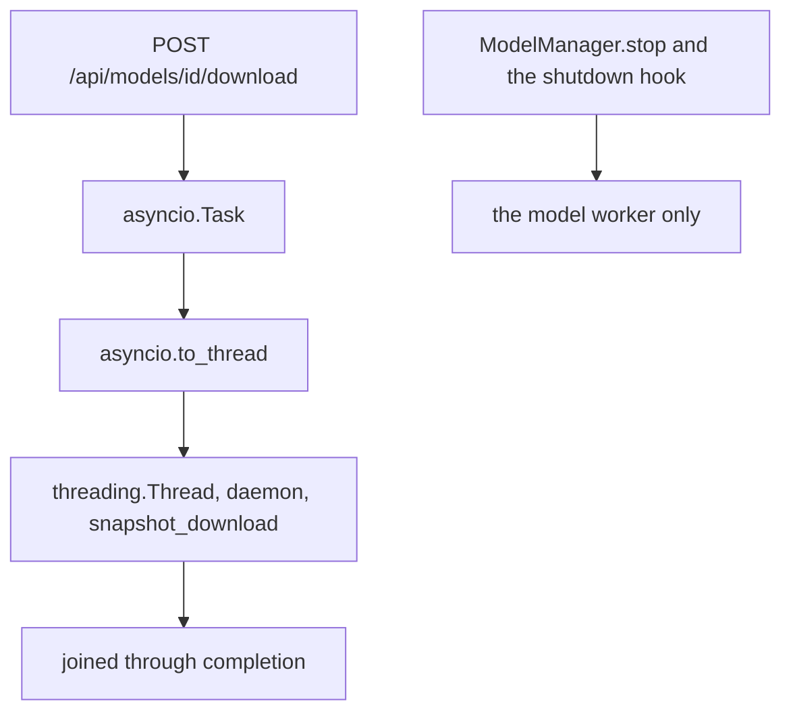

# Own downloads through cancellation and shutdown

Three parts, smallest and most certain first, because `TRUST-04` is the one
that can overrun.

## 1. Bookkeeping

`XAI-01` comes off the hardware queue and moves to done in the status table:
items 180 to 184 were all confirmed on 2026-08-28.

Item 183 asked a question rather than confirming a fix, and the answer came
back yes. [ROADMAP.md](docs/ROADMAP.md) still says the canvas brightening
toward each adaptive stop is "predicted but not yet observed". It was
observed. That is a real result about how DiffusionGemma's confidence behaves
near its halt, and it belongs in Settled decisions rather than staying a
prediction.

`ORG-02`'s table row stops claiming the download client, since part 3 absorbs
it, or the ledger double-counts the same work.

## 2. The elapsed ticker

Decided already: only the elapsed line moves between frames, throughput does
not decay during a stall.

The readout has one caller, inside `handleFrame`, and prints the worker's own
`time.monotonic()` figure, which is also what reaches the saved run. So
interpolate rather than substitute: stamp each frame's worker elapsed against
`Date.now()`, tick at roughly 100ms showing the worker value plus the local
delta, re-sync every frame. Drift stays inside one frame interval and the
terminal frame lands exactly.

Clear the ticker on the terminal frame, on disconnect, and on leaving the
page. A timer outliving its run is the obvious way to get this wrong, so it
gets its own test.

## 3. TRUST-04

### What is true today

Nothing reaches the fetch. Cancelling the task leaves `to_thread` running,
and the helper is a daemon thread that only dies when the process does.
`_stop_locked` and `@app.on_event("shutdown")` touch the worker and never the
download.

### The change that makes it cheap

Progress does not come from the download library. `hf_download.py` says so at
the top: it samples the cache directory on disk, because `snapshot_download`
will not route byte-level progress through a tqdm hook. So moving the fetch
out of process costs no IPC channel. The supervisor keeps sampling the blobs
directory exactly as it does now while a child does the fetching, and the
child only has to exit with a status.

A small entrypoint calls `snapshot_download(repo_id)` and exits.
`start_download` spawns it through the seam `LIFE-02` already built in
[worker_process.py](src/web/worker_process.py), which exposes `poll`,
`terminate`, `kill` and a bounded `wait`, and stores the handle beside the
existing `download_state`. It runs under the supervisor's own interpreter: a
download needs `huggingface_hub` and not torch.

Cancel and shutdown then reuse `_end_process`, the terminate, bounded wait,
kill, bounded wait ladder already written for workers
([server.py:1093-1137](src/web/server.py)). No second escalation policy.

`_downloaded_bytes`, `_repo_total_bytes` and `_repo_blobs_dir` are private in
[hf_download.py](src/inference/hf_download.py) and become shared so the
supervisor can sample. `download_with_progress` stays exactly as it is: the
workers still call it at load time, and that path is already killable, since
cancelling an activation terminates the worker and takes its download thread
with it.

**Resumability is preserved by doing nothing.** Killing the child leaves
`*.incomplete` blobs, `is_repo_cached` already reports a partial cache as
not-cached, and a re-click resumes. Nothing should delete the cache; valid
snapshots may be shared with another process.

### Identity, because two windows can see one download

Downloads have state but no operation number, so a second window cannot tell
whose download finished. Mirror `activation_id`: a `download_id`, returned as
`operation` from the status endpoint, and checked by a new cancel endpoint the
way `cancel_activation` checks it ([server.py:878-901](src/web/server.py)).

### The client half, which is droppable

`ORG-02` owes "the remaining API clients with request epochs" and downloads
are one. Today `/api/models/download-status` is polled from three places: a
500ms recursive loop in `menu.js`, a one-shot re-attach in the same file, and
a perpetual 1000ms loop in `download_toast.js`. When you sit on the
downloading row, two of them run against the same endpoint at once.

A `download_client.js` copying [activation_client.js](src/web/static/activation_client.js)
collapses that into one poller with observers: `start`, `observe`, `cancel`,
`stop`, `ack`, operation fencing, and injected `fetchImpl` and `schedule` so
it tests without a browser.

The cancel control goes in the menu row veneer's progress state, beside the
percentage, mirroring the Ok button its terminal state already has. There is
a stale comment in [style.css](src/web/static/style.css) around line 4178
mentioning "cancel while fetching" with no rules behind it, which is where
this was always meant to go.

Take this as a second commit and be willing to drop it. The correctness fix is
server-side; this is hygiene and slips without leaving anything broken.

## Testing, given the sandbox

This is a finding about terminating processes, and the sandbox refuses to
signal a process in a new session. `test_worker_process.py` already solved
this: real subprocesses only where they exit on their own, and terminate,
kill and wait checked by delegation against a stand-in. Same approach here,
plus `FakeProcess` from `test_worker_lifecycle.py` for the manager-level
cases (cancel mid-download, shutdown mid-download, a download that fails, a
second download refused while one runs, a cancel naming the wrong operation).

Worth knowing: **no test today touches any download endpoint**. This adds the
first, so the endpoint tests are new ground rather than an extension.

The real shutdown bound, whether closing the desktop during a multi-gigabyte
fetch exits inside its 35 seconds, is yours. So is confirming a cancelled
download resumes rather than restarting.

## Docs

README's Implementation Status lists "Real download cancellation (killable
subprocess fetch + cache cleanup)" as open. It needs rewording rather than
ticking: we are deliberately **not** cleaning the cache, because leaving
`*.incomplete` in place is the resume path.

A cancel button is user-visible, so the Help modal wants it. Manual items for
cancel-then-resume, the desktop close mid-fetch, and the two-window case where
one window cancels a download the other started.

One note for the ledger: this finding's evidence cites `HANDOFF.md:3202`, and
that file is 191 lines since `META-01` cut it. The pointer is dead and should
be re-derived rather than chased, the same way `ANALYTICS-03`'s stale evidence
was recorded.