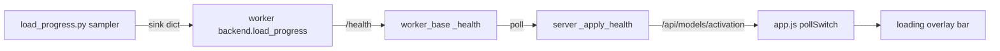

# Polish pass, plus a determinate model-load progress bar

Five commits. Items 1-6 and 8 are small and independent; item 7's bar is a
four-layer change and lands last, on its own.

## 1. Fresh slate on model switch (items 1, 2)

The bug has two halves that fix different cases, so both are needed.

**Device in the snapshot identity.** [app.js](src/web/static/app.js) records
only `model: activeModelId` in `saveSessionState` and gates the restore on
`s.model !== activeModelId` (line 5635). Add `device: activeDevice` to the
`base` object and compare it too. `activeDevice` is already set at line 5937,
before `restoreSessionState()` runs at 5951, so it is free. This fixes the
GPU/CPU switch and covers the menu's activate path for nothing.

**Clear on intent.** A switch ends in `location.reload()` (line 1246), which the
restore path cannot tell from an Analytics round-trip. And after switching away
and back the identity genuinely matches again, so no identity check can catch
it. Call `clearSessionState()` at the two sites that know a reload is a switch:

- `switchModel` in [app.js](src/web/static/app.js) (before the activate POST, ~line 1200)
- the activate handler in [menu.js](src/web/static/menu.js) (~line 1296)

Leave `PARAM_STATE_KEY` alone. It is keyed per model on purpose, and its restore
already handles a device change explicitly (see the comment at app.js:5797-5801,
where `applyLimits()` reclamps against the new override bounds).

**Placeholder text.** `showOutputPlaceholder()` (app.js:326) becomes
`"<display_name> output will appear here..."`, falling back to a generic
`"Output will appear here..."` when `activeModel` is null. The fallback is
load-bearing: boot's `.catch` calls this with no model (app.js:5961). Change the
static markup at [index.html:164](src/web/static/index.html) to the generic
string too, since it paints before `/api/models` resolves.

## 2. Cosmetic pass (items 3, 5, 7a)

- **Plain checkmark.** [analytics.js:949](src/web/static/analytics.js): swap
  `stroke="url(#edited-dots)"` for `stroke="var(--accent)"`. Keep the
  `drop-shadow` glow on `.edited-check`. Then delete what that orphans, all
  confirmed to have no other references: the `<pattern id="edited-dots">` block
  and its `<svg class="svg-defs">` wrapper
  ([analytics.html:21-33](src/web/static/analytics.html)), and `.svg-defs` /
  `.edited-dots-bg` / `.edited-dots-fg`
  ([analytics.css:444-459](src/web/static/analytics.css)).
- **Prompt spacing.** Bump `#prompt-row label`'s `margin-bottom` from `4px` to
  `7px` ([style.css:439](src/web/static/style.css)). This pushes the textarea
  down so the label and the absolutely-positioned `#prompt-history` gain the
  same clearance and stay aligned. The nav buttons are children of
  `#prompt-history`, so they follow automatically.
- **Drop the load estimate.** Remove the `.loading-sub` paragraph at
  [index.html:491-493](src/web/static/index.html).

## 3. Docs language (item 6)

- `xAI` to `XAI` in all 9 spots: [README.md](README.md) (lines 5, 11, 317, 425),
  [AGENTS.md:11](AGENTS.md), [HANDOFF.md](HANDOFF.md) (11, 1584, 1597),
  [ar_sampler.py:14](src/inference/ar_sampler.py), and the two test docstrings
  in `tests/inference/test_ar_sampler.py` and `tests/web/test_save_signals.py`.
- Generalize the framing at [README.md:1](README.md) (title),
  [README.md:5](README.md), [AGENTS.md:9](AGENTS.md),
  [HANDOFF.md:10](HANDOFF.md), and the About modal at
  [index.html:274](src/web/static/index.html). Keep one clause naming discrete
  diffusion as where the depth is, so it stays honest rather than implying even
  coverage. Repo name unchanged.

## 4. Draggable collapsed drawer (item 4)

Three constraints drive the design:

- **Drag `top`, never `transform`.** `#overlay-select-group` already animates
  `transform: translateX(...)` for its slide
  ([style.css:2440](src/web/static/style.css)). It is `position: absolute` in a
  `position: relative` parent on both pages (`#output-section`, style.css:853;
  `#overlay-output-wrap`, analytics.css:784), so `top` is the free axis.
- **A drag must not toggle.** The handle is the toggle button. Follow
  [download_toast.js](src/web/static/download_toast.js): pointer events,
  `DRAG_THRESHOLD_PX = 5`, `setPointerCapture`, and a `justDragged` flag that
  swallows the click on release (lines 36-41, 77-88, 131-202).
- **Shared, not duplicated.** The drawer markup and toggle already exist twice
  (`app.js:2515` and `analytics.js:2032` are near-copies).
  [overlays.js](src/web/static/overlays.js) loads before both on every page, so
  add one `overlaysMakeDrawerDraggable({ group, handle, container, storageKey })`
  there, following the file's existing `overlays*` global convention.

Behavior: active only while the group lacks `.open`; clamp `top` to
`[0, container.clientHeight - group.offsetHeight]`; persist via `persistSet`
with per-page keys (`diffusion_overlay_drawer_top_generator` /
`..._analytics`), read back on init and clamped again in case the viewport
shrank. Add an `.is-dragging` class for a grab cursor, matching the toast.

## 5. AR Alternatives on by default (item 8)

- [registry.py:292](src/backends/registry.py): `default=False` to `default=True`
  on the `alternatives` `ParamSpec`.
- [smollm3_worker.py:158](src/backends/smollm3_worker.py): `data.get("alternatives", False)`
  contradicts the spec default once flipped. Read the spec default rather than
  hardcoding a second copy.
- Leave the sampler's own defaults at `False` (`ar_sampler.py:222, 623, 692`).
  `tests/inference/test_ar_sampler.py:235` pins that, correctly: the library
  default stays off, only the UI default changes.

Cost is bounded. `frame["alts"]` rides only the frame that introduces a position
(`ar_sampler.py:308-314`), so the payload grows O(n), not O(n*k). The one real
consequence is that `positionAlts` sits in the session payload and
`saveSessionState`'s quota fallback (app.js:5589-5603) will fire more often on
long runs; it degrades as designed.

## 6. Model-load progress bar (item 7b)

Two findings from this pass changed the design from what we discussed:

**LLaDA uses `device_map="auto"` on CUDA** ([llada_worker.py:103-105](src/backends/llada_worker.py)),
so accelerate streams shards straight to the GPU and there is no separate
`.to(device)` step at all. Sequential CPU-then-GPU phases would show a bar stuck
at zero. So report **one fraction over `max(RSS delta, cuda_allocated)`**, and
derive the phase label from whichever counter is climbing.

**LLaDA on CPU passes `torch_dtype=None`**, which in transformers 4.38 means the
default dtype, i.e. fp32 from a BF16 checkpoint. So a disk-size target would be
off by 2x on exactly that path. The target must be computed from the
**requested** dtype, not the disk dtype.

Verified on disk: SmolLM3 5.73 GiB / 2 shards / uniform BF16, LLaDA 14.93 GiB /
6 shards / uniform BF16, DiffusionGemma a single 17.5 GiB NF4 `model_nf4.pt`
loaded via `torch.load(map_location="cpu")`
([dgemma_nf4.py:395](src/inference/dgemma_nf4.py)).

### New shared helper

`src/inference/load_progress.py`, mirroring how
[hf_download.py](src/inference/hf_download.py) is shared by all workers and
reusing its poller shape (helper thread, `_POLL_INTERVAL_SECONDS`, a bounded
`_POLL_MAX_ITERATIONS` loop, a `sink` callback, and a clean final emit).

Target derivation, with an explicit indeterminate fallback rather than a wrong
bar:

- Sharded safetensors: `metadata.total_size` from `model.safetensors.index.json`,
  scaled by `requested_dtype_bytes / disk_dtype_bytes`. Disk dtype comes from one
  shard's safetensors header; **bail to indeterminate if that header is not a
  single uniform dtype**, since the scale factor would not apply.
- Single `.safetensors`: file size, same scaling.
- Single `.pt` (DiffusionGemma): file size, no scaling.
- Anything else: indeterminate (phase label only, no bar).

Sampling: baseline RSS captured immediately before the load, since torch and
transformers already resident are hundreds of MB. Report
`max(rss_now - rss_baseline, torch.cuda.memory_allocated())` over the target,
clamped to `[0, 1]` **and forced monotonically non-decreasing**, because the CPU
allocator can return pages and a bar that walks backwards reads as broken.

### Wiring, four layers

- Each worker's `load()` wraps its `from_pretrained` / `load_quantized` in the
  sampler, passing the dtype it requests. Same `sink=lambda p: setattr(self, "load_progress", p)`
  shape already used for downloads.
- [worker_base.py:174-183](src/backends/worker_base.py) currently treats **any**
  non-None `load_progress` as `status == "downloading"`. Add a `phase` key to
  the progress dict and map `phase == "load"` to a `"loading"` status that still
  carries progress.
- [server.py:593-613](src/web/server.py) `_apply_health` explicitly nulls
  progress for `loading` (line 612). Add the branch that keeps it.
- `pollSwitch` in [app.js:1255-1266](src/web/static/app.js) gains a third case
  for loading-with-progress; `menu.js`'s `pollActivation` gets the same.
- The overlay ([index.html:487-495](src/web/static/index.html)) has no bar.
  Note `#progress-bar-container` / `#progress-bar-fill`
  ([style.css:1268-1285](src/web/static/style.css)) are already-dead CSS with no
  markup or JS references: adapt those rules rather than adding a third bar
  style alongside the menu's `.menu-model-veneer-bar`.

### Verification

The helper is pure logic and gets real unit tests in
`tests/inference/test_load_progress.py`: target from a fake sharded index, from
a single file, the mixed-dtype bail, the dtype scale factor (including the
LLaDA-on-CPU 2x case), baseline subtraction, the `[0, 1]` clamp, monotonic
enforcement, and the bounded loop. The end-to-end bar cannot be exercised here
(no CUDA, no display) and goes on the manual checklist.

## Docs and verification

Update [HANDOFF.md](HANDOFF.md) ("Recently shipped" plus new checklist items for
the fresh slate, the drawer drag, the AR default, and the load bar),
[README.md](README.md), [ROADMAP.md](ROADMAP.md), and the About/Help copy in
[index.html](src/web/static/index.html) for the drawer drag, the AR default, and
the load bar.

Run `.venv/bin/python -m pytest`, `node --check` on each changed `.js`,
ReadLints, and the 70-column audit. No em-dashes.