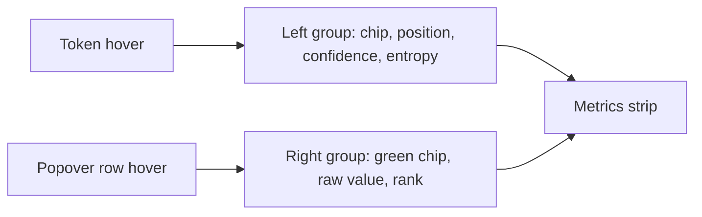

# Probe, rank, and the strip's candidate readout

Five independently verifiable commits. The first three are small and unblock comfortable testing of the last two.

## 1. Reach and alignment polish

Three unrelated one-liners that together fix "the popover is awkward to reach and the strip flickers on the way."

**Strip centering.** [src/web/static/style.css](src/web/static/style.css) line 871, `.token-metrics` `padding: 2px 2px 6px` becomes `padding: 11px 2px 0`. The text currently has 2px above it and 20px below, because `#output-section` contributes its own 14px top padding (line 964) that the strip has no say in. This gives 11 above and 14 below, reads as centered, and costs 3px of height. Exact 11/11 would mean moving that 14px out of `#output-section`, which shifts `#overlay-select-group` (`position: absolute; top: 16px`, line 2684) relative to the canvas, so it is deliberately not attempted.

**Popover reach.** [src/web/static/overlays.js](src/web/static/overlays.js) `overlaysPopoverTop`, the literal `6` on lines 114 and 122 becomes `2`. Safe because nothing hides on a token's mouseleave; the popover closes only on its own mouseleave. Not `0`, so the border still reads as a separate surface and subpixel rounding cannot put the box-shadow on the glyph being read.

**Stop clearing the strip on whitespace.** This is the load-bearing one, and it is Generation-only:

```6252:6259:src/web/static/app.js
    var target = e.target;
    var pos = hoveredTokenPosition(target);
    setEntropyHoverPosition(pos);
    setTokenMetricsHover(pos, target);
    if (pos === null || !scrubberActive || !altsPopover) {
      return;
    }
```

`setTokenMetricsHover` runs before the null check, so crossing the gap between tokens wipes the strip even though the popover survives the same trip. Analytics already returns early for non-token targets ([src/web/static/analytics.js](src/web/static/analytics.js) lines 2809 to 2811) and already holds the strip while the pointer is inside the popover (line 2833). Make Generation match: return early when `pos === null` without touching the strip or the entropy glow. Exit is already handled, since `outputArea`'s mouseleave (line 6314) guards on both popover hover and pinning.

## 2. Dotted placeholder

`field.placeholder = "Enter your own"` in `buildTypedInput` never shows for a mid-sentence position, because the field is pre-seeded with a space and a native placeholder renders only on the empty string.

Replace it with an overlaid `<span>` inside `.typed-entry`, `pointer-events: none`, matching the input's font, size and left padding. Drop the native attribute so there is one mechanism rather than two that must be kept looking alike.

Derive the text from the current draft rather than from whether the field was seeded:

- draft is `" "`: show `\u00B7Enter your own`, the same middle dot `overlaysAltDisplay` uses for spaces (line 199), so it reads continuously with the `\u00B7and` rows above
- draft is `""`: show `Enter your own`
- otherwise: hidden

Backspacing the seeded space then makes the dot visibly disappear, so the placeholder teaches the leading-space rule instead of just labelling the field. Toggle it in `refreshTypedControls`, which already runs per keystroke. The dot takes the same dim color as the words, not brighter.

## 3. Tokenizer surfacing

**Analytics run summary.** Split `tokenizerMetaRow` ([src/web/static/analytics.js](src/web/static/analytics.js) line 1123) into a `Tokenizer:` row carrying `tok["class"]` alone and a new `Tokenizer vocab:` row carrying the localized `vocab_size`. Both keep the existing rule of returning `""` when the key is absent, so older runs render unchanged.

**Popover footer, both pages.** A dim line at the bottom of the popover, below the typed entry, in the `.alt-hint` idiom (9px uppercase) but `--text-secondary` rather than the accent, since it is a caption and not an instruction. Content is `GPT2TokenizerFast \u00B7 128k vocab`, abbreviated so it fits the 190px minimum width; if the class name overflows, ellipsize the name and keep the vocab.

Two different sources, and this matters:

- Generation reads the resident tokenizer from `/api/models`, which the supervisor already exposes as `active_tokenizer`. [src/web/static/app.js](src/web/static/app.js) line 6963 already consumes that snapshot for `active_device`, so this is one more field alongside it.
- Analytics reads the run's own `run.reproducibility.tokenizer`, never the resident one, or a run from another model gets mislabelled.

## 4. Top-K default of -1

[src/backends/registry.py](src/backends/registry.py) lines 276 to 286: `default` and both range floors move from `0` to `-1`, help text becomes "-1 keeps all of them." This makes Top-K parallel to Seed directly below it, which already uses -1 for unset.

[src/inference/ar_sampler.py](src/inference/ar_sampler.py) line 185, `assert top_k >= 0` becomes `>= -1`. The filter's own guard on line 186 is already `top_k <= 0`, so -1 disables with no change to the logic, and every run already saved with `top_k: 0` still means off. No migration.

## 5. The probe: a measured probability and rank

At confirm time nobody knows the typed token's probability. `handle_tokenize` receives only text, and `last_run_state` holds ids and metrics but no logits. After the run the solidified row no longer exists, since `doSubstitute` clears the typed state. So the number has to be measured on confirm.

**Protocol.** `MSG_PROBE` / `MSG_PROBE_RESULT` in [src/backends/protocol.py](src/backends/protocol.py), alongside the tokenize pair.

**Dispatch.** In [src/backends/worker_base.py](src/backends/worker_base.py), unlike `MSG_TOKENIZE` this takes `gen_lock` and reports busy, because it is a real forward pass rather than a vocabulary lookup. Default `Backend.handle_probe` replies with an error, since only the AR backend can answer it.

**Sampler.** A public entry point in [src/inference/ar_sampler.py](src/inference/ar_sampler.py) sharing the prefill with `_probe_forced_position` (line 695), which already stops before the forced position so the last logits are the distribution that position was sampled from, and already uses the plain untempered softmax that `_sample_next` reports from. Returns probability, rank as `int((probs > p).sum()) + 1`, which is one comparison and one reduction with no sort, and the denominator as `probs.numel()`. Use the model's output width, not the tokenizer's `vocab_size`: those legitimately differ (128,256 against 128,000), and the rank denominator is the former. Run it through `run_in_executor` so the blocking pass does not stall the event loop.

**Frontend.** `confirmTypedEntry` fires the probe, the readout slot shows a dim pending mark until the reply lands, and the result is stored on `typedEntryToken`. `buildTypedSolidified` gains a percentage between the `yours` tag and the retry button, formatted like the candidate rows, with `<0.1%` below the display resolution so a wild choice never reads as a literal zero. No bar on this row: at 1e-5 it renders nothing, and the row lives outside the range those bars are scaled for.

The number shown before clicking is the same number the run reports, because both come from the same deterministic function on the same inputs.

## 6. The strip's candidate readout

The right region of the strip becomes the detail surface for whichever popover row is under the pointer. The left group holds steady, as agreed.



**Lift the row builder.** `buildAltsRows` ([src/web/static/app.js](src/web/static/app.js) line 2414) and `buildAltRow` ([src/web/static/analytics.js](src/web/static/analytics.js) line 2016) are already near-identical and are about to gain identical new behavior. Lift one `overlaysBuildAltRow` into [src/web/static/overlays.js](src/web/static/overlays.js) and have both pages call it, matching the reasoning already applied to the strip itself.

**Strip structure.** Add a `candidate` group to `overlaysBuildTokenMetrics` (line 231) in source order after `entropy` and before `extra`, so nothing on the left moves when it appears. `run` keeps its `margin-left: auto` and stays last. The group is a green-tinted chip mirroring the grey `.token-metrics-token`, then the raw probability at full precision and the rank with its denominator. Hidden entirely when absent, which the codebase already does for `.token-metrics-run:empty`. Give `.token-metrics-extra` `min-width: 0` with ellipsis so it is the field that truncates if an overlay, a candidate and a run label ever compete for the row, since `.token-metrics` is `nowrap` with `overflow: hidden` and would otherwise clip arbitrarily.

**Wiring.** Row mouseenter and mouseleave set a module-level candidate reading and call `refreshTokenMetrics`; `buildTokenMetricsReading` (line 3334) includes it. Feeding a position without a span is already an established convention, used by the entropy chart path at line 6288. Analytics gets the same treatment for symmetry, where ranks are always 1 through 5 since it has no typed row.

Raw values on the five captured rows are quantized to 1e-4 by `round(float(...), 4)` in `_top_alternatives` (line 237). Leave that alone; widening it is a one-character change available later if anything needs it.

## Verification and docs

`.venv/bin/python -m pytest`, `node --check` on each changed JS file, ReadLints, and the 70-column audit. New tests for the probe's probability and rank against a stub whose distribution is known, and for the rank matching a captured candidate's recorded position as an independent oracle. Top-K tests updated for the -1 floor.

Update README, ROADMAP, HANDOFF, and the About and Help modals in [src/web/static/index.html](src/web/static/index.html) for the Top-K default change, the typed row's measured probability, and the strip's candidate region. Record the KV cache retention follow-on in HANDOFF with the framing attached: one buffer for the run in `last_run_state`, not one per run, invalidated on regenerate, model swap or prompt change, using `DynamicCache.crop()` which the AR worker's transformers 4.53+ provides. Without that framing it reads as premature optimization to a cold reader.

GPU and display cannot be exercised here, so hand back with a manual checklist continuing from item 92.