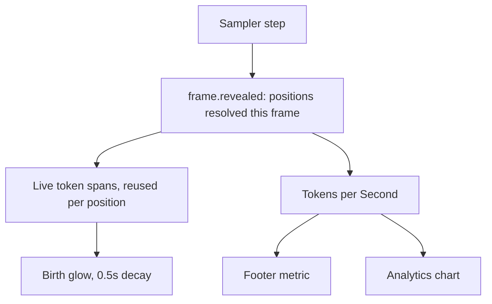

# Reveal signal, birth glow, and Tokens per Second

One missing piece of data gates both new features, so it lands first and
everything else hangs off it.



## Step 0: ruff tooling (independent, commit on its own)

No `pyproject.toml`, `ruff.toml`, or `setup.cfg` exists anywhere in the
repo, and `black==25.9.0` is pinned in
[requirements.txt](requirements.txt) with no config, so it defaults to 88
columns while the code is hand-wrapped to 70. Running `black .` today
would reflow every Python file.

- Add a config-only `pyproject.toml` with `[tool.ruff]` (`line-length = 70`,
  `select` including `C901` and `PLR1702`, `max-complexity = 10`) and
  `[tool.black] line-length = 70` so the two agree.
- Pin `ruff` in [requirements.txt](requirements.txt).
- Run `ruff check` and report the violation counts. Do not mass-fix.

## Step 1: the reveal signal

Semantics, documented once: `revealed` is a list of position indices that
became resolved in this frame and had not been resolved earlier in the
current canvas. Monotone per canvas, so a position glows at most once.

- [src/inference/streaming_sampler.py](src/inference/streaming_sampler.py):
  four yield sites (generate at lines 300 and 365, resume at 467 and 516).
  Both step loops already unpack `step_transfer` from `_diffusion_step`
  and narrow it to `gen_transfer`, which is exactly this signal:

```349:354:src/inference/streaming_sampler.py
            gen_transfer = step_transfer[0, prompt_len:]
            gen_step_conf = step_conf[0, prompt_len:]
            reveal_conf[gen_transfer] = (
                gen_step_conf[gen_transfer]
            )
```

  The two index-0 frames emit an empty list.
- [src/inference/ar_sampler.py](src/inference/ar_sampler.py): in
  `_build_frame`, the newest token is always the last index, so
  `revealed = [len(ids) - 1]`. Covers `_decode_loop` and
  `_substitute_loop` at once.
- [src/inference/dgemma_sampler.py](src/inference/dgemma_sampler.py):
  needs care. `unresolved = (not committed) and changed` means a position
  can flip back to unresolved when its token changes again, and the
  `committed=True` frame resolves everything at once. Track a per-canvas
  `seen_resolved` set (reset alongside `self._prev = None` in `put`) so
  the emitted list stays monotone instead of flickering.
- Testability: extract the diff into a small pure helper (positions newly
  resolved given previous and current resolved flags) and unit test it,
  since there is no test file for either diffusion sampler today
  (`tests/inference/` has only `test_ar_sampler.py` and
  `test_load_progress.py`). Extend
  [tests/inference/test_ar_sampler.py](tests/inference/test_ar_sampler.py)
  for the AR case.

## Step 2: live token spans with node reuse

This is the performance win. Today's live path creates one span per
character and destroys all of them every frame:

```1640:1664:src/web/static/app.js
function renderFrame(text) {
  outputArea.classList.remove("token-layers");
  var fragment =
    document.createDocumentFragment();
  for (var i = 0; i < text.length; i++) {
    // ... one span per character ...
  }
  outputArea.textContent = "";
  outputArea.appendChild(fragment);
}
```

At LLaDA's default `gen_length` of 160 that grows to roughly 640 inline
boxes, laid out from scratch each frame. Token spans make it a constant
160, updated only where something changed.

- [src/web/static/overlays.js](src/web/static/overlays.js): add
  `overlaysSyncTokenSpan(span, index, tok, mask, opts)` holding the
  property application currently inlined in `overlaysBuildTokenSpan`
  (lines 312 to 348), and have the builder create a node then delegate.
  One source of truth for what a token span looks like.
- [src/web/static/app.js](src/web/static/app.js): add
  `renderLiveFrame(tokens, revealed)`. It rebuilds once when the span
  count does not match, then afterwards only touches `textContent` and
  `className` where they differ. Call it from `handleFrame` (replacing
  the `renderFrame(data.text)` at line 1543) when `data.tokens` exists.
- Keep `renderFrame` as is. It is still the fallback inside
  `renderFrameWithTokens` when `frameTokens[i]` is null, and leaving it
  alone keeps this change additive.
- Do not touch the scrubber, crossfade, or diff paths. They render once
  per user action, not per frame.
- Appearance must not change. `.char-mask` carries
  `text-shadow: 0 0 4px var(--mask-glow)`
  ([style.css:1048](src/web/static/style.css)) but `.token-mask`
  deliberately does not, for scroll performance in the scrubber
  ([style.css:1906](src/web/static/style.css)). Add a
  `#output-area.live-tokens .token-mask` rule restoring the glow so the
  streaming view looks identical, without regressing the scrubber.
- Verify this step on its own before adding the glow.

## Step 3: birth glow

Animate a constant-blur shadow's alpha from apex to zero over 0.5s, no
fade in. Blur radius stays fixed, since animating blur is the expensive
shape and is what the scroll-performance comment is about.

- New `token-born` class plus keyframes in
  [src/web/static/style.css](src/web/static/style.css).
- Remove the class on `animationend` so a reused span can glow again and
  classes do not accumulate.
- Cap concurrent glows with a small FIFO (LLaDA at `steps=8` reveals
  about 20 positions at once) and honor the existing
  `prefersReducedMotion()` helper already used by the GPU ticker.
- Scrubbing needs no guard: the glow fires only from `renderLiveFrame`,
  which only `handleFrame` calls, so seeking never retriggers it.
- Setting `tokenBirthGlow`, default on, threaded through
  `SETTINGS_DEFAULTS`, `parseSettings`, and `settingsEqual` in
  [overlays.js](src/web/static/overlays.js) (lines 591 to 663), plus
  `cloneSettings`, `syncControls`, and `wireControls` in
  [settings.js](src/web/static/settings.js) and a new `.settings-row` in
  [settings.html](src/web/static/settings.html).
- Fallback if WebKitGTK struggles: brighten `color` instead of drawing a
  halo. Same trigger, no blur, cheap repaint.

## Step 4: Tokens per Second in the footer

- Add `#status-tps` beside `#status-elapsed` in
  [index.html](src/web/static/index.html) (footer at lines 245 to 262).
  Note the status chips extend leftward from `#status-message`, so a
  third fixed item narrows the space before they start fading.
- Compute from `revealed` counts against `perFrameElapsed`, which
  `handleFrame` already keeps cumulative across segments via
  `resumeElapsedOffset` (lines 1524 to 1531). Cumulative by default;
  click the item to toggle to last-step, persisted in the settings blob.
- Fix Elapsed while here. The footer currently prints the raw
  `data.elapsed` (line 1562), which is segment-local and resets to zero
  after an edit. Use the cumulative `perFrameElapsed` tail instead.

## Step 5: Tokens per Second in Analytics

No new storage and no backward-compatibility gap. `compute_convergence`
counts mask characters, and a masked token is exactly one `░`, so
`mask_count` already is the masked-token count and `mask_count[0]` is the
canvas length:

```87:96:src/analytics/metrics.py
        mask_count = stripped.count(MASK_CHAR)
        resolved = total - mask_count
        results.append({
            "frame": i,
            "mask_count": mask_count,
```

Resolved tokens per frame is `mask_count[0] - mask_count[i]` for
diffusion, and the frame index for autoregressive runs (no masks, one
token per frame). Both come from what
`/api/analytics/runs/{id}/metrics` already returns.

- New `tps-section` in [analytics.html](src/web/static/analytics.html)
  mirroring `timing-section` (lines 242 to 279), reusing the zoom dock,
  tooltip toggle, and compare pins.
- Render function in [analytics.js](src/web/static/analytics.js)
  mirroring `renderTimingChart`, reusing `burnThroughPlugin`,
  `seriesBlendPlugin`, `compareBandFill`, `compareOriginalDataset`, and
  the smart tooltip positioner.
- Pager beside the heading flipping between Elapsed and Tokens per
  Second, following the `alt-pager-btn` pattern in
  [overlays.js](src/web/static/overlays.js). Charts already have `<h3>`
  titles, so no separate titling work is needed; the heading text swaps
  with the pager.
- Clamp negative rates to zero for DiffusionGemma, whose mask count can
  rise between drafts.
- Also ship the outstanding item from
  [HANDOFF.md](HANDOFF.md): show both elapsed totals in the Analytics
  summary rather than the single combined figure.

## Verification

- `.venv/bin/python -m pytest`, `node --check` on each changed JS file,
  `ReadLints`, and a 70-column audit.
- No GPU or display in the sandbox, so hand back a manual checklist. The
  case to press hardest is LLaDA at `steps=8` with `gen_length=160` in
  the `desktop.py` window, which is the peak concurrent-glow scenario on
  the weakest renderer.
- Update [HANDOFF.md](HANDOFF.md), [README.md](README.md),
  [ROADMAP.md](ROADMAP.md), and the About and Help modals in
  [index.html](src/web/static/index.html), since this adds a setting, a
  footer metric, and a chart.