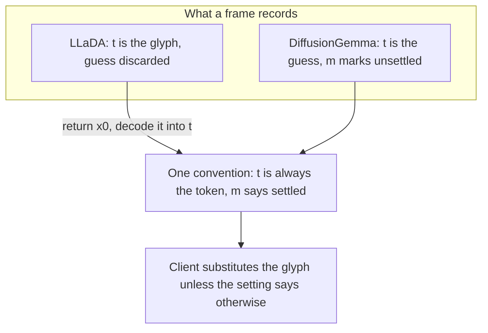

# Reveal the candidate behind a mask

## What each model already has

DiffusionGemma stores the decoded guess as the token's text and only
marks it unresolved, so the `░` is the client's doing. LLaDA stores the
glyph itself:

```180:191:src/inference/streaming_sampler.py
        is_mask = token_id == MASK_ID
        if is_mask:
            display = "░"
        else:
            raw = tokenizer.decode(
                [token_id],
                skip_special_tokens=False,
            )
            display = sanitize_frame(raw)
        token: Dict[str, Any] = {
            "t": display, "m": is_mask, "id": token_id
        }
```

That is a recording choice, not a property of the model. LLaDA computes
a candidate for every masked position on every step, and the sampler
already ships how confident it is:

```285:294:src/inference/streaming_sampler.py
    x0 = torch.argmax(logits_with_noise, dim=-1)

    # True per-token confidence: softmax prob of the argmax
    # prediction. Used for the heatmap regardless of the
    # remasking strategy.
    p = F.softmax(logits, dim=-1)
    true_conf = torch.squeeze(
```

`_diffusion_step` returns `x, true_conf, transfer_index`, keeping the
confidence and dropping the prediction. That confidence is what already
drives LLaDA's mask opacity, so the app has been reporting how sure the
model is of a guess it will not name. The ROADMAP says this display
"would require newly computing what the model was considering", which
is wrong and gets corrected.

## The change



**LLaDA records its guess.** `_diffusion_step` returns `x0` alongside
what it already returns; `streaming_generate` and `streaming_resume`
pass it to `_build_token_list`, which decodes it into `t` for masked
positions instead of writing `░`. Frame 0 has no prediction yet, so it
keeps the glyph, which is correct rather than a gap.

Cost is one extra single-token decode per masked position per frame,
roughly 160 at the start of a run and falling. Against a 30ms diffusion
step that is under a millisecond, so no opt-in gate: making it
conditional would cost more in explanation than in microseconds.

**The client owns the glyph.** One line in the shared span builder:

```781:781:src/web/static/overlays.js
  var text = masked ? mask : tok.t;
```

becomes conditional on an `opts` flag. It goes through `opts` rather
than a global because `appSettings` lives in `app.js` while the builder
lives in `overlays.js`, and the builder must not depend on either page.
Default falsy, so any caller that does not pass it behaves exactly as
today.

**A durable setting**, following `tokenBirthGlow`: a default in
`SETTINGS_DEFAULTS`, a toggle on the settings page, and both pages
reading it through `parseSettings`. Analytics loads `overlays.js`
already but has never read settings, so it gains that one call, which
is what makes the feature retroactive on saved runs rather than
live-only.

**No new styling.** `.token-mask` colors from `--mask-color` against
`.token-resolved`'s `--text-primary`, and the opacity hook shipped
today already fades masks by confidence. So a revealed guess appears as
a dim, tinted word rather than a block, and stays visibly unsettled.

## Two places this reaches that are easy to miss

The guided-edit preview builds spans by hand rather than through the
shared builder, so it has its own copy of the glyph decision:

```4856:4856:src/web/static/app.js
        span.textContent = tok.m ? MASK_CHAR : tok.t;
```

Left alone, the setting would visibly not apply to the faded
original-run preview during "Edit Another Frame". Small enough to route
through the builder rather than patch in place.

And the metrics strip reads `tok.t` directly for its hover readout
(`app.js:3926`, `analytics.js:3794`). DiffusionGemma therefore already
shows the guess there for a masked position; making LLaDA match is a
consistency fix that arrives with the capture change, independent of
the setting. Worth naming in the plan rather than discovering as a
surprise.

## Tests

Extend [overlays_span.test.js](tests/web/static/overlays_span.test.js),
which now exists for exactly this: a masked token renders the glyph by
default, renders `tok.t` when the flag is set, and keeps `token-mask`
either way, so revealed does not mean settled.

For the sampler, `_build_token_list` writes the decoded guess into `t`
for a masked position when given predictions and keeps `░` when not,
which is frame 0. Plus a settings round-trip for the new key, and
source-inspection that both pages pass the flag and the preview path
honours it.

## Docs

README gains the feature and an Implementation Status line. Help gains
the setting, and needs a second look at the "brightening toward a
shatter" wording: with the reveal on, that becomes a word firming up
rather than a block dissolving, and the two features should not read as
describing different things.

ROADMAP: correct the "newly computing" claim, mark layer one shipped,
and revisit the revision-glow entry scoped this morning. That entry
exists because a revision is invisible; with the reveal on you watch
`" the"` become real content, so it may be subsumed or want narrowing
rather than building as scoped.

Manual items for both models, since only hardware can say whether a
canvas full of plausible-looking guesses reads as informative or as
noise. That is the real question this feature asks.