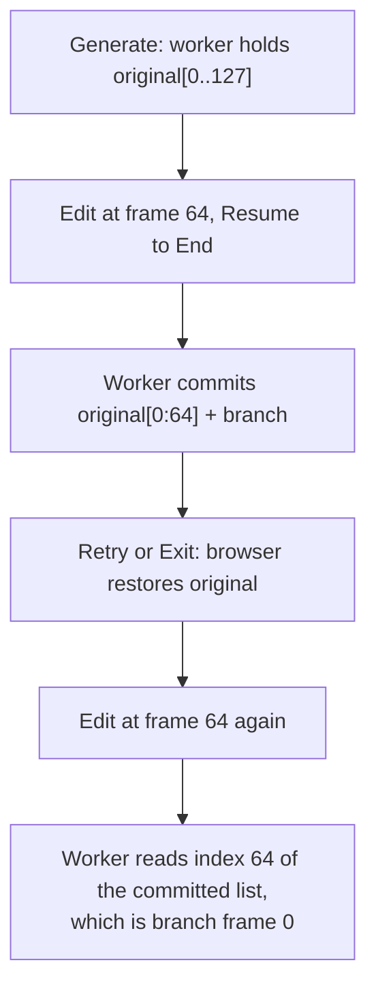

# Rewind the worker when an edit session begins

## The defect

Every completed resume replaces the worker's retained history
([llada_worker.py:103-114](src/backends/llada_worker.py), and the same
`state["frame_history"] = base_history + kept` in
[dgemma_worker.py](src/backends/dgemma_worker.py)). Abandoning the session
rolls back only the browser:

```5855:5863:src/web/static/app.js
function retryGuidedEdit() {
  var wasSubstitution = supportsSubstitution();
  restoreEditSnapshot();
  resetGuidedMode();
```

`restoreEditSnapshot` touches local arrays and sends nothing;
`exitRemaskMode` is the same three lines minus the re-entry.



The user clicks tokens on the original canvas while the worker applies those
positions to a frame from the branch they discarded. Editing an *earlier*
frame is safe, because the prefix below the first edit point is still
original, which is exactly the asymmetry the manual pass hit: a frame-30 edit
behaved and a second frame-64 edit did not.

## Rewind at session start, not session end

You are right that Exit is the stronger discard and should roll back too. The
better conclusion is that neither Retry nor Exit should own this, because
`captureEditSnapshot` is called exactly twice in the whole file, from
[beginEditSession](src/web/static/app.js) at line 5522 and
[beginSubstitutionSession](src/web/static/app.js) at line 5418, and nowhere
else. `handleGuidedDone` re-enters `RUN_PHASE_EDIT` through `runPhasesEnter`
directly (line 5801), so a chained "Run to Here" does **not** re-trigger it.

That makes session start the one place where the client is definitionally
showing the un-edited run, and putting the message there repairs three paths
neither of us listed:

- a **run-scoped error** unwinds the session at
  [app.js:1952-1958](src/web/static/app.js), also client-only
- a **page reload** mid-session, where persistence is skipped entirely
  (`if (runPhase.mode === null)` at line 1937) so `preEditSnapshot` is simply
  gone and the client could never send an end-of-session rollback
- **closing the tab**, or a second window starting its own session

It also answers your Exit-after-a-chain question without a special case:
rewinding to the generated run discards the whole chain, which is precisely
what the client's own `preEditSnapshot` already does, since it is captured
once at session start rather than per segment.

The cost is that the worker sits on the discarded branch between sessions.
Nothing reads it there: the only reader is `_validate_resume`, and a resume
can only come from a session that has just rewound.

## The change

**Protocol.** One constant in [protocol.py](src/backends/protocol.py)
alongside `MSG_CANCEL` and friends. Working name `MSG_REWIND = "rewind"`,
named for its effect rather than for the session event that triggers it.

**Dispatch.** A branch in the loop in
[worker_base.py:1130-1135](src/backends/worker_base.py), shaped like
`MSG_PROBE`: refused with `_send_busy` while a generation is in flight, then
awaited inline. The busy check is defensive rather than reachable (the UI
cannot enter a session mid-run), but a rewind racing `_commit_resume` is
exactly the corruption being fixed.

**Backends.** A `handle_rewind` on `Backend` that checks the run token and
does nothing else, overridden by the two diffusion workers. SmolLM3 needs the
default: `handle_substitute` deliberately passes `state_sink=None` and never
mutates the retained run, which is why What If? has no equivalent bug.

Each diffusion worker keeps a second reference in `_store_state` to the
history as generated. Both lists point at the same `FrameCheckpoint` objects,
so this costs one list rather than a copy of the tensors, mirroring how
`base_history` already stages a prefix for free. LLaDA restores `total_steps`
with it; that figure happens to be invariant under a *completed* resume, but
a cancelled one commits a short history, and restoring both keeps the rewind
obviously total rather than subtly partial.

**Client.** The send goes in `captureEditSnapshot`
([app.js:5284](src/web/static/app.js)), carrying `run_token` and no
`request_id`, matching how resume is sent. Fire and forget: a stale token
earns a request-scoped error that does not unwind the session, and the resume
that follows would be refused anyway, so the user learns at the same moment
they would have before.

## Tests

`tests/backends/test_llada_resume_state.py` gains the core pair: after a
completed resume, a rewind restores the original history **by identity**
(matching how `_assert_run_untouched` already distinguishes restored objects
from equal copies) and restores `total_steps`; and a resume, rewind, resume
sequence hands `streaming_resume` the *same* `FrameCheckpoint` object both
times. That second one is the worker-level form of manual item 182, and it is
the assertion that would have caught this.

Also: a rewind with a stale token changes nothing, a rewind before any resume
is a no-op, and a rewind with no retained run does not raise.

`tests/backends/test_worker_dispatch.py` gains the busy refusal and the
unknown-to-known transition. A small DiffusionGemma case covers `handle_rewind`
directly, since that worker has no resume test today.

`tests/web/test_run_token_client.py` **will fail** and should: it asserts
exactly three sends carry `run_token`, and this makes four. Updating that
count deliberately is the point of the test.

## Docs

Manual item 182 is currently unperformable, because it tells you to generate a
second run and `begin_run` nulls `last_run_state`. Rewrite it around Retry:
edit from a frame, note the branch, Retry, repeat the identical edit, and the
branch should now match. That works only once this lands, which is the
argument for doing them together.

Ledger: a found-while-verifying entry under `XAI-01` recording the divergence,
that it is pre-existing rather than introduced by the checkpoint work, and
that the LIFE-07 four-retry pass looked clean because the wrong canvas still
produces fluent output.

## Verification

`.venv/bin/python -m pytest`, `scripts/lint_ratchet.py`, `node --check` on
`app.js`, ReadLints. Then the rewritten item 182 on hardware, which is now a
real test of the RNG retention rather than a procedure that cannot be run.