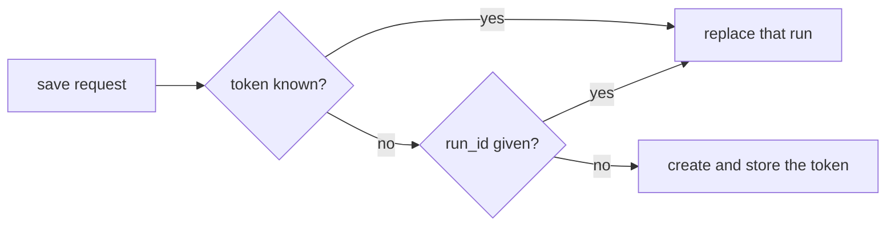

# Save identity by run token

## The bug, and why the fix is identity

`runSaved = true` and the follow-up snapshot both live inside the save POST's
`.then` ([src/web/server.py](src/web/server.py) is fine; the client is the
problem):

```6577:6582:src/web/static/app.js
  })
    .then(function (response) {
      return response.json();
    })
    .then(function (result) {
      isSaving = false;
```

Navigate while that is in flight and the server publishes the run while the
client never learns it did. The snapshot on disk still says `runSaved: false`,
so Edit Frames' `if (!runSaved)` guard fires and saves a second copy. Flushing
cannot fix this, because the client needs the *response*, not just delivery.

Only the create path is unguarded. Replace already has compare-and-swap on
`expected_revision` from `DATA-01`. And because `begin_run` advances the token
only on generate, one token maps to at most one created run: an edit of that
run is a replace, not a create.



## Commit 1: the token becomes save-time identity

**Request.** `SaveRunRequest` ([src/web/server.py](src/web/server.py):1654)
gains `run_token: Optional[str] = None`. The model is `extra="forbid"`, so it
must be declared.

**On disk.** `_build_metadata` carries the token into the bundle, and
`_stage_and_publish` stamps it through with the fields it already adds:

```402:405:src/web/run_store.py
    stamped = dict(bundle.metadata)
    stamped[REVISION_KEY] = revision
    stamped[SCHEMA_VERSION_KEY] = SCHEMA_VERSION
    stamped[CAPTURE_KEY] = capture_manifest(bundle)
```

Additive, as agreed: `validate_staged` checks the version number and the
manifest, never a field list, so the version stays 1 and older runs simply
lack the key.

**Lookup.** `run_store` gains `find_run_by_token(root, token)`, scanning
`list_run_ids` and reading each metadata. The scan is affordable because
`list_runs` ([src/analytics/metrics.py](src/analytics/metrics.py):530) already
does strictly more work on every Analytics load, across 211 runs.

**Resolution.** `run_store.save` takes the token and resolves identity before
choosing a path. The resolution and the publish must be **inside one lock**,
or two in-flight saves for one token both find nothing and both create, which
is the bug. `_REPLACE_LOCK` exists for the same reasoning applied to
revisions, so widen it to cover the whole of `save` rather than adding a
second one. Creates then serialise too, which costs nothing: a save is a
person pressing a button.

**A known token always replaces, never no-ops.** Returning the existing run
without writing looks tempting and loses data: once commit 2 lands, a user who
saves by hand, navigates during the POST, comes back and confirms an edit
sends no `run_id`, and their edit must still be written. The duplicate case
therefore rewrites identical content and lands at revision 2, which is
accurate rather than tidy.

**The endpoint barely changes.** A replace already answers with `run_id` and
`revision`, so the idempotent response falls out of the resolution and
`_save_run_blocking` only needs to pass the token and prefer it over
`body.run_id`.

**Client.** `saveRun` sends `run_token: activeRunToken` when non-empty.
`run_id` and `expected_revision` keep being sent; they become vestigial and
should be removed in a later commit, once the token has been exercised on
hardware.

**Tests.** A create stores the token; a second create with the same token
replaces rather than creating; an absent or empty token still creates, which
is the upgrade path for runs predating `LIFE-01`; racing threads with one
token produce one run, in the style of the `ui_state` concurrency tests.

## Commit 2: nothing is written when an editor opens

Two call sites, identical in shape:

```5312:5316:src/web/static/app.js
  beginSubstitutionSession();
  if (!runSaved) {
    saveRun();
  }
}
```

and the Edit Frames handler around 5421. Abandoning then writes nothing on its
own: `exitRemaskMode` already restores the run and returns to the scrubber, and
Save stays offered because `runSaved` was never set.

Confirm still saves, landing as a replace when the run was saved by hand and a
create when it was not. That is why commit 1 comes first: without the token,
Confirm without a `lastSavedRunId` would produce the two Analytics rows that
the original auto-save existed to prevent.

Help copy states the old behaviour in three places
([index.html](src/web/static/index.html) 374, 377, 488), the last as "Entry
auto-saves the original run".

## Commit 3: refuse to save a degraded restore

A run restored from a quota-limited snapshot has `runFrames.tokens` empty while
`history` is full, and saving it writes a permanently impoverished record: no
token overlay, one chart family. Guard it in `saveRun` and say why.

A stopgap over `RUNTIME-01`'s quadratic per-frame token storage, and the ledger
should say that rather than let it read as a fix.

## Records

Not an audit finding, so it goes in the ledger as found while verifying, noting
that create was the one publication guarantee `DATA-01` left open. Also worth
recording: `_REPLACE_LOCK` is in-process, so a second supervisor breaks the
token guarantee exactly as it breaks the revision one, and the `flock` pattern
now in `ui_state.py` is the model if `LIFE-05`'s deferred half is ever taken.

Manual items: a save interrupted by navigation leaves one run, not two; opening
an editor writes nothing; Confirm writes once; abandoning writes nothing; a
hand-saved run that is then edited is still a single row.