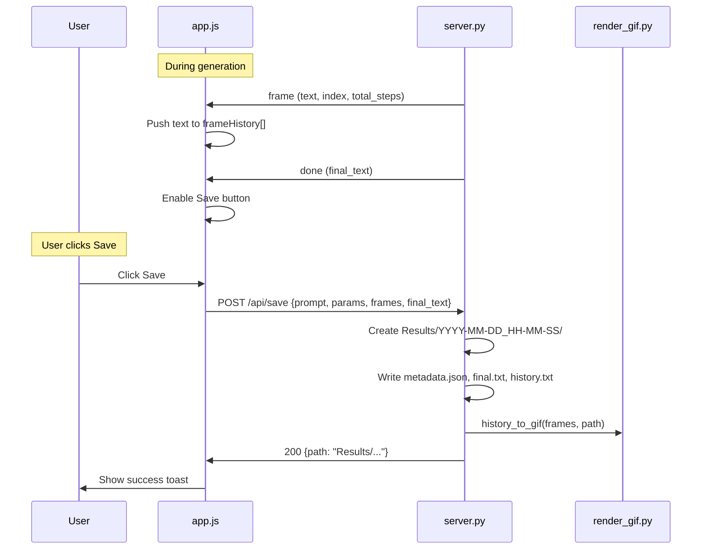

# Save Run Results Feature

## Architecture

The client already receives every frame's text via WebSocket. The approach is:

1. **Client accumulates frame history** in a JS array during generation
2. After run completes, a **Save button becomes clickable**
3. On click, client POSTs accumulated data to a **new REST endpoint**
4. Server writes files to `Results/<timestamp>/` and generates the GIF using the existing PIL renderer

## Backend: New REST endpoint in `server.py`

Add a `POST /api/save` endpoint (registered **before** the catch-all static mount at the bottom of [server.py](src/web/server.py)):

- Accepts JSON body: `{prompt, params, frames: string[], final_text}`
- Creates a timestamped directory under `Results/` using the same `make_run_dir` pattern from [main.py](main.py) (lines 44-48)
- Saves four files:
  - `metadata.json` — prompt, params, final_text, timestamp, model name
  - `final.txt` — the final clean text
  - `history.txt` — frame-by-frame dump with `===== FRAME N =====` headers (same format as existing [artifacts](artifacts/2026-02-26_01-33-13_llada/))
  - `diffusion.gif` — generated via the existing `history_to_gif()` from [render_gif.py](src/inference/render_gif.py)
- Returns JSON `{success: true, path: "Results/..."}` or an error

The endpoint must be mounted **above** the static files catch-all on line 280 of `server.py`, otherwise FastAPI's `StaticFiles` will intercept the route.

## Frontend: Save button and frame accumulation in `app.js`

### State additions

- `var frameHistory = []` — accumulates frame text strings during a run
- `var lastRunParams = null` — stores the params/prompt used for the completed run
- `var lastFinalText = null` — stores the final text from the `done` message

### Frame accumulation

- In `handleFrame(data)`: push `data.text` onto `frameHistory`
- In `startGeneration()`: clear `frameHistory`, `lastRunParams`, `lastFinalText`
- In `handleDone(data)`: store `data.final_text` in `lastFinalText`, store prompt+params in `lastRunParams`, enable the Save button

### Save button behavior

- Add a **Save** button next to Generate/Cancel in the controls area of [index.html](src/web/static/index.html)
- Starts **hidden** (or disabled+hidden). Becomes visible and enabled in `handleDone()`
- Hides again when a new generation starts (`startGeneration()`)
- On click: sends `POST /api/save` with `{prompt, params, frames: frameHistory, final_text: lastFinalText}`
- While saving: button shows "Saving..." and is disabled
- On success: brief toast/status message "Saved to Results/..."
- On error: status bar shows the error

### Save button styling in `style.css`

- Style consistent with existing Generate/Cancel buttons
- Use a distinct but cohesive color (e.g., a blue/cyan accent) to differentiate it from the green Generate button

## Files to modify

- **[src/web/server.py](src/web/server.py)** — add `POST /api/save` endpoint with save logic
- **[src/web/static/app.js](src/web/static/app.js)** — frame accumulation, save button logic, POST request
- **[src/web/static/index.html](src/web/static/index.html)** — add Save button element
- **[src/web/static/style.css](src/web/static/style.css)** — Save button styling, toast/feedback styling

## Files NOT modified

- `src/inference/render_gif.py` — reused as-is
- `src/inference/streaming_sampler.py` — no changes (per project constraint)

## Edge cases to handle

- Save button disabled if the run was cancelled (no valid `done` message)
- Save button disabled during an active generation
- Prevent double-saves (disable button after click until response)
- Large frame histories: gen_length=1024 with steps=1024 could produce ~1024 frame strings. The POST payload could be large but manageable (each frame is at most a few KB of text)

