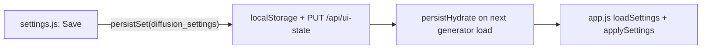

## Part A: Commit Order becomes a generator overlay option

Today Commit Order is a persisted setting applied as an ambient tint; the rendering path already supports a `"commit"` mode, so this is rewiring, not new coloring.

- **Add to the picker** ([src/web/static/app.js](src/web/static/app.js) ~1772): inside the existing `if (!isAutoregressive())` block, push `{ value: "commit", label: "Commit Order" }` (always enabled for diffusion runs, no `disabled`), mirroring the analytics `buildOverlaySelect`. AR runs keep only None + Heatmap.
- **Reset guard**: near the `overlayMode === "diff" && !hasDiff` reset ([app.js](src/web/static/app.js) 1762), also reset `overlayMode = "none"` when `overlayMode === "commit" && isAutoregressive()` so a stale commit selection cannot carry into an AR run.
- **Simplify `effectiveColorMode`** ([app.js](src/web/static/app.js) 1586-1595): drop the `appSettings.commitOrder` branch and return `overlayMode` (keep a commit-for-AR guard). `applyTokenColor` already handles `mode === "commit"` (line 1609).
- **Legend + status** ([app.js](src/web/static/app.js) `setOverlayMode` 1670, `updateStatusPrefs` 1967): show `#commit-legend` when `overlayMode === "commit"` (from `setOverlayMode`), and remove the "Show Commit Order: On/Off" readout. In [index.html](src/web/static/index.html) 202-208, drop `#status-commit-text` and keep `#commit-legend`.

## Part B: Shared Settings page + gear nav

The four remaining settings (`highlightTokens`, `diffusionText` + `diffusionTextMode`, `gpuTicker`) are already global and server-persisted. The generator applies them on load; the page only edits and persists (hydrate-on-navigate).

- **Shared settings model** ([src/web/static/overlays.js](src/web/static/overlays.js)): add `SETTINGS_DEFAULTS` (the four fields, no `commitOrder`), `parseSettings(raw)`, and `settingsEqual(a,b)` so [app.js](src/web/static/app.js) and the new settings.js agree with no drift. `"diffusion_settings"` is already in `PERSIST_KEYS` (line 235).
- **New [src/web/static/settings.html](src/web/static/settings.html)**: shared header (Menu / Generation-if-active / Analytics / active Settings gear), a left tab rail + right pane. Tabs: **Appearance** (diffusion-style text + its Mode sub-row, highlight tokens) and **Interface** (device-tag ticker). Staged Save / Reset footer with the status line, reusing the existing `.settings-row` / `.toggle-switch` styles.
- **New [src/web/static/settings.js](src/web/static/settings.js)**: `persistHydrate(boot)` -> read `localStorage[SETTINGS_KEY]` via `parseSettings` -> populate controls (reuse `createCustomSelect` for Mode) -> stage on change -> Save writes `persistSet(SETTINGS_KEY, ...)`; Save/Reset enablement via `settingsEqual`. Mirror analytics' `revealGenerationLink` to show the Generation link only when a model is resident. No live cross-tab apply.
- **New [src/web/static/settings.css](src/web/static/settings.css)**: tab-rail + pane layout only (rows/toggles come from style.css).
- **Route** ([src/web/static/../server.py](src/web/server.py) ~1625): add `@app.get("/settings.html")` returning `_serve_stamped_page("settings.html")`.
- **Gear nav**: replace the generator's `<a id="link-settings">Settings</a>` ([index.html](src/web/static/index.html) 40) with a gear `<a href="/settings.html">`; add a matching gear to the Main Menu nav ([menu.html](src/web/static/menu.html) 66-68) and the Analytics header ([analytics.html](src/web/static/analytics.html) 42-46). New inline gear SVG in the family-glyph aesthetic.
- **Remove the generator modal**: delete `#modal-settings` ([index.html](src/web/static/index.html) 371-430) and, in [app.js](src/web/static/app.js), its refs and staging machinery (`stagedSettings`, `syncSettingsControls`, `updateSettingsButtons`, `setSettingsStatus`, `updateCommitSettingAvailability`, the `setting*` change handlers, the `linkSettings` modal-open handler 4150-4165, save/reset). Keep `appSettings`, `loadSettings` (via `parseSettings`), `saveSettings` removed (writes now come from settings.js), and `applySettings`.

## Decisions baked in (from our deliberation)

- **Commit Order is now transient per-view** (like Heatmap/Diff), not a saved default. Matches analytics.
- **Hydrate-on-navigate**: settings persist and apply when the generator (re)loads; no live cross-tab sync (optional follow-on).
- **Two tabs** to start (Appearance, Interface), rail is forward-looking for future Models/Analytics tabs.

## Verification

- In-sandbox: `node --check` on `app.js`, `overlays.js`, `settings.js`, `menu`/`analytics` JS if touched; `.venv/bin/python -m py_compile src/web/server.py`; `.venv/bin/python -m pytest`; ReadLints on changed files.
- GUI manual checklist (hand back): generator overlay picker now offers Commit Order for diffusion runs (None + Heatmap only for AR), legend shows on commit mode; gear on all three pages opens `/settings.html`; editing + Save persists and the generator reflects it after reload; Reset/Save enablement correct; desktop app picks up the new page.

## Docs (after validation)

Update [HANDOFF.md](HANDOFF.md), [README.md](README.md) (Settings + overlay picker copy, Implementation Status), and [ROADMAP.md](ROADMAP.md) (move the Settings-page item to shipped), then propose a commit. No push without greenlight.