# SmolLM3 Autoregressive Backend (Phase A)

Bring the first autoregressive (AR) LLM, **SmolLM3-3B**, into the app end to end, reusing the streaming frame/token contract. New isolated env (`.venv-ar`), CPU-capable by default with a per-activation CPU/GPU toggle, and a `model_type` flag that gates diffusion-only UI off while keeping run + timing + confidence + Heatmap.

## Key decisions (settled)
- **Wheel**: standard CUDA-capable torch in `requirements-ar.txt` (matches [requirements.txt](requirements.txt) / [requirements-dgemma.txt](requirements-dgemma.txt), which both pull the `nvidia-*-cu12` stack). Runs on CPU when no GPU; the code, not the wheel, picks the device.
- **Device default**: GPU when a GPU is present and the model fits, else CPU. On a GPU-less box the GPU option is disabled and CPU is forced.
- **Overlays for AR**: keep **Heatmap** (per-token sampling confidence is the natural AR xAI view), hide **Diff vs Original** and **convergence**; **Commit Order** setting is disabled and forced Off (dimmed).
- **Payload**: full-snapshot growing-sequence frames (scrubber replays left to right unchanged). O(n^2) in tokens is acknowledged; keep the `max_new_tokens` recommended cap at 256 and clamp harder on CPU.
- **transformers pin**: `>=4.53.0`; finalize the exact pin by freezing the built env.

## Device selection flow

```mermaid
flowchart LR
  menu["Main Menu row (AR only): CPU/GPU toggle"] -->|"POST /api/models/smollm3/activate {device}"| act["activate_model"]
  act --> mgr["manager.activate(model_id, device)"]
  mgr -->|"device==cpu: skip _preflight_vram"| spawn["spawn worker --device"]
  spawn --> rw["run_worker.py --device"]
  rw --> cwa["create_worker_app(backend, device)"]
  cwa --> load["Backend.load(device)"]
```

## 1. New environment and dependencies
- Add `requirements-ar.txt`: CUDA torch wheel, `transformers>=4.53.0` (pin exact on freeze), `accelerate`, plus the worker's server stack (`fastapi`, `uvicorn`, `websockets`, `starlette`, `pydantic`) mirroring [requirements-dgemma.txt](requirements-dgemma.txt). Maintainer creates `.venv-ar` and freezes (GPU/venv steps are manual; not runnable in-sandbox).
- README setup gains a `.venv-ar` block plus the agreed one-line CPU-only note (`pip install torch==<pin> --index-url https://download.pytorch.org/whl/cpu` before the rest) for GPU-less users.

## 2. Contract: model-type flag
- [src/backends/protocol.py](src/backends/protocol.py) `ModelCapabilities` (lines 45-51): add `model_type: Literal["diffusion", "autoregressive"] = "diffusion"`. It reaches the client automatically via `info.model_dump()` in `_models_snapshot` ([server.py:463](src/web/server.py)).

## 3. Device threading through the worker contract
- [src/backends/worker_base.py](src/backends/worker_base.py): change abstract `Backend.load(self)` (line 73) to `load(self, *, device: str = "cuda")`; `create_worker_app(backend, *, device: str = "cuda")` and call `asyncio.to_thread(backend.load, device=device)` (line 121).
- [src/backends/run_worker.py](src/backends/run_worker.py): add `--device` (default `"cuda"`); pass `create_worker_app(backend, device=args.device)`.
- Update existing loads to the new keyword-only signature with no behavior change: [dgemma_worker.py:51](src/backends/dgemma_worker.py) and the LLaDA worker's `load`. **Low-risk**: `load_quantized(nf4_dir, *, device: str = "cuda")` already accepts a device kwarg ([dgemma_nf4.py:366-370](src/inference/dgemma_nf4.py)), and LLaDA's `load` already computes `"cuda" if torch.cuda.is_available() else "cpu"` internally (`llada_worker.py:70-71`); threading the explicit device just replaces those defaults.

## 4. Registry entry
- [src/backends/registry.py](src/backends/registry.py): add `SMOLLM3 = ModelInfo(id="smollm3", display_name="SmolLM3-3B", venv_python=".venv-ar/bin/python", worker_module="src.backends.smollm3_worker", checkpoint="HuggingFaceTB/SmolLM3-3B", min_vram_gib=8.0, capabilities=ModelCapabilities(model_type="autoregressive", supports_resume=False, supports_cfg=False))` and register it in `REGISTRY`.
- `param_specs`: `max_new_tokens` (default 256, recommended (16, 256), experimental (1, 2048)), `temperature` (default 0.6, recommended (0, 1.5), experimental (0, 10)), `top_p` (default 0.95, recommended (0, 1)), `seed` (-1), `thinking` (BOOL, default False, reuses the existing thinking panel).

## 5. AR sampler (new, generic)
- New `src/inference/ar_sampler.py`: `async def streaming_generate(model, tokenizer, prompt, *, max_new_tokens, temperature, top_p, thinking, seed, device, cancel_event, ...)`. Manual token-by-token loop with KV cache (run in a thread pushing to a `queue.Queue`, mirroring `_run_streamed` in [dgemma_sampler.py:230](src/inference/dgemma_sampler.py)). Per step: logits -> temperature/top_p (temp 0 = argmax) -> sampled token; `c` = softmax prob of the chosen token.
- Emit one **full-snapshot** frame per new token in the existing shape (from [dgemma_sampler.py _emit](src/inference/dgemma_sampler.py)): `{ "type": "frame", "index", "total_steps": max_new_tokens, "canvas_index": 0, "mean_conf", "text", "tokens": [{"t", "m": false, "id", "c"}] }`, then `{ "type": "done", "final_text", "thinking" }`. Stop on EOS. Split thinking on SmolLM3's reasoning delimiter (confirm exact tags at implementation).

## 6. AR worker (new)
- New `src/backends/smollm3_worker.py` mirroring [dgemma_worker.py](src/backends/dgemma_worker.py): `Smollm3Backend(Backend)` with `load(self, *, device)` (AutoTokenizer + `AutoModelForCausalLM`, `torch_dtype=bfloat16`, `.to(device)`; bf16 on CPU to halve RAM), `_validate_generate` (clamps via `param_specs`), `handle_generate` driving `ar_sampler.streaming_generate` through `stream.run`, and `build_backend()`. No `handle_resume` (inherits `NotImplementedError`; UI never sends resume since `supports_resume=False`).
- **CPU realism**: store `device`; when `device == "cpu"`, apply a lower `max_new_tokens` ceiling (~128) inside `_validate_generate` so a CPU run cannot accidentally launch a very long generation.

## 7. Supervisor: per-activation device
- [server.py activate_model](src/web/server.py) (line 495): accept an optional JSON body (`ActivateRequest(device: Optional[str] = None)`), pass to `manager.activate(model_id, device=...)`.
- `manager.activate(self, model_id, *, device: Optional[str] = None)` (line 263): **resolve a None device server-side** to `"cuda" if a GPU is detected (`_gpu_name()` truthy) else "cpu"`, then append `--device <device>` to the spawn command (lines 292-306) and skip `_preflight_vram` (line 276) when `device == "cpu"`. Resolving None here means the generator's in-header model switch (`switchModel()`, [app.js:859-861](src/web/static/app.js)) and any body-less activate keep working, and auto-fall back to CPU on a GPU-less box, with no device picker needed there.
- **Graceful no-GPU**: verify the total-absence path (no `nvidia-smi`) degrades: `_free_vram_gib()` returns None, so `_preflight_vram` skips (lines 334-340) and CPU activation proceeds; the menu shows "GPU not detected" via existing `gpu_status`. No diffusion-model menu-gating change (avoid regressing the "VRAM unreadable but GPU present" case).

## 8. Menu device toggle
- [menu.js buildRow](src/web/static/menu.js) (line 166): for the AR row (`model.capabilities.model_type === "autoregressive"`), render a small CPU/GPU segmented control, defaulting to GPU when a GPU is present (`info.gpu_name` truthy) and the row `fits`, else CPU with the GPU option disabled. Thread `gpuPresent` from `info` into `renderModels`/`buildRow`.
- [menu.js selectModel](src/web/static/menu.js) (line 338): send `{ method: "POST", headers: {"Content-Type": "application/json"}, body: JSON.stringify({ device }) }`; diffusion rows send `"cuda"` (server default, unchanged behavior).
- [style.css](src/web/static/style.css): make `.menu-model-row` `position: relative` (line 2184) and add a `.menu-model-device` control absolutely positioned top-right, mirroring `#prompt-history` (lines 275-283).

## 9. Generator UI gating
- [app.js](src/web/static/app.js): add `isAutoregressive()` reading `activeModel.capabilities.model_type`.
- Edit Frames is already `supports_resume`-gated ([app.js:1970-1975](src/web/static/app.js)) so AR hides it; confirm only.
- `buildOverlaySelect` ([app.js:1366-1403](src/web/static/app.js)): for AR omit the "Diff vs Original" option, leaving None + Heatmap.
- Commit Order setting: in the Settings open handler ([app.js:3710-3724](src/web/static/app.js)) and `syncSettingsControls` ([app.js:1597-1614](src/web/static/app.js)) disable `settingCommitCb` (`#setting-commit-order`, ref at app.js line 89, markup at index.html ~387-395) and force Off for AR (dim its row); guard `effectiveColorMode` ([app.js:1197-1205](src/web/static/app.js)) so it never returns `"commit"` for AR. Add a disabled toggle style: there is no `.toggle-switch input:disabled` rule today (toggle styles at [style.css:515-554](src/web/static/style.css)).

## 10. Analytics gating
- Persist the flag at save: [server.py _save_run_blocking](src/web/server.py) (lines 699-708) add `metadata["model_type"] = REGISTRY[model_id].capabilities.model_type if model_id in REGISTRY else "diffusion"`. This lands on the run-list objects (`allRuns`) via `load_run_metadata`; old runs lack it and default to diffusion (correct, all pre-existing runs are diffusion). No metrics-endpoint change needed.
- [analytics.js loadRunCharts](src/web/static/analytics.js) (lines 790-811) already receives `run` (currently unused): when `run.model_type === "autoregressive"`, skip `renderConvergenceChart` and hide its section; keep timing + confidence.
- **HTML gap**: the convergence `.chart-section` has no `id` and is not hidden by default (unlike `#timing-section` / `#confidence-section`), so add an `id` (e.g. `#convergence-section`) in [analytics.html](src/web/static/analytics.html) (~185-204) so it can be hidden, mirroring the timing/confidence pattern.
- Compare view (`showComparison`, [analytics.js](src/web/static/analytics.js) ~1462-1537) always overlays convergence and its payload carries no model fields; cross-reference `allRuns` by `run_id` to skip AR runs' convergence series. `compute_convergence` in [metrics.py](src/analytics/metrics.py) stays (harmless; unused for AR).

## 11. Docs
- README: add SmolLM3 to the model list, a `.venv-ar` setup block + CPU-only one-liner, an Implementation Status checkbox, and Project Structure entries (`smollm3_worker.py`, `ar_sampler.py`, `requirements-ar.txt`).
- ROADMAP: move Phase A items to shipped. HANDOFF: refresh "Recently shipped" and "Where to pick up" (Phase C: top-k last-token resume; more AR models). AGENTS.md: add `.venv-ar` to the environments list.

## 12. Verification
- In-sandbox: `.venv/bin/python -m py_compile` changed Python, `node --check` changed JS, `.venv/bin/python -m pytest`, ReadLints.
- Manual (needs GPU/model, hand back a checklist): activate SmolLM3 on GPU and on CPU; tokens stream left to right with confidence; Heatmap works; Edit Frames, Diff, and Commit Order are absent/disabled; analytics hides convergence but shows timing + confidence; save + reload; a no-GPU box forces CPU and still runs.