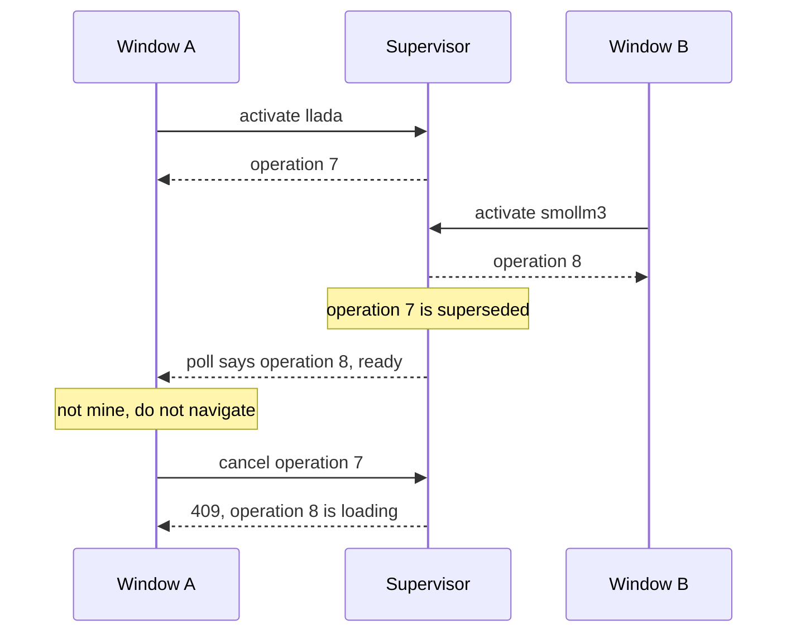

# Stage 4, pass two: one activation client, then operation identity

`ORG-04` first because the audit says it blocks a clean `LIFE-03`, and pass one
proved the point: adding the ready-branch discard meant editing both clients,
and the failure surfacing landed in only one of them.

`LIFE-01` and `PROTOCOL-01` move to pass three, as agreed.

## What is duplicated today

Four readers of one endpoint, three of them polling loops:

- `startLoadProgressPoll` ([src/web/static/app.js](src/web/static/app.js):571), boot display, no terminal action
- `pollSwitch` ([src/web/static/app.js](src/web/static/app.js):1457), reloads on ready
- `pollActivation` ([src/web/static/menu.js](src/web/static/menu.js):1295), navigates on ready
- `showPriorLoadFailure` ([src/web/static/menu.js](src/web/static/menu.js):1488), one-shot, added by `LIFE-06`

Plus two copies of `ACTIVATION_POLL_MS = 250` (`app.js:569`, `menu.js:19`), two
activate POSTs, one cancel, and two progress pairs that both wrap the one
genuinely shared piece, `overlaysActivationProgress`.

## Commit 1: the activation client, generator adopts it

New `src/web/static/activation_client.js`. Classic global script, no DOM, built
as a factory, following [src/web/static/detail_requests.js](src/web/static/detail_requests.js)
exactly: that file is the repo's precedent for a shared browser module that
`node --test` can load into a `vm` context and drive.

```js
activationClientCreate({
  fetchImpl,   // injected so tests need no network
  schedule,    // injected so tests need no timers
  pollMs,
  onProgress,  // (state, progress) -> void
  onReady,     // () -> void
  onFailed,    // (message) -> void
})
// start(modelId, {device})  POST activate, then poll to a terminal state
// observe()                 poll an activation this page did not start
// readOnce()                a single status read
// cancel()                  POST the cancel
// stop()                    stop polling without cancelling
```

The split is transport and state machine in the client, presentation and
navigation in the page. So `setLoadingProgress` / `finishLoadingProgress` and
`updateActivationProgress` / `finishActivationProgress` stay where they are and
keep wrapping `overlaysActivationProgress`; only the fetching, the retry
schedule and the terminal decision move.

Script tag goes after `overlays.js` in
[src/web/static/index.html](src/web/static/index.html):595 and
[src/web/static/menu.html](src/web/static/menu.html):90, mirroring where
`detail_requests.js` sits on the analytics page.

Generator adopts it in this commit: `startLoadProgressPoll` becomes
`observe()`, `pollSwitch` becomes `start()` with an `onReady` that reloads.

## Commit 2: menu adopts it

`pollActivation` and `selectModel` collapse into one `start()`,
`cancelSelection` into `cancel()`, `showPriorLoadFailure` into `readOnce()`.
The second `ACTIVATION_POLL_MS` goes.

## Commit 3: activation identity, server side

`ModelManager` gains a monotonically increasing `activation_id` and the target
it belongs to, set in `activate()` under the existing lock.

- `POST /api/models/{id}/activate` returns `operation` alongside `ok`/`active`/`state`
- `GET /api/models/activation` returns `operation`
- `POST /api/models/activate/cancel` takes an optional `{"operation": n}` body

**On cancel, an absent or stale operation is refused with 409 naming what is
actually loading.** This is the cross-window Cancel decision. Today the button
stops whatever worker is loading, whoever started it, which is one half of the
finding. Refusing silently would read as a broken button, so the refusal
carries a message the menu can show.

The WebSocket proxy gains a handshake. Right after
`websockets.connect(...)` succeeds and before `await _pipe(browser, worker)`
([src/web/server.py](src/web/server.py):1409), the supervisor sends one frame:

```json
{"type": "resident", "model": "llada", "device": "cuda", "operation": 7}
```

Supervisor-side because the supervisor is what owns activation identity, and
because it needs no worker change and no three-venv compile risk. Deterministic
ordering: it goes out before any worker frame, since the worker's own
`model_status` only follows the connection.

As a cheap independent cross-check, the worker's `model_status` frames in
[src/backends/worker_base.py](src/backends/worker_base.py):615 and :762 gain
`"model": backend.model_info.id`. The worker already has it and does not send
it, which the finding calls out; it catches a proxy pointed at the wrong
worker, which the supervisor's own frame by definition cannot.

## Commit 4: the client honours identity



Three behaviours, one per clause of the finding's Verification:

- **No client navigates for another operation.** The client records the
  operation its `start()` returned and drops a terminal state carrying a
  different one, so `onReady` never fires for somebody else's load.
- **No client cancels another operation.** `cancel()` sends its id; the menu
  shows the 409's message rather than appearing to do nothing.
- **No client sends an X request to Y.** `handleMessage`
  ([src/web/static/app.js](src/web/static/app.js):1581) gains a `resident` case
  comparing against the page's boot-time `activeModelId` and `activeDevice`. On
  a mismatch: mark not ready, disable generate, and take the rescue path below.

An unknown message type is already ignored by that switch, so a page that
predates this handles the new frame harmlessly.

## Commit 5: rescue an unsaved run before reloading

Per the decision taken, a mismatch auto-saves an unsaved completed run in the
background and then reloads, mirroring what entering What-If already does.

`saveRun` is fire-and-forget today ([src/web/static/app.js](src/web/static/app.js):6397)
and its three programmatic callers ignore the result, so having it return the
promise it already builds is backward compatible. The mismatch path then reads:

- nothing to save (`runSaved`, or no frames): reload
- otherwise: `saveRun()`, then reload, with a timeout so a hung save cannot
  strand the page on a model that is no longer there

Worth noting why this is possible at all: `ws.onclose` does not disable saving,
and after `DATA-04` a save carries its own provenance instead of reading the
resident worker, so a run outlives the worker that made it. Continuation does
not, which is why the run is saved and then let go rather than kept on screen.

## Tests

- `tests/web/static/activation_client.test.js` under `node --test`, loading the
  shipped file into a `vm` context with injected `fetchImpl` and `schedule`:
  the poll reaching ready, an error state, a terminal state belonging to
  another operation being ignored, cancel sending its id, and `stop()` ending
  the loop.
- Python tests against the endpoints for the operation id: it increments, it
  appears in both responses, a stale cancel is refused with 409 and does not
  stop the running worker, a matching cancel does.
- A supervisor test that the `resident` frame precedes worker traffic.
- Source-inspection tests for the generator's mismatch branch, matching
  `tests/web/test_switch_preserves_run.py`.

## Hardware queue

Two windows, which the sandbox cannot do: A activates X while B activates Y and
neither navigates for the other; B's Cancel does not kill A's load and says so;
A's generator, left open, detects the change, saves its unsaved run and reloads
onto Y with the run present in Analytics.