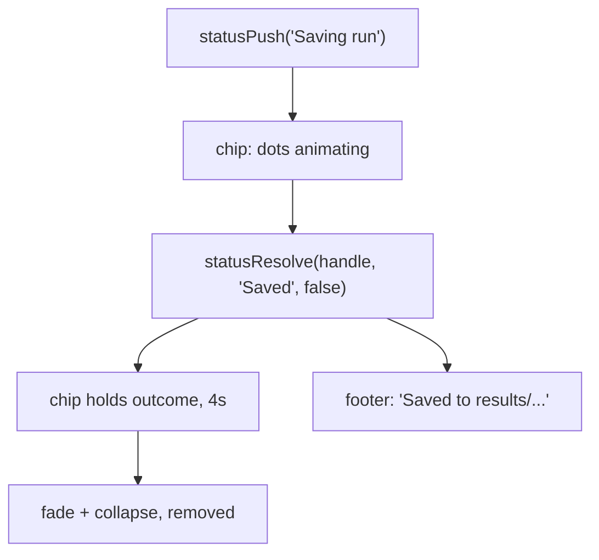

# Status message stack

## The problem, precisely

Three async operations write to the one `#status-message` span, all via `startStatusDots(base)`: generation, resume (What If and guided edit), and save. Saves are guarded by `isSaving` and only one run is ever in flight, so **the real concurrency ceiling is two**: a save plus a run. That is exactly the reported bug, where `enterSubstitutionMode` ([app.js:3605](src/web/static/app.js)) auto-saves the pre-edit run and picking a candidate fires `doSubstitute` while that POST is still in the air, stomping "Saving run" with "Resuming".

## Split of responsibility (settled)

- **Footer `#status-message` = resting state.** Empty when idle; `"Done."`, `"Saved to <path>"`, `"Error: ..."` otherwise. Every existing write stays verbatim, so `saveSessionState` ([app.js:5338](src/web/static/app.js)) and `restoreSessionState` ([app.js:5456](src/web/static/app.js)) need no changes.
- **Stack = work in flight.** One chip per operation, with its dots animation, showing how it ended and then fading.



## 1. Per-element dot timers (the enabling refactor)

`denoiseReveal` already stores its timer on the element (`el._denoiseTimer`, [app.js:4103](src/web/static/app.js)) with a comment saying it does so "so independent targets can animate simultaneously without one cancelling the other." But `startStatusDots` / `startStatusCycle` / `stopStatusDots` keep module-level singletons:

```4078:4080:src/web/static/app.js
var statusDotsTimer = null;
var statusDotsCount = 3;
var statusCycleTimer = null;
```

Move all three onto the element (`el._dotsTimer`, `el._dotsCount`, `el._cycleTimer`), following the precedent directly above them, and give the three functions an `el` first parameter. This is what lets two chips animate at once; everything else composes on top.

## 2. Markup and CSS

Wrap the existing span rather than replacing it, so it stays a plain text node that `restoreSessionState` can assign to:

```html
<div id="status-stack">
  <!-- chips prepended above; newest chip is nearest the bottom -->
  <span id="status-message"></span>
</div>
```

In [style.css](src/web/static/style.css), `#status-stack` takes over `margin-left: auto` from `#status-message` ([style.css:1065](src/web/static/style.css)), is `position: relative` reserving one line, and holds an absolutely positioned `bottom: 0; right: 0` column (`flex-direction: column; align-items: flex-end`) that grows upward.

Why this shape: an empty `#status-message` collapses to zero height, so during a run the single chip lands exactly on today's footer baseline (no visible shift for the common case), and on completion the footer text fills in beneath the fading chip. No show/hide logic needed. Overflow above the footer is safe because the clipping `#output-section` ([style.css:856](src/web/static/style.css)) is a sibling, not an ancestor. Give the stack `z-index: 10` so it clears `#overlay-select-group` (6); it stays well under the popover (60) and modals (90).

Reuse the toast entrance already used twice in the codebase (`opacity` + `translateY(8px)`, `0.25s ease`) rather than a new keyframe, and skip the slide under `prefersReducedMotion()`.

## 3. The push/resolve API

```js
var handle = statusPush("Saving run");            // chip with dots
statusResolve(handle, "Saved", false);            // swap text, start dismissal
statusResolve(handle, "Save failed: ...", true);  // danger variant
```

- Hard cap of `STATUS_STACK_MAX = 4`, dropping the oldest (a scroll region would be dead code at a ceiling of two, and TigerStyle wants everything bounded).
- Dismissal at `STATUS_CHIP_HOLD_MS = 4000`, inside the 3 to 5s window asked for.
- `statusResolve` on an already-retired handle is a no-op, so a late promise cannot resurrect a chip.

## 4. Rewiring the call sites

- **Save** ([app.js:4548](src/web/static/app.js)): handle is a local closed over by `.then` / `.catch`. Resolve at the three terminal branches (4642 success, 4652 failure, 4667 catch), each of which already calls `stopStatusDots()` first.
- **Run** (`startGeneration` [app.js:4366](src/web/static/app.js), `doSubstitute` [app.js:3675](src/web/static/app.js), `doGuidedResume` [app.js:3939](src/web/static/app.js)): these end in the WebSocket handlers, so the handle lives in one module-level `runStatusHandle`. Honest, since the three are mutually exclusive. `handleDone` ([app.js:1450](src/web/static/app.js)) and `handleError` ([app.js:1492](src/web/static/app.js)) already do `stopStatusDots()` then a footer assignment, so each becomes resolve-then-footer with no restructuring.
- Pushing into the run slot must retire any handle already there, so a retried run cannot strand a stale chip.

## 5. The `resetStatus()` trap

`resetStatus()` currently clears the message ([app.js:4258](src/web/static/app.js)) and is called immediately before `startStatusDots("Resuming")` in both `doSubstitute` (3673) and `doGuidedResume` (3937). That is precisely when a save may be in flight, so it must clear the **footer only**. If it clears the stack, the original bug comes straight back.

Left alone: `"Prompt is empty."` (4344) and `switchFailed` (1281) are one-shot with no async pair, so they stay footer-only. `handleError`'s 5s color decay is unchanged.

## 6. Docs and verification

Update the Help modal (`#modal-help` in [index.html](src/web/static/index.html)), README, ROADMAP, and HANDOFF (including retiring the "Status message stack" backlog entry at [HANDOFF.md:1306](HANDOFF.md)). Run `node --check`, ReadLints, `.venv/bin/python -m pytest`, and the 70-column audit. GPU and display work cannot be exercised here, so hand back a manual checklist whose central item is the 3c repro: start What If on an unsaved run and pick a candidate while the auto-save is still running, then confirm both chips are up at once.