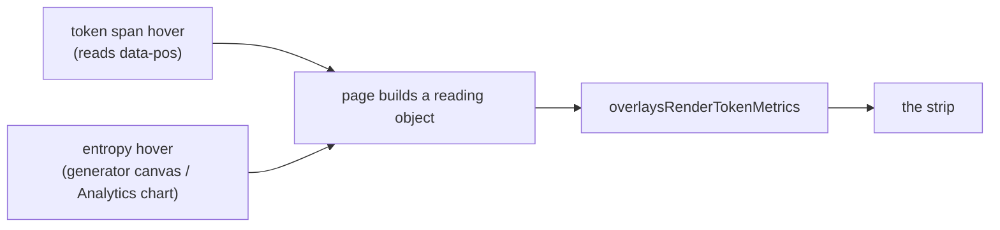

# Token metrics strip replacing the hover tooltip

Scope is the metrics strip only. The What If? typed-token work stays a separate
plan, with its settled decisions recorded in `HANDOFF.md` as part of this pass so
nothing from the discussion is lost.

## Why this is a net simplification

The "tooltip" is the native `title` attribute, written in one place:

```376:379:src/web/static/overlays.js
  var title = opts.titleFor ? opts.titleFor(index, tok) : "";
  if (span.title !== title) {
    span.title = title;
  }
```

Everything upstream of that line exists only to feed it: `tokenTitleFn`,
`tokenTitleExtra`, `tokenExtraLabel` and an inline `titleFor` on the generator;
`overlayTitleFn`, `commitExtraFor` and the `extraFor` / `originalExtraFor`
parameter chain on Analytics. The strip computes the same values at hover time
from the same helpers, so all of that plumbing is deleted rather than rerouted.

It also unblocks the candidate popover, which is currently contorted around a
tooltip it cannot control:

```98:101:src/web/static/overlays.js
// Place it vertically, preferring above the token. The browser draws
// the native title tooltip below the cursor and we cannot move that,
// so a popover below would sit underneath the tooltip. Falls back to
// below when the token is too close to the top of the viewport.
```

The above-preference stays (it reads better), but the comment becomes a choice
rather than a workaround.

## Two hover sources, one readout



Each page owns the branching (which mode, which frame, which layer) and hands
`overlays.js` a plain object. The renderer stays branchless, which keeps one
source of truth for formatting across both pages.

## What the strip shows

One line in the `#status-bar` idiom (11px, `--text-secondary` labels,
`--text-primary` values), left-aligned:

- The token itself, through the existing `overlaysAltDisplay`
  ([overlays.js:178](src/web/static/overlays.js)), so a space reads as a
  middle dot rather than a blank.
- Position as `N / total`.
- Confidence, with a small inline bar.
- Entropy in nats, with a small inline bar, when the run carries it.
- The overlay-specific extra the tooltip carried: `Resolved at step: N` under
  Commit Order, `was: X` or `(remasked here)` under Diff.
- A run tag reading `Original` or `Edited`, only while a comparison is active.

Idle state keeps every label and shows `-` for each value.

## Placement

**Generation.** A new sibling immediately before `#output-section`
([index.html:140](src/web/static/index.html)). `#app` is a flex column and
`#output-section` is `flex: 1; min-height: 0`
([style.css:857](src/web/static/style.css)), so the strip takes `flex-shrink: 0`
and the canvas absorbs the height.

**Analytics.** Between `#overlay-viewer-header` and `#overlay-output-wrap`
([analytics.html:152](src/web/static/analytics.html)). `#overlay-viewer` is a
flex column and the wrap is `flex: 1`, so the same `flex-shrink: 0` applies and
the fixed `90vh` modal is unaffected. Note `#overlay-readout` is already taken
by the drawer's diff summary, so the new element needs a distinct id.

Shared visual styling goes in `style.css`, which both pages load.

## Wiring

**Generation** ([app.js](src/web/static/app.js)):

- `#output-area` `mouseover` (5698) already derives the position via
  `hoveredTokenPosition`; add the strip update beside
  `setEntropyHoverPosition`.
- `#output-area` `mouseleave` (5753) clears, but must keep the existing early
  return when the popover is hovered, or the readout would blank while you are
  reading the popover for that position.
- `#entropy-profile` `mousemove` (5722) already yields a position via
  `entropyProfilePosition`; add the strip update there and clear on its
  `mouseleave`.
- Refresh on anything that changes what a held position means: each
  `renderLiveFrame`, scrubber movement, the `runBlend` slider, and overlay mode
  changes. Clear in `resetStatus`, `resetRunState`, `deactivateScrubber` and on
  model switch.

**Analytics** ([analytics.js](src/web/static/analytics.js)):

- `#overlay-output` `mouseover` (2654) and `mouseleave` (2673), same popover
  early return.
- `tokenLinkPlugin.afterEvent` (1287) already computes the hovered bar index and
  calls `setTokenHighlight`; the strip update goes there, which gets
  chart-to-strip for free.
- Refresh on `onRunBlendInput` (3608), scrubber movement and overlay mode
  changes; clear when the modal closes or a different run loads.

## Decisions worth stating

- **Always present.** Anything that appears only on hover makes the canvas jump
  every time the pointer crosses it. Roughly 30px is reserved permanently.
- **Which stacked layer.** Read the hovered span's ancestor layer class
  (`token-layer-original` / `token-layer-edited`) rather than recomputing state,
  so the strip reads what is actually on screen. Chart hover has no span, so it
  falls back to `overlaysEditedOwnsPointer`
  ([overlays.js:266](src/web/static/overlays.js)). These already agree at every
  blend value, including exactly 50/50, so no existing behavior changes.
- **A separate hover variable.** `setEntropyHoverPosition` deliberately forces
  `entropyHoverPos` to null whenever the profile row is hidden, which is exactly
  the live-generation case. The strip needs its own `metricsHoverPos`, set from
  the same three call sites. They answer different questions with different
  lifetimes: which column is lit, versus which position is being read.
- **Live generation gains a readout it never had.** `LIVE_TOKEN_OPTIONS = {}`
  means streaming tokens carry no title today, but they do carry `data-pos`, so
  the strip works there for free once refreshed per frame.
- **Absent is not zero.** Today a missing confidence renders as
  `Confidence: 0`. The strip shows `-` when the field is absent and a real
  number when it is genuinely zero, since a run saved without the signal is not
  a run that was certain.
- **No `aria-live`.** A region that re-announces on every hover would be
  unusable with a screen reader; this stays a visual readout.

## Edge cases to honor

- Diffusion tokens carry no `.e` at all (`streaming_sampler.py`,
  `dgemma_sampler.py` emit `.t`, `.m`, `.id` and optional `.c`), so entropy
  reads `-` for LLaDA and DiffusionGemma.
- Masked tokens and positions queued for remasking keep their existing
  confidence-of-zero semantics.
- `renderFrame`'s character-span fallback emits no `data-pos`, so hover yields
  nothing and the strip idles. That is existing behavior, not a regression.
- The candidate popover is unchanged and continues to open on token hover.

## Verification

`node --check` on each changed JS file, `ReadLints`, `.venv/bin/python -m pytest`
(no Python changes, run as a guard), and the 70-column audit on changed lines.
GPU and display cannot be exercised here, so hand back a manual checklist
covering: both pages idle correctly with reserved height, token hover and
entropy hover agree, the crossfade flips the run tag at the midpoint, Commit
Order and Diff supply their extra line, a diffusion run shows `-` for entropy, a
live run updates while streaming, and no token shows a native tooltip anywhere.