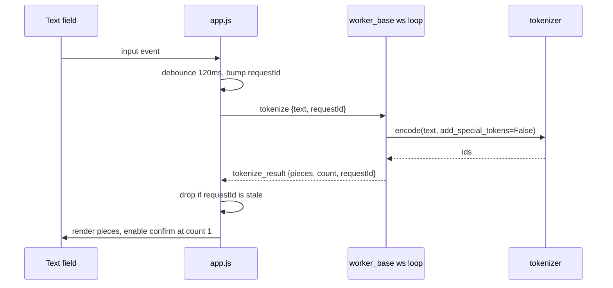

# Typed token for What If, tokenizer identity, and an AR top-k knob

Three commits, sequenced. Every decision below was settled in the deliberation recorded in [HANDOFF.md](HANDOFF.md) lines 1666 to 1747; this plan only makes them concrete.

## Commit 1: Report and persist the tokenizer's identity

The identity must come off the loaded object, not from `ModelCapabilities`, which is static registry data served with no worker running and free to drift from what the checkpoint loads.

- [src/backends/worker_base.py](src/backends/worker_base.py): in `_health` (line 201), extend the payload with a `tokenizer` dict when `status == "ready"`, read via `getattr(backend, "tokenizer", None)`. Report `class` (`type(tok).__name__`), `name_or_path`, `is_fast`, and `vocab_size`. Note in a comment that `vocab_size` is the base vocabulary and `len(tokenizer)` would include added tokens; the base figure is the one that makes the 5-nat entropy reference interpretable.
- [src/web/server.py](src/web/server.py): add `ModelManager.active_tokenizer`, cached where `active_versions` is (line 617, `if status == "ready"`), and cleared in both `activate()` and `_stop_locked()` alongside it. Expose it in `_models_snapshot()` next to `active_device`, and write it into `metadata["reproducibility"]["tokenizer"]` in `_save_run_blocking` (line 1332).
- [src/web/static/analytics.js](src/web/static/analytics.js): a `tokenizerMetaRow(run)` beside `processorMetaRow` (line 1098), appended at line 1055. It reads `run.reproducibility.tokenizer` and returns `""` when absent, so the 103 existing runs render unchanged. No endpoint change: `list_runs` in [src/analytics/metrics.py](src/analytics/metrics.py) returns raw metadata dicts, so a new key flows through on its own.
- Docs: the About and Help copy in [src/web/static/index.html](src/web/static/index.html), plus [README.md](README.md).

## Commit 2: The typed token

### Step 1, make the popover pinnable (generator only)

This is a change to what the popover is, not a detail of the text field. It is hover-scoped and destructive today: `hideAltsPopover` sets `textContent = ""` and fires on the popover's `mouseleave` (line 5884), the output area's `mouseleave` (line 5869), any capture-phase `scroll` (line 5914), and `resize` (line 5924), while `renderAltsPopover` (line 2414) rebuilds every child on each hover.

In [src/web/static/app.js](src/web/static/app.js): an `altsPopoverPinned` flag, set while the input holds focus or a non-empty draft. While pinned, all four hover-driven closers return early, and the `mouseover` handler does not call `showAltsPopover` for a new position, so the draft survives. Unpinned by confirm, cancel, `Escape`, or a document `pointerdown` outside the popover (which is the settled "clicking outside is a cancel"). A scroll while pinned leaves the box where it is rather than re-anchoring, since re-anchoring would slide the field out from under the pointer.

Analytics needs none of this: its popover is read-only, because substitution only ever applies to the live run.

### Step 2, the preview round trip

- [src/backends/protocol.py](src/backends/protocol.py): `MSG_TOKENIZE` and `MSG_TOKENIZE_RESULT` constants.
- [src/backends/worker_base.py](src/backends/worker_base.py): a default `Backend.handle_tokenize` using `getattr(self, "tokenizer", None)`, so all three models get the preview and diffusion What If inherits it later. Dispatch it in the ws loop after `MSG_SUBSTITUTE` (line 319) **without** taking `gen_lock`: it is a microsecond vocabulary lookup, and the lock exists to serialize generation.
- The client carries a monotonic `requestId` and discards stale replies. Debouncing alone does not guarantee ordering.

### Step 3, the row itself

In [src/web/static/app.js](src/web/static/app.js), appended inside `renderAltsPopover` after `buildAltsRows` (line 2436) and only when `pickable`:

- A text box reading "Enter your own". Confirm (green check) and cancel (red X) drop out from behind its right edge using the status chips' motion without the fade.
- Leading space pre-seeded from the token being replaced, not from a sentence-position heuristic: if `frameTokens[currentScrubFrame][pos].t` starts with a space, seed one. A single backspace removes it.
- Pieces render below: one piece in the normal green, several in alternating tints, and the warning orange `#ff9f1c` only when the count exceeds what is allowed, since that color means edit or remask everywhere else.
- Confirm is disabled unless `count === 1`, re-enabling live. Confirming solidifies the entry into an `alt-row` you click to run, with a small retry icon at its right.

### Step 4, the typed substitution path and a true confidence

- [src/backends/smollm3_worker.py](src/backends/smollm3_worker.py): `_validate_substitute` gets a second, explicitly typed branch rather than a loosened first one. When `data["typed"]` is set, re-encode the text server side, require exactly one id, require it matches the client's `token_id`, and return `forced_conf = None`. The captured-candidate branch is untouched.
- `forced_entropy` stays `state["entropies"][position]` in both branches. Entropy describes the distribution at that position, which does not change with the token you force. This is a place someone would plausibly "fix" by mistake.
- [src/inference/ar_sampler.py](src/inference/ar_sampler.py): move the prefill boundary in `_substitute_loop` (line 506). Prefill over prompt plus prefix **excluding** the forced token, so the last-position logits are the distribution at the forced position and `probs[forced_id]` is the typed token's true probability. Emit the seed frame with it, then call `_stream_tokens` with `step_ids` of just the forced token and the cache from that prefill. `_stream_tokens` (line 375) gains an optional `past` parameter, initialized into its `past` local. Total compute is unchanged: prefix plus one token either way. This also survives `budget == 0`, where `_stream_tokens` never runs.
- Use the true value only when `forced_conf is None`. A captured candidate keeps the probability its original run recorded.

## Commit 3: AR sampling top-k

Distinct from `TOP_K_ALTERNATIVES = 5`, which is the capture count and stays deferred. Hugging Face applies top-k before top-p, so they compose as a truncation followed by a nucleus cut.

- [src/backends/registry.py](src/backends/registry.py): a `top_k` `ParamSpec` on `SMOLLM3` after `top_p` (line 260). `ParamType.INT`, `default=0` meaning no truncation, `recommended=(0, 100)`. The zero default keeps every existing run's behavior byte-identical.
- [src/inference/ar_sampler.py](src/inference/ar_sampler.py): thread it into `_sample_next` (line 216) and apply it to `scaled` before `_top_p_filter` (line 239). The substitution path is deliberately greedy (`temperature=0.0`), which ignores both filters, so it needs no change.

## Verification

`.venv/bin/python -m pytest`, `node --check` on each changed JS file, ReadLints, and the 70-column audit. New tests mirroring `tests/`: the health payload shape, the typed validation branch (accepting one token, rejecting several and rejecting a client/server id mismatch), and top-k composing with top-p.

GPU and display work cannot be exercised in the sandbox, so this hands back with a manual checklist covering the pin surviving pointer drift and scroll, the leading-space seed, confirm gating at exactly one token, and a typed token honestly reporting a low probability.

## A note on the commit boundary

The pinning refactor has no user-visible surface on its own and so cannot be validated independently, which is the repo's stated boundary. It is step one of commit 2 rather than a commit of its own.