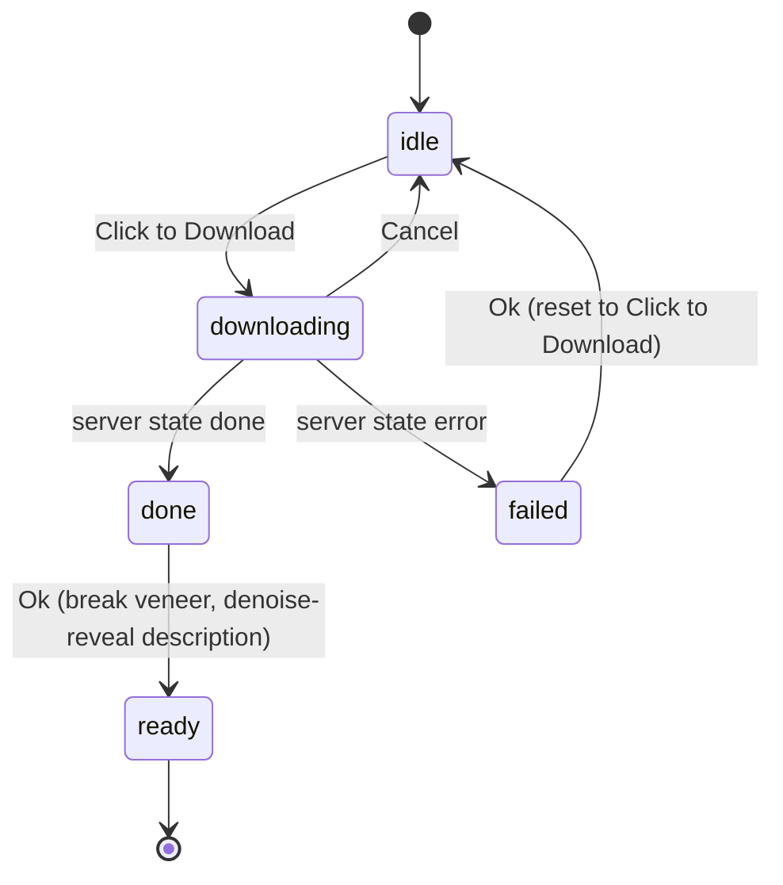

# Veneer Flow, Family Icons, and Dropdown Ticker

Refinements from the latest round of testing. Grouped into commit-sized units; ordered easiest-first.

## Group 1: quick fixes

- **Menu confirm cursor** ([style.css](src/web/static/style.css) `.menu-model-confirm` ~2410): add `cursor: default` (it inherits `cursor: pointer` from `.menu-model-row`, the same bug the dropdown's `.switch-confirm` already fixed); keep `cursor: pointer` only on the buttons, and `stopPropagation` on the confirm box's click for parity.
- **Veneer Cancel contrast** ([style.css](src/web/static/style.css) `.menu-model-veneer-cancel` ~2782): it uses `--text-secondary` on the translucent veneer and blends in. Make it high-contrast (white/bright text, red border, red on hover) so it reads clearly over the veneer.

## Group 2: family icons

Redesign the two glyphs in [menu.js](src/web/static/menu.js) (`_AR_ICON` / `_DIFFUSION_ICON`), keeping the `<title>` tooltip:
- **Autoregressive**: an angular "@"/"a" whose tail arcs back over the top into the start (the AR feedback loop), all 45/90-degree turns to read as a terminal glyph (per your screenshot-5 sketch, folding in "A"/"R").
- **Diffusion**: overlay a "D" and "F" so the D's bowl + F's mid-bar resolve into a reversed epsilon (screenshot 6). Prototype two variants: a single stroked path that traces the epsilon, and a superposition version (semi-transparent D over F) that literalizes the idea; pick on review.

These are iterative/visual; the exact paths get tuned in Agent mode.

## Group 3: veneer flow (hidden description + confirmation)

- **Hide the description while veneered** ([menu.js](src/web/static/menu.js) `buildRow`): a `needs-download` row hides `.menu-model-desc` so the veneer's label / progress bar only share space with the dimmed name + device tag (no clash). On successful download, reveal the description with the menu's existing denoise effect (`revealOnce`, the `startLoadingCycle` helper) so green glyphs resolve into the description text, matching the generator.
- **Veneer states** ([menu.js](src/web/static/menu.js) `buildDownloadVeneer` + the download flow, [style.css](src/web/static/style.css)): add a message+Ok area. On `done`: keep the veneer, show "Download successful for {model}!" with an **Ok** that breaks the veneer and triggers the denoise reveal (in `finishDownload`). On `error`: show "Download attempt unsuccessful. Error: {message}" with an **Ok** that returns to "Click to Download" (`resetDownload`); surface `manager.download_error` (already tracked).

## Group 4: download progress (disable Xet + accurate fraction)

- **Disable Xet for the pre-fetch** ([hf_download.py](src/inference/hf_download.py) `download_with_progress`): set `os.environ["HF_HUB_DISABLE_XET"] = "1"` before `snapshot_download`. `hf-xet==1.5.2` ([requirements-ar.txt](requirements-ar.txt)) currently routes bytes through the Xet client, which bypasses the `tqdm_class` hook, so the bar stalls (~8%) then jumps. Disabling it uses the classic downloader whose tqdm we can track. (You want to observe the perf tradeoff; easy to revert.)
- **Fraction accuracy** ([hf_download.py](src/inference/hf_download.py) `_make_progress_tqdm`): only aggregate byte-unit bars (capture `kwargs.get("unit")`, count when it starts with `B`) so the outer "Fetching N files" count bar no longer pollutes `total`.

## Group 5: dropdown ticker (collapsed slot) + Settings toggle

- **Collapsed-slot ticker** ([app.js](src/web/static/app.js) `setModelSelectValue`): replace the static collapsed device pill with a ticker that cycles the active model's tag between the device (`GPU`/`CPU`) and its signed headroom (`+Z` / `-Z`, no "GiB"), ~2s per side with a 0.5-1s fade. Manage the interval (clear/rebuild on each `renderModelSelector`). Honor `prefers-reduced-motion` and the new setting (below): when off, show just the device label.
- **Settings toggle** ([index.html](src/web/static/index.html) settings modal, [app.js](src/web/static/app.js) settings state): add `gpuTicker` (default on) to `DEFAULT_SETTINGS` / `appSettings` / `stagedSettings` (~119-136), a settings row + checkbox, the `syncSettingsControls` mirror, the change handler, and Save/Reset. It persists automatically in the `diffusion_settings` blob via `saveSettings` -> `persistSet` (no server whitelist change). Proposed label: "Device tag ticker" (description: cycle the header tag between device and VRAM headroom).

## Group 6: dropdown hover side-popup (expanded rows)

- **Drop the oblong from dropdown options** ([app.js](src/web/static/app.js) `buildOptionDevice`): remove the `buildHeadroomOblong` prepend so option rows are just `[name] [device pill / toggle]`, matching the collapsed value width (fixes the open-list-wider-than-box asymmetry). The oblong stays on the Main Menu (which has room).
- **Hover side-popup** ([app.js](src/web/static/app.js) `renderModelSelector`, [style.css](src/web/static/style.css)): on hovering a `.model-select-option`, show a small popover to the side of the row with the full readout ("Required X GiB, Available Y GiB, +/-Z.Z"), from `min_vram_gib` + `vram_headroom_gib`. Dismiss on mouseleave / list close.
- Optional: drop "(NF4)" from DiffusionGemma's display name only if rows crowd; not needed yet.

## Group 7: docs and verification

- **Docs**: brief README/HANDOFF notes for the veneer confirmation flow, the ticker + its Settings toggle, and the Xet-disabled pre-fetch.
- **Verify**: `.venv/bin/python -m py_compile` changed modules, `node --check` changed JS, `.venv/bin/python -m pytest`, ReadLints. Manual (needs GPU/model): menu confirm shows an arrow cursor between the buttons; new family icons render with tooltips; veneered row hides its description, downloads with a visible Cancel and a smooth (Xet-off) bar, shows a success/error message with Ok, and denoise-reveals the description on Ok; the dropdown collapsed slot tickers device <-> headroom (and stops when the Setting is off / reduced-motion), while expanded rows are symmetric with a hover side-popup.