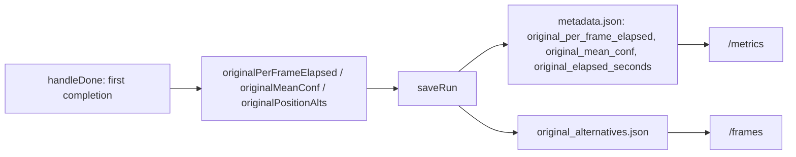

# What If lifecycle fixes and edited-run timing foundation

Two commits. The first is self-contained bug fixes. The second repairs a
data-alignment bug and lays down the persistence that the confidence,
timing, and popover work will read.

Deliberately **not** in scope here: the shared Original/Edited crossfade,
cross-highlighting, popover pagination, the confidence toggle, the timing
chart overlay/markers, and the status message stack. Those get planned
after this lands and is validated on hardware.

---

## Commit 1: What If confirm and retry lifecycle

### 1a. Close the post-confirm unlock window

[confirmGuidedEdit](src/web/static/app.js) fires an async save, then
immediately re-shows the button before the save's `.then()` sets
`editedRunSaved`:

```javascript
function confirmGuidedEdit() {
  saveRun();          // async; sets editedRunSaved only on success
  resetGuidedMode();
  activateScrubber(); // unhides #btn-what-if, runs updateEditFramesLock
}
```

Change [updateEditFramesLock](src/web/static/app.js) (line 2462) to lock on
a pending edited save as well as a completed one. Edits already exist at
confirm time, so the condition is available synchronously:

```javascript
var lockEdits = editedRunSaved
  || (isSaving && remaskEdits.length > 0);
```

Apply to both `btnEditFrames` and `btnWhatIf` branches. Add
`updateEditFramesLock()` to the `isSaving = true` block in
[saveRun](src/web/static/app.js) (line 3911) and to both terminal handlers,
so the lock tracks the save's whole lifetime and releases if the save fails.

### 1b. Make the locked state read as disabled

`.btn-edit-frames.is-locked` in [style.css](src/web/static/style.css)
(line 1650) sets only `opacity` and `cursor`; the real gate is a JS
early-return, which is why the button still looks clickable. Add
`pointer-events: none;` to that rule and set `aria-disabled="true"` when
locking. Keep the existing JS guards in `enterSubstitutionMode` and
`enterRemaskMode` as the paired assertion.

### 1c. Stop the worker from re-pointing at the branch

[smollm3_worker.py](src/backends/smollm3_worker.py) line 326 replaces the
run the next substitution validates against:

```python
        # Chain substitutions: the branch becomes the run a further
        # substitution re-enters.
        if branch.get("ids"):
            state.update(branch)
```

`state` is `self.last_run_state`, so after a substitution the worker
validates candidates against the branch while Retry has restored the
client to the original via
[restoreEditSnapshot](src/web/static/app.js) (line 2908). Positions at or
after the edit then fail `_validate_substitute` with "token X was not among
the captured candidates at position Y".

Remove the mutation and replace the comment with why the original stays
pinned: every substitution re-enters the recorded run, matching the
client's Retry semantics (the button is hidden mid-session and locked after
confirm, so chained branching is not reachable from the UI).

### 1d. Regression test

New `tests/backends/test_smollm3_substitute.py`. `Smollm3Backend()`
constructs without loading a model (verified: 1.3s import in `.venv`), so
the test sets `last_run_state` by hand, monkeypatches
`streaming_substitute` and stubs the WebSocket and `FrameStreamer`, drives
`handle_substitute` with `asyncio.run` (no `pytest-asyncio` in the venv),
and asserts `last_run_state["alternatives"]` and `["ids"]` are unchanged.
Add a paired test that `_validate_substitute` still accepts an original
candidate at a position after the edit once the branch has run.

---

## Commit 2: edited-run timing and comparison data

### 2a. Root cause

Both splice sites truncate the frame arrays but leave `perFrameElapsed`
alone. [doSubstitute](src/web/static/app.js) line 3059:

```javascript
  resumeFrameOffset = position;
  frameHistory.length = resumeFrameOffset;
  frameTokens.length = resumeFrameOffset;
  frameCanvasIndex.length = resumeFrameOffset;
  frameMeanConf.length = resumeFrameOffset;
```

[doGuidedResume](src/web/static/app.js) line 3330 is identical, so this hits
diffusion too. The branch's samples append to the original's full array, so
`per_frame_elapsed` ends up longer than `frames` and the Timing x-axis stops
meaning what every other chart's means. Because
[worker_base.py](src/backends/worker_base.py) line 53 restarts the timer per
segment, `elapsed_seconds` (last element) is the branch duration alone.

### 2b. Keep elapsed aligned and monotonic

Add a module variable `resumeElapsedOffset = 0` next to `resumeFrameOffset`
(line 288). At both splice sites, capture the offset before truncating:

```javascript
  resumeElapsedOffset = resumeFrameOffset > 0
    ? perFrameElapsed[resumeFrameOffset - 1]
    : 0;
  perFrameElapsed.length = resumeFrameOffset;
```

In [handleFrame](src/web/static/app.js) line 1373, add the offset and round
to the server's two decimals so floating point noise does not accumulate:

```javascript
    perFrameElapsed.push(
      +(data.elapsed + resumeElapsedOffset).toFixed(2)
    );
```

Reset `resumeElapsedOffset = 0` in
[resetRunState](src/web/static/app.js) (line 3676), and add it to
`captureEditSnapshot` / `restoreEditSnapshot` (lines 2893, 2908) alongside
`perFrameElapsed` so a cancelled session restores both together.

`elapsed_seconds` in [saveRun](src/web/static/app.js) line 3922 then becomes
the true total with no change to that expression.

### 2c. Capture the pre-edit run's signals

[handleDone](src/web/static/app.js) line 1430 already snapshots the original
once, guarded on the first completion. Extend it:

```javascript
  if (originalTotalFrames === 0) {
    originalTotalFrames = frameHistory.length;
    originalFrameHistory = frameHistory.slice();
    originalFrameTokens = frameTokens.slice();
    originalPerFrameElapsed = perFrameElapsed.slice();
    originalMeanConf = frameMeanConf.slice();
    originalPositionAlts = positionAlts.slice();
  }
```

`originalPositionAlts` is the one that cannot be recovered later:
`doSubstitute` truncates `positionAlts` at the edit and the branch
overwrites the rest, so without this the original's candidate sets are gone
for good. Reset all three in `resetRunState`, and add them to the `full`
payload in `saveSessionState` / `restoreSessionState`
(lines 4644, 4705) next to `originalFrameTokens`, otherwise a round trip to
Analytics loses them.

### 2d. Persist them

Extend the `remaskEdits.length > 0` block in `saveRun` (line 3958) to send
`original_per_frame_elapsed`, `original_elapsed_seconds`,
`original_mean_conf`, and `original_alternatives` (via the existing
`alternativeRecordsFrom`, which already returns null when nothing was
captured).

Server side:

- [SaveRunRequest](src/web/server.py) line 1111: four new optional fields,
  `original_alternatives` typed like `alternatives`.
- `_save_run_blocking` (line 1254): the three arrays and the scalar into
  `metadata`; `original_alternatives.json` written with `_dump_alternatives`
  next to the existing `original_tokens.json` write.
- [load_run_frames](src/analytics/metrics.py) line 130: load
  `original_alternatives.json` into `original_alternatives`, mirroring the
  existing `original_tokens.json` and `alternatives.json` handling including
  the malformed-file `ValueError`.
- `_compute_run_frames` (line 1398) forwards `original_alternatives`;
  `_compute_run_metrics` (line 1364) adds the three new metadata keys to its
  forwarded key tuple.

`SaveRunRequest` is strict pydantic, so an undeclared field is dropped
silently. Extend
[tests/web/test_save_signals.py](tests/web/test_save_signals.py) in its
existing style to pin all four new fields through the request model and the
`load_run_frames` round trip.



### 2e. Repair elapsed for already-saved runs

Legacy edited runs keep a branch-only `elapsed_seconds`, and the Analytics
table Time column and detail Elapsed row both read it
([analytics.js](src/web/static/analytics.js) lines 528 and 927). The
correct total is recoverable: scanning `per_frame_elapsed` for the drop
gives the same answer [buildCumulativeTiming](src/web/static/analytics.js)
(line 616) already computes for the chart.

Add a pure `total_elapsed_seconds(per_frame_elapsed)` to
[metrics.py](src/analytics/metrics.py) using that segment-offset scan, and
apply it in `list_runs` (line 220) to set `elapsed_seconds`. It is
idempotent: new monotonic arrays have no drops so it returns the last value
unchanged, while legacy arrays get corrected. Unit test both shapes plus the
empty and single-element edges in
[tests/analytics/test_metrics.py](tests/analytics/test_metrics.py).

### 2f. Keep the resumed-segment coloring working

`buildCumulativeTiming` derives `resumeStartSet` purely from elapsed drops.
Once new runs are monotonic that set is empty, so the light-blue post-resume
coloring in [renderTimingChart](src/web/static/analytics.js) (line 2040)
would silently disappear. Conversely, `remask_edits[].frame_index` points at
the wrong place inside a legacy misaligned array.

Resolve one boundary set with an explicit rule: use the detected drops when
any exist (legacy), otherwise fall back to the remask frame indices (new
runs). Put it in a small named helper so the dashed marker planned for the
Timing chart can reuse it later.

---

## Verification

- `.venv/bin/python -m pytest` (new backend test, extended save-signal and
  metrics tests).
- `.venv/bin/python -m py_compile` on changed Python modules.
- `node --check` on `app.js` and `analytics.js`.
- ReadLints on every changed file, plus the 70-column audit.

## Manual checklist (needs GPU and a display)

1. SmolLM3: run, What If, pick a candidate, confirm. The What If button
   greys out immediately at confirm and stays unclickable, with no window
   where it responds.
2. Same run, but Retry instead of confirm, then pick a token after the edit
   position. No "not among the captured candidates" error.
3. Save a fresh edited SmolLM3 run. In Analytics, the Timing chart's last
   frame index now matches Confidence and Entropy, and the Elapsed row shows
   a total consistent with the chart's final y value rather than the branch
   alone.
4. Open a pre-existing edited run. Its Time column and Elapsed row show the
   repaired total, the Timing chart still shows its post-resume segment in
   light blue, and nothing else regressed.
5. LLaDA Edit Frames resume: confirm the same alignment fix holds for
   diffusion.
6. Generate, edit, navigate to Analytics and back: the restored session
   still saves a complete edited run.